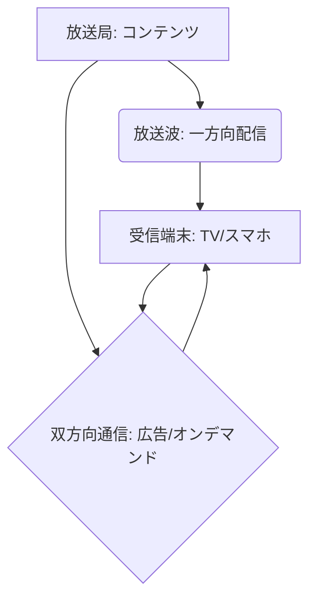

# T14-03-02 IP放送・インターネット統合配信（ATSC 3.0）

## Summary（5つの要点）

1. **放送と通信の融合**: 従来の**放送波（電波）**による一方向配信に加え、**インターネットプロトコル（IP）**をベースとした**双方向通信**を統合した次世代の放送規格 `(1)`。
2. **ATSC 3.0**: 米国で策定された標準規格「**NextGen TV**」。高画質化に加え、**パーソナライズされた広告**、**オンデマンド機能**、**視聴者との双方向サービス**を可能にする。
3. **パーソナライゼーション**: インターネット連携により、視聴者の属性や履歴に基づいた**ターゲティング広告**や、番組の**追加情報（データ放送）**のカスタマイズ配信が可能になる。
4. **マルチプラットフォーム対応**: **スマートフォン、タブレット**などのモバイルデバイスへの直接受信を容易にし、災害時などには**緊急警報や避難情報**を確実に配信する機能を持つ。
5. **日本国内の動向**: 日本では、**DVB-I**（欧州）や**ATSC 3.0**を参考に、**放送法と電気通信事業法**にまたがる**「放送と通信の融合」**に向けた制度・技術の検討が進んでいる `(2)`。

#### 概念図

---

### 技術評価表（定量的な視点）
| 評価項目 | 評価 | 根拠 |
| :--- | :--- | :--- |
| 導入コスト | ⭐⭐⭐☆☆ | 放送局、受信端末（TV、チューナー）の入れ替えが必要 |
| 技術成熟度 | ⭐⭐⭐⭐☆ | ATSC 3.0は米国、韓国などで既に商用展開済み |
| 日本の競争力 | ⭐⭐⭐☆☆ | 制度設計、規格統一で欧米・韓国に後れ。基盤技術は保有 `(2)` |
| 市場性 | ⭐⭐⭐⭐⭐ | 広告収益の改善、新規サービスの創出など、放送事業者の生命線となる |
| 品質保証の重要性 | ⭐⭐⭐⭐⭐ | 災害時の**緊急情報伝達**の**信頼性と到達率**の確保が最重要 |
---

## 日本の立ち位置・強み弱みのSummary

### 強み：日本企業や研究機関が持つ独自の技術、優位性などを箇条書きで記述。

* **放送技術と通信技術の統合ノウハウ**: **NHK**の**ISDB-T**（地デジ規格）開発実績や、**NTT**などの通信技術力が高い。
* **災害情報伝達システム**: J-ALERT、ETWSなどの**緊急速報システム**の運用ノウハウは世界的に見ても高い。
* **家電メーカーの受信機技術**: **ソニー、パナソニック**などの家電メーカーが、次世代規格に対応する**受信機（TV、チューナー）**の技術開発力を持つ。

### 弱み：日本が抱える規制、標準化の遅れ、海外依存などを箇条書きで記述。

* **法制度・規制の壁**: **放送法と電気通信事業法**に跨る複雑な法規制が、**「放送と通信の融合」**や**新規ビジネスモデル**の導入を遅らせる要因となっている。
* **規格統一の遅れ**: **ATSC 3.0**のような明確な**次世代標準規格**の国内統一が遅れており、ベンダーやコンテンツホルダーが投資に踏み切りにくい状況。
* **パーソナライズ広告への懸念**: 視聴データ利用による**プライバシー保護**や、**パーソナライズされた情報の偏り**に対する社会的な懸念への対応が課題。

---

## 技術ロードマップ（短期/中期/長期）

### 短期目標（～2027年）

* **「放送と通信の融合」**に向けた**法制度改革**を推進し、IPベースの双方向サービス導入に向けた**標準化（DVB-I、ATSC 3.0ベース）**を完了。
* **スマートフォン**などのモバイルデバイスへの**放送波直接受信機能**の実証実験と、**災害時情報伝達**の強化。
* **パーソナライズド広告**の技術開発と、**プライバシー保護**を両立するためのガイドライン策定。

### 中期目標（2028年～2031年）

* 新規サービスのための**IP放送規格**を本格導入し、**双方向番組、投票、オンデマンド**などのサービスを全国展開。
* 放送局と通信キャリアの**MEC（Multi-access Edge Computing）**を活用した**コンテンツ配信効率化**を実現。
* **AI**を活用し、視聴者の**感情や反応**に基づいた**リアルタイムなコンテンツ変更**を試行。

### 長期目標（2032年～2035年）

* 放送波とIP通信が**シームレスに統合**され、ユーザーは**放送か通信かを意識せず**にコンテンツを消費できる環境が実現。
* **次世代テレビ**が単なる視聴端末でなく、**家庭内の情報ハブ**として機能し、スマートシティ（T18-03）や防災インフラ（T18-01）と連携。

### 📚 参照リンク

1. [ATSC 3.0 NextGen TVの技術と応用 - ATSC](https://www.atsc.org/)
2. [放送と通信の融合に関する総務省の検討会報告書 - 総務省](https://www.soumu.go.jp/)
3. [DVB-Iと欧州の次世代放送 - DVB Project](https://dvb.org/)
4. [モバイルデバイスへの放送配信技術 - NHK技研](https://www.nhk.or.jp/strl/)