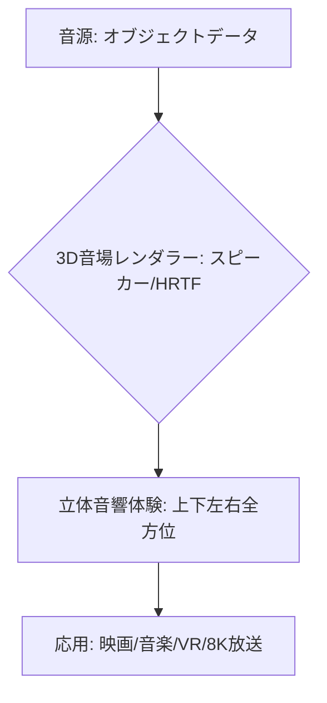

# T14-03-03 立体音響・空間オーディオ技術（Dolby Atmos/DTS:X）

## Summary（5つの要点）

1. **全方位の臨場感**: **上下左右全方位**から音が聞こえるように音場を再現する技術。従来のサラウンド（平面的な音場）に対し、**高さ方向**の情報を加えることで、**圧倒的な没入感**と**リアリティ**をコンテンツに付与する `(1)`。
2. **オブジェクトベースオーディオ**: **音源そのもの（オブジェクト）**を3次元空間上の**座標**として配置し、再生環境（スピーカー数）に応じてレンダリングする方式。**Dolby Atmos、DTS:X、MPEG-H 3D Audio**が主要な標準 `(2)`。
3. **多用途への展開**: 映画館や家庭用AV機器だけでなく、**音楽配信（Apple Music、Amazon Music）、ライブストリーミング、VR/ARコンテンツ、ゲーム**など、**メディア全般**での採用が加速。
4. **日本の動向**: **4K/8K放送**（T14-03-01）の**次世代音響規格**として採用されており、特にNHK技研が**22.2chマルチチャンネル音響**の研究をリードしている。
5. **パーソナライズ化**: ヘッドホンやイヤホンでも立体音響を実現するため、ユーザーの**頭部伝達関数（HRTF）**を用いた**パーソナライズドな音響補正**技術が重要となる。

#### 概念図

---

### 技術評価表（定量的な視点）
| 評価項目 | 評価 | 根拠 |
| :--- | :--- | :--- |
| 導入コスト | ⭐⭐⭐☆☆ | 制作環境は高コスト。再生機器（サウンドバー、対応ヘッドホン）は普及価格帯に移行 |
| 技術成熟度 | ⭐⭐⭐⭐⭐ | Dolby Atmos/DTS:Xは映画・音楽業界で事実上の標準。技術は成熟 |
| 日本の競争力 | ⭐⭐⭐⭐☆ | NHKの22.2ch技術が国際標準に貢献。AV機器メーカーの技術力も高い `(2)` |
| 市場性 | ⭐⭐⭐⭐⭐ | VR/メタバース、音楽配信の普及により、空間オーディオの需要は爆発的に増加 |
| 品質保証の重要性 | ⭐⭐⭐⭐⭐ | 音響の**定位感、遅延、再生環境による音質差**の最小化が体験の鍵 |
---

## 日本の立ち位置・強み弱みのSummary

### 強み：日本企業や研究機関が持つ独自の技術、優位性などを箇条書きで記述。

* **NHKの先導的な研究**: **NHK放送技術研究所**が開発した**22.2chマルチチャンネル音響**技術は、**8K放送**の音響規格として採用され、国際標準化に貢献している。
* **AV機器メーカーの技術力**: **ソニー、ヤマハ、パイオニア、デノン**などのAV機器メーカーが、**Dolby Atmos/DTS:X**対応の**サウンドバー、AVアンプ、ヘッドホン**において高い技術力を持つ。
* **コンテンツ制作のノウハウ**: アニメ、ゲーム、音楽などのコンテンツ制作分野で、立体音響を活かした**クリエイティブなノウハウ**が蓄積されつつある。

### 弱み：日本が抱える規制、標準化の遅れ、海外依存などを箇条書きで記述。

* **標準化の海外依存**: **オブジェクトベースオーディオ**の主流規格（Dolby Atmos、DTS:X）は**米国企業**が主導しており、技術ライセンス料などの面で海外依存度が高い。
* **制作人材の不足**: 立体音響コンテンツを**正確にミキシング・制作**できる**音響エンジニア**が、従来のステレオ/サラウンドエンジニアに比べて絶対的に不足している。
* **互換性の課題**: 異なる立体音響規格（Atmos, DTS:X, MPEG-H, 22.2ch）間の**互換性**を確保するための**メタデータ変換技術**の標準化が課題。

---

## 技術ロードマップ（短期/中期/長期）

### 短期目標（～2027年）

* **音楽ストリーミング、ライブ配信**における**空間オーディオ対応**を標準化し、対応コンテンツ数を大幅に増加。
* **TV内蔵スピーカー**や**サウンドバー**での**立体音響再生**の品質を向上させ、特別な機器なしで楽しめる環境を普及。
* **VR/ARデバイス**（T8-01-04）と連携し、**聴覚による没入感**を強化する技術を開発。

### 中期目標（2028年～2031年）

* **聴覚と視覚**（8K/自由視点）を統合した**「超臨場感メディア」**の制作技術を確立し、商用化。
* **AI**を活用し、**既存のステレオ音源**を**高品質な立体音響**に**リアルタイムで変換**する技術を実用化。
* **ユーザーの聴覚特性（HRTF）**を自動測定・補正し、**パーソナライズされた音場**を再現する技術を標準搭載。

### 長期目標（2032年～2035年）

* **音響情報**が**メタバース**（T8-01）や**デジタルツイン**（T14-02-04）に不可欠なデータとなり、**音のデジタルツイン**が実現。
* **脳波**（T8-02-04）や**生体情報**と連携し、ユーザーの**感情**に合わせた**音響空間**を**自律的に生成**する技術を実現。

### 📚 参照リンク

1. [Dolby Atmos技術解説 - Dolby](https://www.dolby.com/technologies/dolby-atmos/)
2. [NHK 22.2chマルチチャンネル音響 - NHK技研](https://www.nhk.or.jp/strl/)
3. [空間オーディオと音楽ストリーミング - Apple Music](https://www.apple.com/jp/apple-music/)
4. [DTS:X技術と応用 - DTS](https://www.dts.com/)