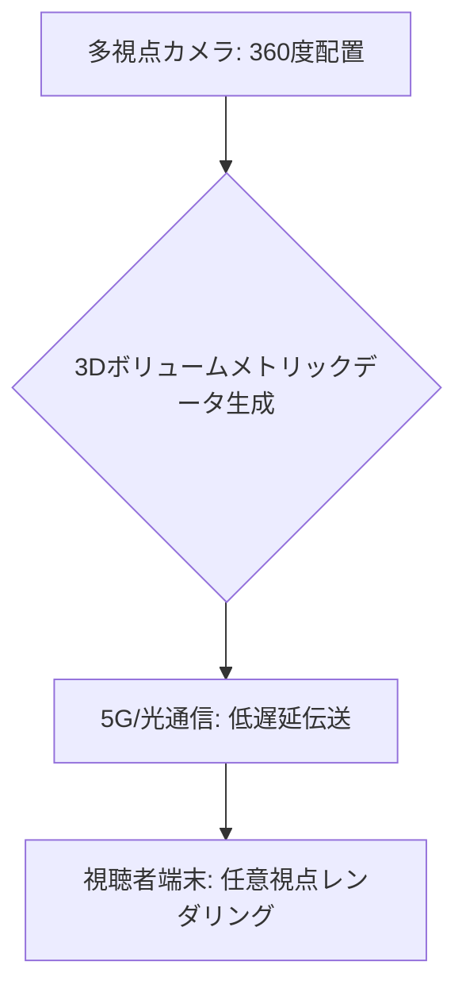

# T14-03-04 自由視点映像・多視点ライブ配信

## Summary（5つの要点）

1. **視点の自由**: スタジアムやライブ会場に**数十台～数百台のカメラ**を設置し、その映像データから**任意の角度**や**任意の場所**からの映像を**リアルタイム**で再構成し、視聴者に提供する技術 `(1)`。
2. **ボリュームメトリック技術**: 複数カメラの画像から**被写体の3D空間情報**（形状、テクスチャ、動作）を**データ化（ボリュームメトリックデータ）**し、視聴者側のデバイスで自由に視点を変えて映像をレンダリングする。
3. **応用分野**: **スポーツ中継**（リプレイ時の選手目線、コート上の任意視点）、**eスポーツ、コンサート、ファッションショー**など、**没入感**と**ユーザーの能動性**が求められるライブコンテンツ。
4. **高速通信の利用**: 膨大な量のカメラデータを処理し、**低遅延**で視聴者に届けるため、**5G**（T14-02-03）や**光ファイバー網**といった**超高速・大容量通信**が不可欠 `(2)`。
5. **先行開発事例**: **Intel True View**（NBA、MLB、NFLなどで採用）、**キヤノンのFree Viewpoint Video System**が代表的。リアルタイム処理の**高速化**と**データ量の削減**が鍵。

#### 概念図

---

### 技術評価表（定量的な視点）
| 評価項目 | 評価 | 根拠 |
| :--- | :--- | :--- |
| 導入コスト | ⭐⭐☆☆☆ | 多数のカメラ、専用の高速処理サーバー、高帯域ネットワークが必要 |
| 技術成熟度 | ⭐⭐⭐⭐☆ | 技術は確立。商用化は大規模なスポーツイベントで進んでいる |
| 日本の競争力 | ⭐⭐⭐⭐⭐ | **キヤノン**の映像システム、**NTT**の5G・光通信技術で世界をリード `(1)` |
| 市場性 | ⭐⭐⭐⭐⭐ | ライブエンターテイメント、スポーツ中継の**キラーコンテンツ**として需要が高い |
| 品質保証の重要性 | ⭐⭐⭐⭐⭐ | **視点変更時の遅延**、**3D再構成の継ぎ目**、**画質の安定性**が視聴体験に直結 |
---

## 日本の立ち位置・強み弱みのSummary

### 強み：日本企業や研究機関が持つ独自の技術、優位性などを箇条書きで記述。

* **映像機器技術**: **キヤノン、ソニー**などのカメラ・レンズメーカーが、自由視点映像の取得に必要な**高精度な同期カメラシステム**や**映像処理技術**に強みを持つ。
* **通信インフラ**: **NTT**などが、自由視点映像の膨大なデータをリアルタイムで伝送・処理するための**5G/ローカル5G**（T14-02-03）や**光通信ネットワーク**技術を保有。
* **コンテンツとの融合**: **eスポーツ、音楽ライブ**などの高品質なコンテンツ制作力と、自由視点映像技術を組み合わせる**応用ノウハウ**が豊富。

### 弱み：日本が抱える規制、標準化の遅れ、海外依存などを箇条書きで記述。

* **ボリュームメトリック処理のプラットフォーム依存**: 3D再構成やレンダリングの**コアソフトウェアプラットフォーム**が、**Intel True View**などの海外勢に依存している側面がある。
* **データ処理のボトルネック**: カメラ台数が増えるほど**リアルタイムなデータ処理（GPU処理）**が困難になり、大規模システムにおける**処理速度**の限界が課題。
* **受信端末の性能要求**: 視聴者側の端末（スマホ、PC、VRデバイス）に**高度なグラフィック処理能力**が要求され、普及を妨げる要因となる可能性がある。

---

## 技術ロードマップ（短期/中期/長期）

### 短期目標（～2027年）

* **5G/ローカル5G**（T14-02-03）の高速大容量通信を活かし、**大規模スポーツイベント**での**自由視点ライブ配信**を商用化。
* **カメラ設置・キャリブレーション**の**自動化技術**を開発し、制作コストを大幅に削減。
* **VR/ARデバイス**（T8-01-04）での**自由視点体験**を標準化。

### 中期目標（2028年～2031年）

* 自由視点映像を**デジタルツイン**（T14-02-04）と統合し、**リアルタイムな物理シミュレーション**と連携した**インタラクティブコンテンツ**を開発。
* **AI**を活用し、**カメラ設置位置の最適化**、**3D再構成の自動補正**、**データ量の削減**を実現。
* **8K映像**（T14-03-01）と**立体音響**（T14-03-03）を統合した**「超臨場感メディア」**の制作技術を確立。

### 長期目標（2032年～2035年）

* **汎用的なボリュームメトリックデータフォーマット**が国際標準となり、メタバース（T8-01）や**ホログラムディスプレイ**への配信が標準化。
* 自由視点映像技術が、**遠隔医療**（手術のリアルタイム共有）や**高度な産業検査**にも応用される。

### 📚 参照リンク

1. [キヤノンの自由視点映像システム - Canon Global](https://global.canon/ja/v-system/)
2. [Intel True Viewとスポーツ中継 - Intel Sports](https://www.intel.com/content/www/us/en/sports/true-view.html)
3. [NTTの自由視点映像伝送技術 - NTT R&D](https://www.ntt.co.jp/)
4. [NHKの多視点映像技術 - NHK技研](https://www.nhk.or.jp/strl/)