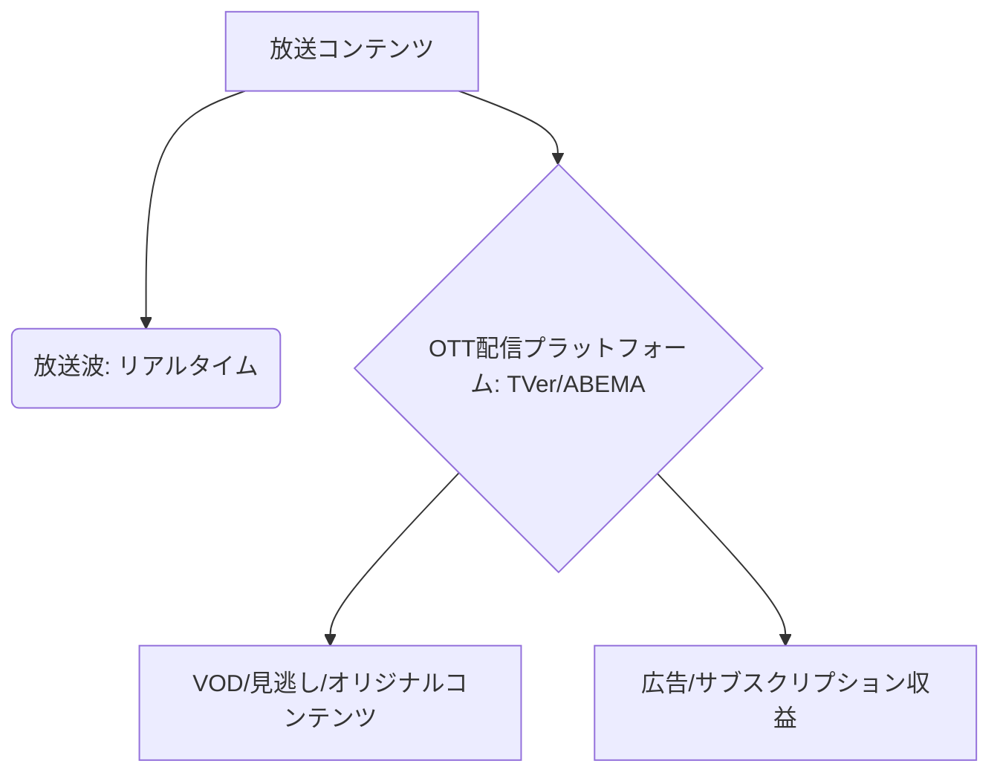

# T14-03-05 放送・配信プラットフォーム統合（TVer、ABEMAモデル）

## Summary（5つの要点）

1. **OTTとの融合**: 従来の**放送波**によるリアルタイム視聴に加え、インターネット経由の**OTT（Over-The-Top）配信**を統合し、**見逃し配信、アーカイブ視聴**を可能にするプラットフォーム `(1)`。
2. **TVerモデル**: **日本民放各社**が連携し、**無料の見逃し配信**を広告収益モデルで提供する共同プラットフォーム。視聴者の**利便性向上**と、**広告市場の拡大**を両立。
3. **ABEMAモデル**: インターネット専業で、**ニュース、スポーツ、オリジナルコンテンツ**を24時間配信。**基本無料**（広告ベース）と**有料サブスクリプション**（ABEMAプレミアム）を組み合わせた収益モデルを持つ。
4. **コンテンツライフサイクルの最大化**: 放送コンテンツを**配信プラットフォーム**に展開することで、**コンテンツの視聴機会**と**収益機会**を最大化し、**若年層のテレビ離れ**に対応する `(2)`。
5. **データ活用**: 配信プラットフォームで得られる**視聴者データ**（視聴時間、離脱率、属性）を分析し、**番組制作、コンテンツ調達、ターゲティング広告**に活用する。

#### 概念図

---

### 技術評価表（定量的な視点）
| 評価項目 | 評価 | 根拠 |
| :--- | :--- | :--- |
| 導入コスト | ⭐⭐⭐☆☆ | 配信インフラ（CDN）、データ分析システム、DRM（著作権管理）の投資が必要 |
| 技術成熟度 | ⭐⭐⭐⭐⭐ | TVer, ABEMAは大規模トラフィックを安定処理。技術は成熟 |
| 日本の競争力 | ⭐⭐⭐⭐⭐ | **TVer、ABEMA**は海外勢（Netflix、Amazon）と異なる独自の**協調モデル**で成功 `(1)` |
| 市場性 | ⭐⭐⭐⭐⭐ | 放送業界の**収益構造変革、DX推進**に不可欠な基盤 |
| 品質保証の重要性 | ⭐⭐⭐⭐⭐ | **大規模アクセス時の安定性**、**著作権保護（DRM）**の確実な実行が必須 |
---

## 日本の立ち位置・強み弱みのSummary

### 強み：日本企業や研究機関が持つ独自の技術、優位性などを箇条書きで記述。

* **国内コンテンツの強さ**: **アニメ、ドラマ、バラエティ**など、放送局が保有する**高品質なコンテンツ資産**が、配信プラットフォームの強力な牽引役となっている。
* **協調と競争のモデル**: **TVer**のように、複数の競合する放送局が**共通の配信プラットフォーム**を構築・運用する**協調モデル**は、世界でもユニークな成功例。
* **安定した配信技術**: 大規模なトラフィックを処理するための**CDN（Content Delivery Network）技術**や、**著作権管理（DRM）技術**において高い運用ノウハウを持つ。

### 弱み：日本が抱える規制、標準化の遅れ、海外依存などを箇条書きで記述。

* **海外プラットフォームとの競争**: **Netflix、Amazon Prime Video、Disney+**といったグローバルプラットフォームに比べ、**オリジナルコンテンツ制作への投資規模**で劣後する。
* **データ活用の遅れ**: 視聴者データの収集・分析は進んでいるが、それを**リアルタイムな番組制作**や**高度な広告ターゲティング**に活かす**データドリブンな意思決定**の文化が遅れている。
* **地域放送局との連携**: 全国すべての地域放送局との**システム連携**や**収益分配**の仕組みが複雑であり、ローカルコンテンツの配信拡大が課題。

---

## 技術ロードマップ（短期/中期/長期）

### 短期目標（～2027年）

* **配信プラットフォーム**における**高画質化（4K/8K）**と**立体音響**（T14-03-03）の標準対応を完了。
* **IP放送**（T14-03-02）と連携し、**テレビのリモコン操作**で**シームレスに配信サービス**を起動できる環境を実現。
* **AI**を活用した**レコメンデーションエンジン**の精度を向上させ、視聴者の**パーソナライズ**を強化。

### 中期目標（2028年～2031年）

* 配信データに基づき、**視聴率だけでなく収益貢献度**を最大化する**コンテンツ制作・編成システム**を導入。
* **ブロックチェーン**（T16-02-01）技術を応用し、**コンテンツの著作権管理、二次利用、広告収益の分配**の透明性を確保。
* **自由視点映像**（T14-03-04）などの**インタラクティブコンテンツ**に対応した配信規格を標準化。

### 長期目標（2032年～2035年）

* 放送と配信が完全に統合された**「メディアクラウド」**が標準となり、ユーザーは**単一のID**で全てのコンテンツにアクセス可能に。
* **AI**が視聴者の**気分や状況**を検知し、**最適なコンテンツ**を**リアルタイムにキュレーション・パーソナライズ**して提供。

### 📚 参照リンク

1. [TVerの事業戦略と技術基盤 - TVer](https://tver.jp/)
2. [ABEMAのプラットフォーム戦略 - AbemaTV](https://abema.tv/)
3. [放送コンテンツのインターネット配信に関する政策 - 総務省](https://www.soumu.go.jp/)
4. [DRMとコンテンツ保護技術の動向 - DCI](https://www.dcimovies.com/)