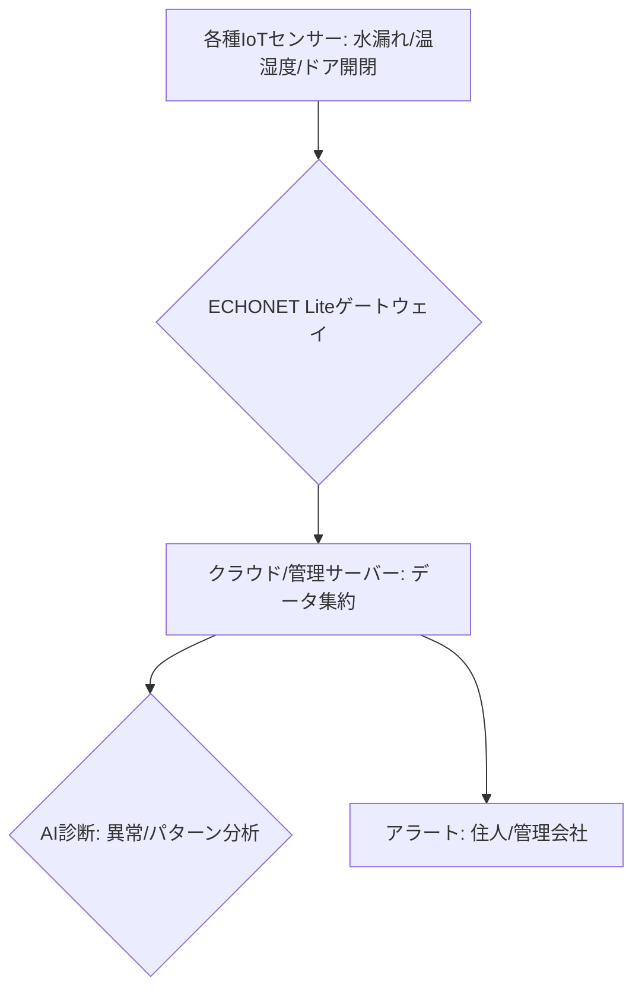

# T14-04-01 住宅IoTセンサーネットワーク

## Summary（5つの要点）

1. **常時監視システム**: 住宅内に設置された**多種多様なIoTセンサー**（温湿度、照度、水漏れ、ガス漏れ、ドア・窓開閉、消費電力など）が、居住空間と設備の状況を**24時間常時監視**する `(1)`。
2. **異常検知とアラート**: 監視データに**設定値を超えた異常**（例: 水漏れ、CO/ガス漏れ、不審なドア開閉）を検知した場合、**住人、セキュリティ会社、管理会社**に**即座にアラート**を送信し、早期対応を促す。
3. **相互接続性（ECHONET Lite）**: 異なるメーカーの家電製品や住宅設備を**相互に接続・連携**させるための**日本独自の通信規格**（ECHONET Lite）を採用。これにより、スマートホームシステムの**拡張性**を担保する `(2)`。
4. **応用分野**: **防犯・防災**（火災、水害、侵入）、**高齢者・見守り**（活動量、温湿度）、**エネルギー管理**（T14-04-04）など、生活全般の**安全性と利便性の向上**に貢献。
5. **データ連携**: センサーデータを**クラウドやエッジゲートウェイ**（T14-02-01）に集約し、**AIによる劣化診断**（T14-04-02）や**詳細な生活パターン分析**の基盤となる。

#### 概念図

---

### 技術評価表（定量的な視点）
| 評価項目 | 評価 | 根拠 |
| :--- | :--- | :--- |
| 導入コスト | ⭐⭐⭐⭐☆ | センサー単体は安価。システム全体の構築・設置費用が必要 |
| 技術成熟度 | ⭐⭐⭐⭐⭐ | センサー技術、無線通信は成熟。ECHONET Lite対応製品が多数流通 |
| 日本の競争力 | ⭐⭐⭐⭐⭐ | **ECHONET Lite**を基盤とした**スマートホーム分野**では、パナソニック、LIXILなどが強み `(2)` |
| 市場性 | ⭐⭐⭐⭐⭐ | **高齢化社会**における**見守り**、**住宅の資産価値維持**に不可欠 |
| 品質保証の重要性 | ⭐⭐⭐⭐⭐ | 水漏れ・ガス漏れ検知の**誤検知率、検出遅延**が、**安全性の評価**に直結 |
---

## 日本の立ち位置・強み弱みのSummary

### 強み：日本企業や研究機関が持つ独自の技術、優位性などを箇条書きで記述。

* **国内標準規格の確立**: **ECHONET Lite**は、電力会社、家電メーカー、住宅メーカーが広く採用する**日本発のホームネットワーク標準**であり、相互接続性（インターオペラビリティ）に優れる。
* **住宅設備との深い連携**: **パナソニック、LIXIL**などの総合住宅メーカーが、**建材、設備**（窓、ドア、給湯器）に**IoTセンサー**を組み込んだ**スマートホームシステム**を開発・提供している。
* **高齢者見守りサービス**: 少子高齢化が進む日本において、**IoTセンサー**を活用した**高齢者や一人暮らしの安否確認・緊急通知サービス**が充実している。

### 弱み：日本が抱える規制、標準化の遅れ、海外依存などを箇条書きで記述。

* **プラットフォーム競争力**: **Amazon Alexa、Google Home、Apple HomeKit**といった**OSレベルのスマートホームプラットフォーム**は海外勢に支配されており、日本独自規格の**国際展開**に課題がある。
* **セキュリティ対策**: ネットワークに接続されるエッジデバイスの増加に伴い、**各センサーの認証**や**通信暗号化**といった**エッジセキュリティ**（T14-02-05）の徹底が課題。
* **導入コストの壁**: 既存住宅への**レトロフィット**（後付け）において、**設置費用や通信環境整備**のコストが、一般家庭への普及を妨げる一因となっている。

---

## 技術ロードマップ（短期/中期/長期）

### 短期目標（～2027年）

* **AI**を活用した**センサーデータの誤検知削減**と**パターン異常検知**の精度向上。
* **スマートメーター**（T14-04-05）や**HEMS**（T14-04-04）とセンサーネットワークの**データ連携**を標準化し、エネルギー管理の効率化を推進。
* **スマートロック**（T14-04-03）と連携した**防犯・入退室管理**の統合システムを普及。

### 中期目標（2028年～2031年）

* 住宅内の**全ての設備・建材**にIoTセンサーが組み込まれ、**住宅のデジタルツイン**（T14-02-04）が実現。
* **AI**が住人の**生活習慣**を学習し、**温湿度、照度、換気**などを**自律的に最適制御**するシステムの普及。
* センサーデータが**保険会社、住宅管理会社**と連携し、**保険料やメンテナンス費用**に反映されるモデルを構築。

### 長期目標（2032年～2035年）

* 住宅が**自律的に自己診断・自己修復**を行い、**ホームメンテナンスが完全に自動化**された社会の実現。
* センサーデータと**医療・介護データ**が連携し、住宅が**健康維持・増進**に貢献する**「ヘルスケア・スマートホーム」**が標準化。

### 📚 参照リンク

1. [スマートホームのIoTセンサー活用 - Panasonic](https://panasonic.jp/)
2. [ECHONET Lite規格の概要と標準化 - ECHONETコンソーシアム](https://www.echonet.jp/)
3. [スマートホームセキュリティの動向 - LIXIL](https://www.lixil.co.jp/)
4. [IoTセンサーによる見守りサービス - 積水ハウス](https://www.sekisuihouse.co.jp/)