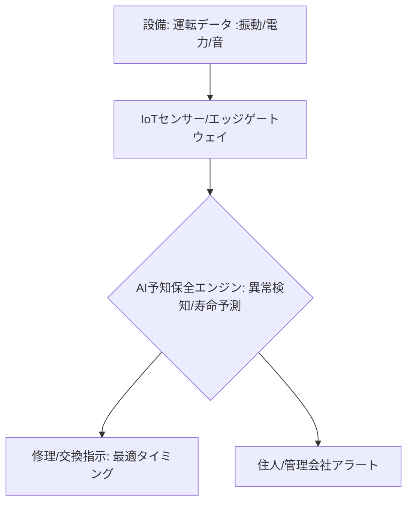

# T14-04-02 AIによる設備劣化診断・予知保全

## Summary（5つの要点）

1. **故障の事前予測**: エアコン、給湯器、換気扇、エレベーター、太陽光発電設備などの**動作データ**（振動、異音、温度、消費電力、稼働時間）を**IoTセンサー**で収集し、**AI**が**故障の兆候**をリアルタイムで分析・予測する技術 `(1)`。
2. **予知保全（PdM）**: 従来の**事後保全**（故障後の修理）や**定期保全**（時間経過による交換）に対し、AIの予測に基づいて**最適なタイミング**で部品交換や修理を行う。これにより、**突然の故障を回避**し、**メンテナンスコストを最適化**。
3. **AI解析モデル**: **深層学習（Deep Learning）**や**異常検知アルゴリズム**を活用し、正常時のパターンから逸脱する**微細な変化**を捉える。特に**異音・振動解析**が主要な手段 `(2)`。
4. **業務効率化**: マンション管理組合、ビル管理会社、賃貸住宅管理会社にとって、**巡回点検の負担**を軽減し、**故障対応の緊急出動**を削減できるため、**業務効率**が大幅に向上。
5. **メーカーの強み**: **ダイキン**（エアコン）、**三菱電機**（エレベーター、給湯器）、**パナソニック**（住宅設備）など、設備メーカーが持つ**膨大な運転データ**と**専門知識**がAIモデルの精度向上に不可欠。

#### 概念図

---

### 技術評価表（定量的な視点）
| 評価項目 | 評価 | 根拠 |
| :--- | :--- | :--- |
| 導入コスト | ⭐⭐⭐☆☆ | センサー設置、AIプラットフォーム構築、データ蓄積・学習費用が必要 |
| 技術成熟度 | ⭐⭐⭐⭐☆ | 産業機械では成熟。住宅設備への適用が加速中 |
| 日本の競争力 | ⭐⭐⭐⭐⭐ | **ダイキン、三菱電機**など、高品質な設備メーカーがデータとノウハウで世界をリード `(1)` |
| 市場性 | ⭐⭐⭐⭐⭐ | メンテナンスコスト削減、住宅の**資産価値維持**、**サービス品質向上**に不可欠 |
| 品質保証の重要性 | ⭐⭐⭐⭐⭐ | 故障予測の**精度（適合率/再現率）**が、**修理コスト、顧客満足度**に直結 |
---

## 日本の立ち位置・強み弱みのSummary

### 強み：日本企業や研究機関が持つ独自の技術、優位性などを箇条書きで記述。

* **高品質な設備とデータ蓄積**: **長寿命かつ高品質な住宅設備**（エアコン、エレベーターなど）のメーカーが多く、**膨大な正常時・異常時の運転データ**を保有している。
* **センサー技術の応用**: **高感度な振動・音響センサー**の技術力が高く、微細な劣化の兆候を捉えることに優れている。
* **OT（制御技術）との連携**: 制御系（OT）に精通したエンジニアが多く、**AIの予測結果**を**設備の制御システム**にフィードバックする技術（デジタルツイン、T14-02-04）の応用が進んでいる。

### 弱み：日本が抱える規制、標準化の遅れ、海外依存などを箇条書きで記述。

* **データのサイロ化**: 異なる設備メーカー間、あるいは設備と住宅管理会社との間で**データ連携**が進んでおらず、**包括的な予知保全**の実現が難しい。
* **AI人材不足**: 膨大な時系列データを分析し、**汎用的な劣化予測モデル**を開発・運用できる**データサイエンティスト**や**AIエンジニア**が不足している。
* **既設設備への対応**: 既に設置されている**古い設備**に後付けでIoTセンサーやAI診断システムを導入する**レトロフィット**のコストが高く、普及を妨げている。

---

## 技術ロードマップ（短期/中期/長期）

### 短期目標（～2027年）

* **主要な設備**（HVAC、給湯器）における**AI予知保全システム**の導入を、大規模マンション・ビルで標準化。
* **AI**による**異音・振動解析**の精度を向上させ、**軽微な劣化**の段階でのアラート発報を実現。
* **HEMS**（T14-04-04）などの**エネルギーデータ**を予知保全AIに組み込み、**電力消費パターン**からの劣化診断を開始。

### 中期目標（2028年～2031年）

* 予知保全システムと**デジタルツイン**（T14-02-04）を連携させ、**AIが予測した劣化状況**を**仮想空間**で再現し、**メンテナンス計画を最適化**。
* **ローカル5G**（T14-02-03）などの**無線通信**を活用し、**遠隔地**や**特殊環境下**にある設備（例: 橋梁、トンネル）への**AI予知保全**を拡大。
* **サービスロボット**による**点検データの自動収集**とAI診断へのフィードバックを実用化。

### 長期目標（2032年～2035年）

* 住宅設備が**AI予測**に基づいて**部品を自己発注・自己交換**する**自律的なメンテナンスシステム**が実現。
* **住宅設備の寿命**がAIにより正確に予測され、**住宅売買時の査定**や**保険料**に自動的に反映される社会インフラを構築。

### 📚 参照リンク

1. [AI活用による機器の予知保全 - ダイキン工業](https://www.daikin.co.jp/csr/report/ai_oem.html)
2. [AIを活用したエレベーターの予知保全 - 三菱電機](https://www.mitsubishielectric.co.jp/)
3. [IoTと予知保全の動向 - 経済産業省](https://www.meti.go.jp/)
4. [住宅設備のスマートメンテナンス - Panasonic](https://panasonic.jp/)