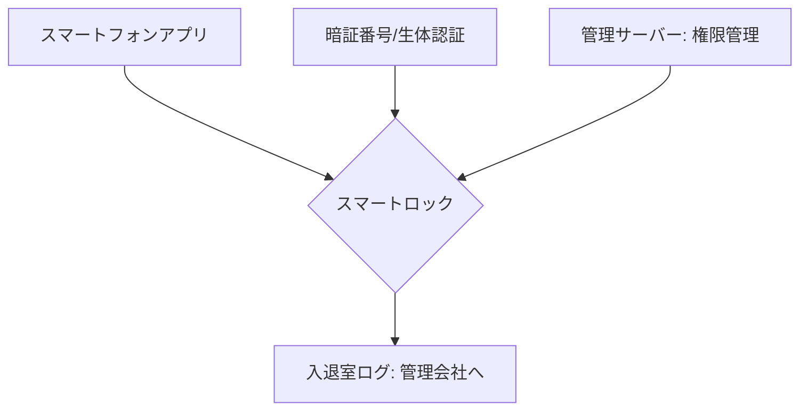

# T14-04-03 スマートロック・遠隔入退室管理

## Summary（5つの要点）

1. **鍵のデジタル化**: 従来の物理鍵を使用せず、**スマートフォンアプリ、暗証番号、ICカード、生体認証（指紋、顔）**などで解錠できる**次世代のドアロックシステム** `(1)`。
2. **遠隔での権限管理**: 住宅所有者や管理会社が、**時間や期間を限定**して**入室権限**を**遠隔地から発行・取り消し**できる。これにより、鍵の受け渡しや紛失リスクを解消。
3. **応用シーン**: **民泊（Airbnb）、シェアオフィス、レンタルスペース**など、**不特定多数**の利用者が一時的にアクセスする必要があるサービスに不可欠。また、**宅配ボックス**や**置き配**のセキュリティ向上にも寄与。
4. **日本の主要プレイヤー**: **Qrio**（ソニー系）、**Sadiot**（ミネベアミツミ系）、**Akerun**（フォトシンス）など、**高いセキュリティ基準**と**日本特有のドア形状**に対応した製品が展開されている。
5. **連携と利便性**: **IoTセンサーネットワーク**（T14-04-01）と連携し、**入退室履歴**を記録・管理する。**Amazon Key**（配達員の一時的な入室許可）などの**新しい物流サービス**との連携も進む。

#### 概念図

---

### 技術評価表（定量的な視点）
| 評価項目 | 評価 | 根拠 |
| :--- | :--- | :--- |
| 導入コスト | ⭐⭐⭐⭐☆ | 後付け型は安価。埋め込み型は高価だが、利便性が高い |
| 技術成熟度 | ⭐⭐⭐⭐⭐ | 通信技術、認証技術は成熟。セキュリティ信頼性の確立が課題 |
| 日本の競争力 | ⭐⭐⭐⭐⭐ | Qrio、Akerunなど、独自の製品開発とサービスモデルで強み `(1)` |
| 市場性 | ⭐⭐⭐⭐⭐ | 民泊、シェアリングエコノミー、置き配の普及により需要が爆発的に増加 |
| 品質保証の重要性 | ⭐⭐⭐⭐⭐ | **セキュリティ（不正アクセス防止）**と**通信障害時の動作保証**が最重要 |
---

## 日本の立ち位置・強み弱みのSummary

### 強み：日本企業や研究機関が持つ独自の技術、優位性などを箇条書きで記述。

* **高いセキュリティ要件への対応**: **日本の住宅・錠前の複雑な規格**に対応しつつ、**金融機関レベルの暗号化技術**を用いた**セキュリティチップ**の搭載が進んでいる。
* **後付け（レトロフィット）の容易さ**: 既存のドアの**加工なし**で設置できる**「後付け型」**スマートロックの技術が進んでおり、普及の障壁が低い。
* **サービス連携の柔軟性**: **Amazon Key**などの**新たな物流サービス**や、**高齢者見守りサービス**との連携が積極的に進められている。

### 弱み：日本が抱える規制、標準化の遅れ、海外依存などを箇条書きで記述。

* **電池切れ・通信障害リスク**: 電源を内蔵電池に頼る製品が多く、**電池切れや無線通信障害時**の**物理的な解錠手段**の確保と、その信頼性担保が課題。
* **個人情報保護**: **入退室履歴**という**機微な個人情報**の**収集・管理・利用**に関する**プライバシー保護**の法規制・ガイドライン整備が追い付いていない。
* **IoTプラットフォームの乱立**: 複数のスマートロックメーカーが独自のクラウドサービスを提供しており、**異なるシステム間の連携**や**データ標準化**が遅れている。

---

## 技術ロードマップ（短期/中期/長期）

### 短期目標（～2027年）

* **顔認証、虹彩認証**などの**生体認証技術**を搭載したスマートロックを普及させ、**ハンズフリー**での解錠を一般化。
* **マンション、オフィスビル**での**一括管理システム**を導入し、**清掃員、点検業者**への**時限制限付きのアクセス権発行**を標準化。
* **エッジセキュリティ**（T14-02-05）技術を導入し、**不正アクセス検知**をデバイス内でリアルタイム実行。

### 中期目標（2028年～2031年）

* **ブロックチェーン・分散型ID（DID）**（T16-02-01）を活用し、**入退室権限**を**自己主権型**で管理する**高信頼性システム**を構築。
* **スマートホームのAI**が、**住人の帰宅パターン**を学習し、**鍵の施錠忘れ**を自動で補正する**自律制御**を実現。
* **宅配ドローン**（T19-10）や**自動運転車**との連携により、**物品の受け渡し**や**車両の入庫管理**を完全に自動化。

### 長期目標（2032年～2035年）

* **住宅、車、オフィス**など、**すべての物理的なアクセスポイント**が**単一のデジタルID**で管理される**ゼロトラストアクセス社会**を実現。
* **鍵そのものが消滅**し、**場所、時間、人の属性**に応じて**入退室権限**が**AIによって自動付与・剥奪**される仕組みが社会インフラ化。

### 📚 参照リンク

1. [スマートロック Qrio Lock - Qrio](https://qrio.me/smartlock/)
2. [スマートロック Akerunによる入退室管理 - Photosynth](https://akerun.com/)
3. [Amazon Keyとスマートロックの連携 - Amazon Japan](https://www.amazon.co.jp/)
4. [住宅IoTセキュリティガイドライン - 経済産業省](https://www.meti.go.jp/)