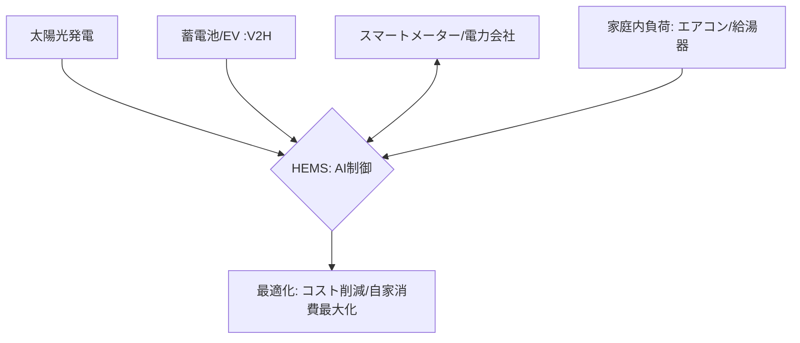

# T14-04-04 ホームエネルギー管理システム（HEMS）

## Summary（5つの要点）

1. **エネルギーの最適制御**: 太陽光発電、蓄電池、EV充電器、エアコン、給湯器、照明などの**住宅内のエネルギー機器**をネットワークで接続し、**電力使用量**と**発電量**を**集中管理・最適制御**するシステム `(1)`。
2. **電力コストの削減**: **電力価格（市場価格）**や**天気予報**、**家庭内の使用パターン**をAIで予測し、**電力価格が安い時間帯**に蓄電、**高い時間帯**に蓄電池からの放電や自家消費を促す。
3. **再生可能エネルギーの活用**: 太陽光発電などの**再生可能エネルギー**の**自家消費率**を最大化し、**CO2排出量の削減**と**電気代の節約**を両立。特に**FIT（固定価格買取制度）終了後**の家庭で重要性が増している。
4. **V2H（Vehicle to Home）**: **電気自動車（EV）**を**家庭用蓄電池**として活用し、**EVのバッテリー**に貯めた電力を家庭で利用したり、系統に送電したりする機能。EVの普及と連動し、**エネルギー供給の柔軟性**を向上させる `(2)`。
5. **応用と連携**: **スマートメーター**（T14-04-05）を経由して電力会社や**スマートグリッド**（T18-02-04）と連携し、家庭のエネルギーを**地域全体の電力需給調整**（デマンドレスポンス）に貢献させる。

#### 概念図

---

### 技術評価表（定量的な視点）
| 評価項目 | 評価 | 根拠 |
| :--- | :--- | :--- |
| 導入コスト | ⭐⭐☆☆☆ | 機器（HEMSコントローラ、蓄電池、V2H充放電器）が高価 |
| 技術成熟度 | ⭐⭐⭐⭐☆ | 機器連携規格（ECHONET Lite）は確立。AI最適制御の高度化が進行中 |
| 日本の競争力 | ⭐⭐⭐⭐⭐ | **パナソニック、シャープ、三菱電機**など、機器メーカーがシステム全体で強み `(1)` |
| 市場性 | ⭐⭐⭐⭐⭐ | **脱炭素社会**、**電力自由化**、**EV普及**に伴い、全家庭への普及が必須 |
| 品質保証の重要性 | ⭐⭐⭐⭐⭐ | 電力系統との**接続安定性**、**デマンドレスポンス**への確実な応答が必須 |
---

## 日本の立ち位置・強み弱みのSummary

### 強み：日本企業や研究機関が持つ独自の技術、優位性などを箇条書きで記述。

* **機器の互換性標準**: **ECHONET Lite**（T14-04-01）規格により、異なるメーカーの太陽光、蓄電池、HEMSが**高いレベルで相互接続**できる環境が整備されている。
* **V2H技術の先行**: **トヨタ、日産**といった自動車メーカーと**シャープ、ニチコン**などの機器メーカーが連携し、**EVを活用したエネルギー管理**（V2H）技術で世界をリードしている `(2)`。
* **蓄電池技術**: **リチウムイオン電池**の製造技術や、それを安全に管理するための**BMS（バッテリー管理システム）**の技術力が高い。

### 弱み：日本が抱える規制、標準化の遅れ、海外依存などを箇条書きで記述。

* **AI最適制御の高度化**: **デマンドレスポンス**や**複雑な電力市場価格**に対応するための**AI予測モデル**の**精度**と**リアルタイム性**の向上が課題。
* **導入コスト**: HEMS導入には、コントローラーに加え、**蓄電池や太陽光発電設備、V2H機器**といった高価な初期投資が必要。
* **セキュリティ対策**: HEMSが電力系統と接続されることで、**サイバー攻撃**による**電力インフラへの影響**リスクが増大し、**エッジセキュリティ**（T14-02-05）の強化が急務。

---

## 技術ロードマップ（短期/中期/長期）

### 短期目標（～2027年）

* **AI**による**電力市場価格予測**と**家庭内負荷予測**の精度を向上させ、電力コスト削減効果を**年間10%以上**に引き上げ。
* **V2H機器**の価格を大幅に引き下げ、**EV購入者**への**HEMSセット導入**を推進。
* **HEMS**と**住宅IoTセンサー**（T14-04-01）の連携を強化し、**在宅状況や天気**に応じた**きめ細やかなエネルギー制御**を実現。

### 中期目標（2028年～2031年）

* HEMSが**スマートグリッド**（T18-02-04）の**分散型電源**として機能し、**地域全体の電力需給バランス調整**に自動で参加する**VPP（Virtual Power Plant）**を全国展開。
* **家庭用燃料電池（エネファーム）**や**水素エネルギー**と連携し、電力だけでなく**熱エネルギー**も統合管理するシステムを開発。
* **AI**が**設備の劣化状況**（T14-04-02）も考慮に入れ、**エネルギー最適化**と**予知保全**を両立する制御を実現。

### 長期目標（2032年～2035年）

* **各家庭**が**自律的なエネルギー基地**となり、電力系統に完全に依存せず、**再生可能エネルギー**だけで生活できる**カーボンニュートラルな住宅**が標準化。
* **EV、HEMS、スマートメーター**が**シームレスに連携**し、エネルギーの**売買、取引**が**ブロックチェーン**（T16-02-01）で自動実行される社会の実現。

### 📚 参照リンク

1. [HEMSとスマートライフ - Panasonic](https://panasonic.jp/smart/hems.html)
2. [V2HシステムとEVの活用 - シャープ](https://jp.sharp/)
3. [スマートグリッドとデマンドレスポンス - 経済産業省](https://www.meti.go.jp/)
4. [ニチコンのV2Hシステム - Nichicon](https://www.nichicon.co.jp/)