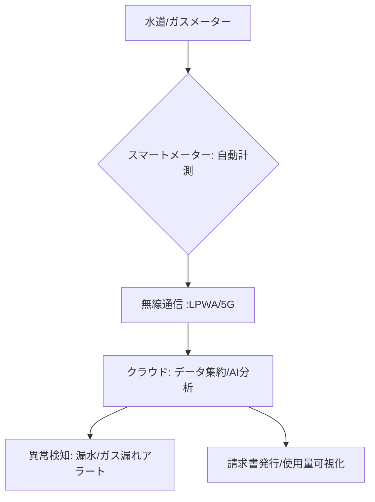

# T14-04-05 水道・ガス自動検針・使用量モニタリング

## Summary（5つの要点）

1. **検針の自動化**: **スマートメーター**を水道・ガスのメーターに設置し、使用量を**自動的**に計測し、**無線通信（LPWA、5G）**でクラウドにデータを送信。これにより、**検針員の訪問が不要**になる `(1)`。
2. **リアルタイムモニタリング**: 使用量のデータを**30分〜数時間ごと**といった**高い頻度**で取得可能になり、家庭や事業所での**詳細な使用パターン**の**リアルタイム確認**が可能になる。
3. **異常検知・漏水対策**: 通常の使用パターンと異なる**異常な継続使用**（例: 夜間、不在時の水の流れ）を**AIで自動検知**し、**水漏れやガス漏れ**の**早期発見・早期対応**に貢献する `(2)`。
4. **業務効率化**: 水道局やガス会社にとって、**検針業務のコスト削減**、**請求業務の効率化**、**メーター故障の早期発見**、**災害時の情報収集**など、オペレーション全体の効率が向上。
5. **日本の普及目標**: **東京ガス、大阪ガス、水道局**などがスマートメーターの導入を推進しており、**2030年**を目途に**全戸への普及**を目指す。電力スマートメーター（HEMSの基盤）に続くインフラのDXとなる。

#### 概念図

---

### 技術評価表（定量的な視点）
| 評価項目 | 評価 | 根拠 |
| :--- | :--- | :--- |
| 導入コスト | ⭐⭐⭐☆☆ | メーター本体、通信インフラ（LPWA基地局）の設置費用が必要 |
| 技術成熟度 | ⭐⭐⭐⭐☆ | 電力スマートメーターで技術は成熟。水道・ガスへの適用が拡大中 |
| 日本の競争力 | ⭐⭐⭐⭐☆ | 東京ガスなど都市ガス会社、メーターメーカーが世界水準の技術を保有 `(1)` |
| 市場性 | ⭐⭐⭐⭐⭐ | **労働力不足**、**インフラ老朽化対策**として、全戸普及が急務 |
| 品質保証の重要性 | ⭐⭐⭐⭐⭐ | 計測の**正確性（検定制度）**と、**ガス漏れ検知の信頼性**が最重要 |
---

## 日本の立ち位置・強み弱みのSummary

### 強み：日本企業や研究機関が持つ独自の技術、優位性などを箇条書きで記述。

* **高い計測技術**: **水道、ガス**のメーターにおける**耐久性、信頼性、計測精度**は世界トップクラス。特にガス供給における**高度な安全性**確保のノウハウを持つ。
* **LPWA通信の活用**: **LoRaWAN、Sigfox**などの**LPWA（Low Power Wide Area）通信技術**を活用した**低コストかつ広範囲**のデータ収集ネットワーク構築が進んでいる。
* **災害対応**: 災害発生時に**ガス供給エリア**の**使用状況**を**遠隔で把握**し、**供給遮断の判断**や**復旧作業**に活かすシステム開発が進んでいる。

### 弱み：日本が抱える規制、標準化の遅れ、海外依存などを箇条書きで記述。

* **電力との連携不足**: **電力スマートメーター**が先行しているが、水道・ガスとの**データ連携**や**システム統合**が進んでおらず、**エネルギーの総合的な管理**（T14-04-04）に課題が残る。
* **導入スピードの課題**: メーターの**法定交換期間**との兼ね合いや、**セキュリティ確保**のための規制対応に時間を要し、**全戸普及**のスピードが海外に比べて緩やか。
* **プライバシー保護**: **リアルタイムの使用量データ**は、**在宅状況や生活パターン**を示す**機微な情報**であり、**データ利活用とプライバシー保護**のバランスが課題。

---

## 技術ロードマップ（短期/中期/長期）

### 短期目標（～2027年）

* **スマートメーター**の**無線通信機能**と**電池寿命**を大幅に改善し、**設置コスト**を削減。
* **AI**による**漏水、ガス漏れ**の**自動検知精度**を向上させ、**24時間体制のリアルタイムアラートシステム**を構築。
* **HEMS**（T14-04-04）や**住宅IoTセンサー**（T14-04-01）との**データ連携**を強化し、家庭内での**水・ガスの消費行動**の最適化を支援。

### 中期目標（2028年～2031年）

* **水道、ガス、電気**の**全スマートメーターデータ**を統合した**「統合エネルギー・水データプラットフォーム」**を構築。
* **AI**が検知した**漏水・ガス漏れアラート**に基づき、**自動で遮断**を行う**自律制御システム**を実用化（安全規制との両立が前提）。
* **地域全体の水道管・ガス管**の**劣化診断**と**交換計画**に、**各戸のスマートメーターデータ**を応用。

### 長期目標（2032年～2035年）

* スマートメーターが**水道・ガスの品質**（水質、ガス組成）を**リアルタイムで計測**する**センサー機能**を搭載。
* **ブロックチェーン**（T16-02-01）技術を応用し、**使用量データの改ざん防止**と**安全なデータ流通**を実現。

### 📚 参照リンク

1. [ガススマートメーターの導入と活用 - 東京ガス](https://www.tokyo-gas.co.jp/business/smartmeter/index.html)
2. [水道スマートメーター導入の動向 - 東京都水道局](https://www.waterworks.metro.tokyo.lg.jp/)
3. [LPWAを活用した水道メーター自動検針 - 総務省](https://www.soumu.go.jp/)
4. [ガススマートメーターと災害対応 - 大阪ガス](https://www.osakagas.co.jp/)