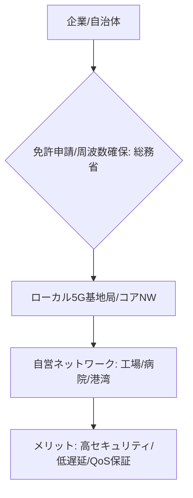

# T14-05-01 ローカル5G免許取得・自営ネットワーク構築

## Summary（5つの要点）

1. **企業・自治体による自営網**: **公衆通信事業者**に依存せず、企業や自治体などの**特定の主体**が、**独自の5G基地局**を設置し、**自社敷地内や特定エリア**で専用の**5Gネットワークを運用**できる制度 `(1)`。
2. **日本の制度化**: **総務省**が2019年に制度化し、**4.6GHz帯**と**28GHz帯**などの周波数を割り当て。日本は**プライベート5G**の**制度設計**において世界的に先行している。
3. **QoSとセキュリティの確保**: 公衆網の**混雑や障害**に影響されず、**必要な通信品質（QoS：Quality of Service）**と**高いセキュリティレベル**（T14-05-05）を**自前で完全にコントロール**できる。
4. **主な活用分野**: **スマート工場**（AGV、ロボット制御）、**病院**（遠隔診療、手術支援）、**建設・港湾**（重機自動化）、**スタジアム**（高精細映像配信）など、**高信頼性・低遅延**が求められる産業分野 `(2)`。
5. **主要ベンダー**: **富士通、NEC**といった国内メーカーに加え、**エリクソン、ノキア**などの海外ベンダーも基地局やコアネットワーク設備を提供し、市場競争が激化している。

#### 概念図

---

### 技術評価表（定量的な視点）
| 評価項目 | 評価 | 根拠 |
| :--- | :--- | :--- |
| 導入コスト | ⭐⭐☆☆☆ | 基地局、コアNW、運用人材の初期投資が高額 |
| 技術成熟度 | ⭐⭐⭐⭐☆ | 基地局技術は成熟。ネットワーク構成の簡素化が進む |
| 日本の競争力 | ⭐⭐⭐⭐⭐ | **総務省の制度設計**で世界を先行。富士通、NECが技術提供 `(1)` |
| 市場性 | ⭐⭐⭐⭐⭐ | **工場DX、社会インフラの老朽化対策**として不可欠 |
| 品質保証の重要性 | ⭐⭐⭐⭐⭐ | 自営網であるため、**システム設計・構築・運用**の**QoS保証責任**が企業側にある |
---

## 日本の立ち位置・強み弱みのSummary

### 強み：日本企業や研究機関が持つ独自の技術、優位性などを箇条書きで記述。

* **法制度の先行**: 総務省による**ローカル5G制度の迅速な導入**は、**グローバルでも類を見ない**ものであり、日本の産業界への展開を後押ししている。
* **国内ベンダーの強み**: **富士通、NEC**などの国内通信ベンダーが、**日本独自の周波数**に対応した**基地局、コアネットワーク（CU/DU）**製品を開発・提供しており、サプライチェーンの安定性がある。
* **産業界との親和性**: **トヨタ、日立、三菱電機**など、**製造業の現場**（工場DX）における**高信頼性通信の要件**を深く理解しており、実証実験の実績が豊富。

### 弱み：日本が抱える規制、標準化の遅れ、海外依存などを箇条書きで記述。

* **導入コストの高さ**: 従来のWi-Fiシステムに比べ、**基地局、コアNW、無線機の初期投資**が高く、中小企業での導入障壁となっている。
* **運用人材の不足**: 企業や自治体が自前で5Gネットワークを構築・運用するため、**無線技術、ネットワークセキュリティ**に精通した**専門人材**が不足している。
* **海外依存のリスク**: 基地局の**RFチップやモジュール**、あるいは**コアネットワークのソフトウェア**の一部で、**ノキア、エリクソン**などの海外ベンダーへの依存が残る。

---

## 技術ロードマップ（短期/中期/長期）

### 短期目標（～2027年）

* **ローカル5Gの導入実績**を**全国1000件以上**に拡大し、**工場、病院、港湾**における**主要な無線インフラ**としての地位を確立。
* **基地局、コアNWの小型化・低価格化**を進め、中小企業でも導入しやすい**パッケージソリューション**を提供。
* **5G-TSN統合**（T14-05-04）による**工場制御の無線化**を本格的に商用展開。

### 中期目標（2028年～2031年）

* **ネットワークスライシング**（T14-05-03）技術を応用し、**複数の企業・用途**が**一つの物理的インフラ**を**共有**できる**「シェアードローカル5G」**モデルを普及。
* **Beyond 5G/6G**（T14-01-01）への**ソフトウェアアップグレード**を容易にする**クラウドネイティブなコアNW**を標準化。
* **AI**を活用し、**電波状況、端末負荷**を**リアルタイムで最適化**する**自律運用システム**を導入。

### 長期目標（2032年～2035年）

* **プライベート5G**が**企業・自治体のデジタルツイン**（T14-02-04）を支える**必須のインフラ**となり、**有線接続を大幅に代替**。
* 5Gが**量子暗号通信**（T14-01-04）と統合され、**究極のセキュリティ**を持つ**産業制御ネットワーク**が実現。

### 📚 参照リンク

1. [ローカル5G導入に関する総務省の制度 - 総務省](https://www.soumu.go.jp/)
2. [ローカル5Gによる製造業DX事例 - 富士通](https://www.fujitsu.com/jp/)
3. [プライベート5Gネットワークソリューション - NEC](https://jpn.nec.com/)
4. [5Gプライベートネットワークのグローバル動向 - Ericsson](https://www.ericsson.com/)