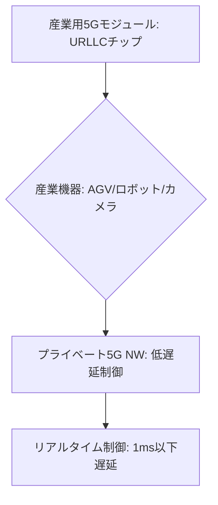

# T14-05-02 産業用5G端末・モジュール

## Summary（5つの要点）

1. **URLLCへの対応**: 産業機械の制御に不可欠な**超高信頼・低遅延通信（URLLC: Ultra-Reliable Low-Latency Communication）**をハードウェアとソフトウェアの両面で実現する5Gチップセット、モジュール、端末 `(1)`。
2. **低遅延の要件**: **3GPP Release 16**以降で標準化されたURLLC機能により、**エンド・ツー・エンドで1ms以下**の通信遅延（T14-02-03の目標値）を実現し、**リアルタイム制御**を可能にする。
3. **応用デバイス**: **AGV（無人搬送車）の衝突防止・協調走行**、**産業用ロボットの遠隔操作**、**4K/8K高精細監視カメラ**など、**プライベート5G**（T14-05-01）ネットワークに接続される**エッジデバイス**に内蔵される。
4. **主要サプライヤー**: **クアルコム、MediaTek**などのチップベンダーが、産業用途に特化した**耐久性、省電力性、セキュリティ機能**を備えたモジュールを開発。**ソニーセミコンダクタ**などのセンサーメーカーも関連。
5. **エッジコンピューティングとの統合**: 5Gモジュールに**AI推論エンジン**を組み込み、**エッジコンピューティング**（T14-02-01）機能を持たせることで、**データ処理の分散化**と**応答速度のさらなる向上**を実現する。

#### 概念図

---

### 技術評価表（定量的な視点）
| 評価項目 | 評価 | 根拠 |
| :--- | :--- | :--- |
| 導入コスト | ⭐⭐⭐☆☆ | 産業用モジュールは一般消費者向けより高価だが、量産効果で低下中 |
| 技術成熟度 | ⭐⭐⭐⭐☆ | Release 16ベースのURLLCモジュールの商用化が2025年以降本格化 |
| 日本の競争力 | ⭐⭐⭐☆☆ | チップセットはクアルコム、MediaTekに依存。モジュール統合と応用で強み |
| 市場性 | ⭐⭐⭐⭐⭐ | **工場DX**の**無線化・自動化**に不可欠なコア部品 |
| 品質保証の重要性 | ⭐⭐⭐⭐⭐ | **高信頼性**（99.999%）が要求され、**通信断絶時のフェイルセーフ**が必須 `(1)` |
---

## 日本の立ち位置・強み弱みのSummary

### 強み：日本企業や研究機関が持つ独自の技術、優位性などを箇条書きで記述。

* **産業機器の需要と連携**: **ファナック、安川電機**などの**産業用ロボットメーカー**や、**自動車産業**からの**高いURLLC要求**が技術開発を牽引している。
* **高信頼性技術のノウハウ**: **ソニーセミコンダクタ**などのセンサーメーカーや、**三菱電機、日立**などの**制御技術**を持つ企業が、**産業システム全体の高信頼性設計**のノウハウを持つ。
* **エッジAIチップの技術**: **AI推論エンジン**を組み込んだ**超低消費電力**の**エッジAIチップ**の開発において、独自の技術を持つ。

### 弱み：日本が抱える規制、標準化の遅れ、海外依存などを箇条書きで記述。

* **コアチップセットの海外依存**: 5Gモジュールの**コアとなるベースバンドチップ**の多くを**クアルコム、MediaTek**といった海外ベンダーに依存しており、サプライチェーンのリスクがある。
* **URLLCの普及遅れ**: URLLC機能の実装には**5Gコアネットワーク**側での対応も必要であり、**プライベート5Gインフラ**の**本格普及**が遅れると、モジュールの需要拡大も遅れる。
* **標準化活動への影響力**: 5G/Beyond 5Gの**3GPP標準化**プロセスにおいて、**URLLCやTSN**などの**産業用途の要件**に関する**日本の影響力**をさらに強化する必要がある。

---

## 技術ロードマップ（短期/中期/長期）

### 短期目標（～2027年）

* **3GPP Release 17**に対応した**URLLCモジュール**を量産出荷し、**エンド・ツー・エンドの遅延1ms以下**を実環境で実現。
* **産業用ロボット、AGV**の**安全制御系**に5Gモジュールを導入し、**有線接続の代替**を本格化。
* **エッジAI推論チップ**と5Gモジュールを**一体化**した**高機能エッジデバイス**を開発。

### 中期目標（2028年～2031年）

* 5Gモジュールが**環境センサー、セキュリティ、TSN**（T14-05-04）など**複数の機能**を統合した**多機能IoTハブ**として機能。
* **ローカル5G**（T14-05-01）の**ネットワークスライス**（T14-05-03）と**端末モジュール**の**動的連携**をAIで最適制御。
* **6G**（T14-01-01）の**テラヘルツ帯**に対応可能な**超広帯域モジュール**の研究開発を完了。

### 長期目標（2032年～2035年）

* **産業用5Gモジュール**が**全ての産業機械**に標準搭載され、**産業界の無線化**と**リアルタイム協調制御**が社会インフラとなる。
* モジュールが**量子耐性暗号**（T14-01-04）に対応し、**究極のセキュリティ**を持つ**産業制御通信**を実現。

### 📚 参照リンク

1. [Qualcommの産業用5G IoTソリューション - Qualcomm](https://www.qualcomm.com/)
2. [URLLCと5G-Advancedの技術動向 - 3GPP](https://www.3gpp.org/)
3. [産業IoT向け5Gモジュール - Sony Semiconductor Solutions](https://www.sony-semicon.com/)
4. [5Gによる工場無線化の実証事例 - Yaskawa Electric](https://www.yaskawa.co.jp/)