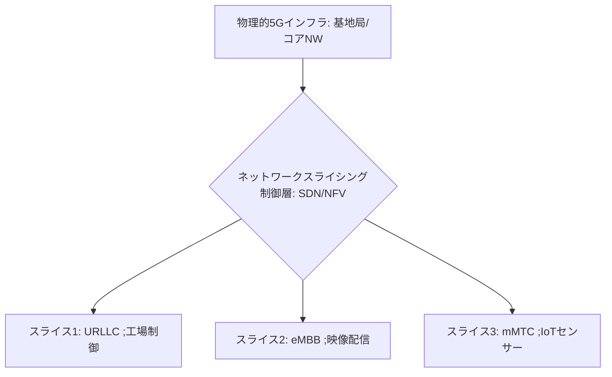

# T14-05-03 ネットワークスライシング技術

## Summary（5つの要点）

1. **ネットワークの仮想分割**: 一つの**物理的な5Gネットワークインフラ**（基地局、伝送路、コアネットワーク）を、**ソフトウェア制御**により、**用途や要件に応じて複数の独立した仮想ネットワーク（スライス）**に分割する技術 `(1)`。
2. **QoSの動的保証**: スライスごとに**通信速度、遅延、信頼性、セキュリティ**などの**QoS**を**動的に、かつ厳密に保証**できる。これにより、異なる要件を持つサービスを**単一のインフラ**で同時に提供可能。
3. **基盤技術（SDN/NFV）**: **SDN（Software Defined Networking）**と**NFV（Network Function Virtualization）**を組み合わせて実現される。コアネットワーク機能や基地局機能の一部を**ソフトウェアで仮想化**し、**柔軟なリソース配分**を可能にする `(2)`。
4. **応用と活用**: **スマート工場**での**URLLCスライス**（ロボット制御）、**スタジアム**での**eMBBスライス**（高精細映像配信）、**スマートシティ**での**mMTCスライス**（多数IoTセンサー接続）など、多岐にわたる。
5. **プライベート5Gでの利用**: **ローカル5G**（T14-05-01）において、企業が**自社の異なる部門やアプリケーション**に対して、**専用の通信品質**を持つ**プライベートスライス**を柔軟に提供する基盤となる。

#### 概念図

---

### 技術評価表（定量的な視点）
| 評価項目 | 評価 | 根拠 |
| :--- | :--- | :--- |
| 導入コスト | ⭐⭐⭐☆☆ | SDN/NFVを実装したコアネットワーク設備が必要。クラウド化でコスト減も |
| 技術成熟度 | ⭐⭐⭐⭐☆ | 商用公衆網での導入が進展。プライベート5Gへの適用が加速中 |
| 日本の競争力 | ⭐⭐⭐⭐⭐ | **NTTドコモ、NEC**などが世界に先駆けて商用化。SDN/NFVで強み `(1)` |
| 市場性 | ⭐⭐⭐⭐⭐ | **多用途展開**、**インフラ共有**、**コスト効率化**に不可欠な技術 |
| 品質保証の重要性 | ⭐⭐⭐⭐⭐ | 各スライスの**QoSが他のスライスに影響されない**よう、**分離と隔離**を保証することが重要 |
---

## 日本の立ち位置・強み弱みのSummary

### 強み：日本企業や研究機関が持つ独自の技術、優位性などを箇条書きで記述。

* **商用化の先行**: **NTTドコモ、NEC**などが世界に先駆けて**ネットワークスライシング**の**商用化**を実現しており、**運用ノウハウ**が豊富。
* **SDN/NFV技術**: **NTTグループ**が長年にわたり研究開発してきた**SDN（Software Defined Networking）**と**NFV（Network Function Virtualization）**の**コア技術**が強固な基盤となっている。
* **多用途への展開実績**: **公衆網**だけでなく、**ローカル5G**（T14-05-01）における**スマートシティ、工場DX**など、**多様な要件**に応じたスライス設計の**実証実績**を持つ。

### 弱み：日本が抱える規制、標準化の遅れ、海外依存などを箇条書きで記述。

* **SLA（サービス品質保証）の複雑性**: スライスごとに異なるSLAを動的に管理・保証するための**運用（O&M）システム**が複雑で、**自動化**が十分に進んでいない。
* **相互接続性の課題**: **異なるベンダー**のネットワーク機器で構成されたインフラ上での**スライスの相互接続性**と**End-to-End QoS保証**の標準化が課題。
* **セキュリティ境界の曖昧さ**: スライス間で**論理的な分離**を保つための**セキュリティ境界線**の設定が難しく、**スライス間の不正アクセス**に対する**高度なセキュリティ対策**（T14-05-05）が必要。

---

## 技術ロードマップ（短期/中期/長期）

### 短期目標（～2027年）

* **AI**を活用した**スライス設計、展開、リソース配分**の**自動化（Zero-Touch Operations）**技術を確立。
* **ローカル5G**（T14-05-01）において、**URLLCとeMBBスライスの同時利用**を標準化し、工場、病院での**多用途展開**を推進。
* スライスの**利用状況、QoS違反**を**リアルタイムで可視化**する**ダッシュボードシステム**を導入。

### 中期目標（2028年～2031年）

* **6G/Beyond 5G**（T14-01-01）を見据え、**異種ネットワーク**（Wi-Fi、光ファイバー）を含む**End-to-Endのスライシング**を実現。
* **ブロックチェーン**（T16-02-01）技術を応用し、**スライス利用権の取引**や**SLAの履行証明**を自動化する**プラットフォーム**を構築。
* **デジタルツイン**（T14-02-04）と連携し、**仮想空間上でスライスの性能シミュレーション**と**事前検証**を可能にする。

### 長期目標（2032年～2035年）

* ネットワーク全体が**自律分散制御**され、**AI**がユーザーの**要求**に応じて**最適な通信スライス**を**瞬時に生成・消滅**させる**「インテリジェント・ネットワーク」**が実現。
* **スライシング技術**が**国家レベルのインフラ**となり、**防災、医療、交通**など**重要社会機能**の**QoSを動的に保証**する基盤となる。

### 📚 参照リンク

1. [ネットワークスライシング技術と商用化 - NTTドコモ](https://www.nttdocomo.co.jp/)
2. [5Gネットワークスライシングの技術と応用 - Ericsson](https://www.ericsson.com/)
3. [SDN/NFVによるネットワーク仮想化 - NEC](https://jpn.nec.com/)
4. [3GPPにおけるネットワークスライシング標準化 - 3GPP](https://www.3gpp.org/)