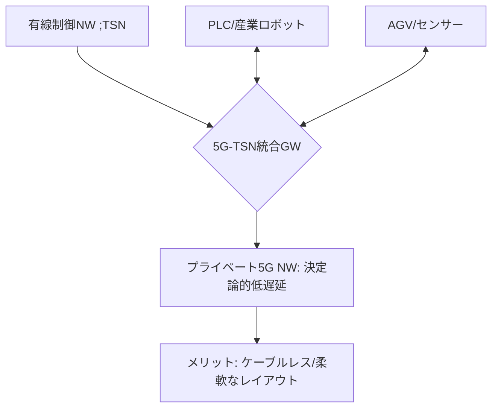

# T14-05-04 5G-TSN統合（Time-Sensitive Networking）

## Summary（5つの要点）

1. **産業制御の無線化**: **工場、プラント**の**リアルタイム制御**に従来用いられてきた**有線産業イーサネット規格「TSN」**（Time-Sensitive Networking）の**時間精度、信頼性、低遅延性**を**5G無線通信**で実現し、**ワイヤレスでの制御ネットワーク構築**を可能にする技術 `(1)`。
2. **TSNの役割**: TSNは**IEEE 802.1**で標準化された技術群で、**通信のスケジューリング、優先制御、時刻同期**などにより、**決定論的な低遅延**と**高信頼性**を保証する `(2)`。
3. **5Gとの融合**: 5Gの**URLLC**（T14-05-02）機能とTSNの**時間同期機能**を統合することで、**有線に匹敵するレベル**の**通信品質**を**ロボット、PLC（プログラマブルロジックコントローラ）**間で実現。
4. **柔軟なレイアウト**: 有線ケーブルが不要になることで、**工場内のレイアウト変更**や**設備の移動**が**大幅に容易**になり、**生産ラインの柔軟性**と**効率**が飛躍的に向上する。
5. **主要プレイヤー**: **シーメンス、ボッシュ**などの産業オートメーション大手、そして**三菱電機**などの**FA（ファクトリーオートメーション）**ベンダーが**ローカル5G**（T14-05-01）と連携した実証実験を推進中。

#### 概念図

---

### 技術評価表（定量的な視点）
| 評価項目 | 評価 | 根拠 |
| :--- | :--- | :--- |
| 導入コスト | ⭐⭐⭐☆☆ | 5G基地局とTSN対応機器が必要だが、配線コスト削減効果が大きい |
| 技術成熟度 | ⭐⭐⭐⭐☆ | 5G-TSN統合の標準化（3GPP Release 16/17）は完了。商用実証が加速 |
| 日本の競争力 | ⭐⭐⭐⭐⭐ | **FA分野**（三菱電機、安川電機）の強さと**ローカル5G**の先行で優位性 `(2)` |
| 市場性 | ⭐⭐⭐⭐⭐ | **スマート工場**の**無線化・フレキシブル化**に不可欠な技術 |
| 品質保証の重要性 | ⭐⭐⭐⭐⭐ | **時刻同期精度**と**パケットロス率**が、**ロボットの協調動作**と**安全停止**に直結 |
---

## 日本の立ち位置・強み弱みのSummary

### 強み：日本企業や研究機関が持つ独自の技術、優位性などを箇条書きで記述。

* **FA（ファクトリーオートメーション）のノウハウ**: **三菱電機、安川電機、オムロン**などの企業が**長年培ってきた産業制御技術**と**TSN**の知見が深く、5Gとの統合において優位性を持つ。
* **ローカル5Gの環境**: **ローカル5G**（T14-05-01）の制度が整備されているため、**工場という特定環境**での**5G-TSN統合**の**実証と早期商用化**が進めやすい。
* **高信頼性への要求**: 日本の製造業の**品質、信頼性**に対する**高い要求水準**が、**URLLC、TSN統合技術**の**精度と信頼性**を国際水準以上に引き上げる要因となっている。

### 弱み：日本が抱える規制、標準化の遅れ、海外依存などを箇条書きで記述。

* **TSNプロトコルの海外依存**: TSNの**コア技術（チップ、ソフトウェア）**は**シーメンス、ボッシュ、インテル**などの**欧米企業**が先行しており、**ライセンスや標準化**における影響力に課題が残る。
* **セキュリティ対策**: **無線化**による**サイバー攻撃**のリスク増大に対し、**5G-TSN**を統合した** End-to-End**での**産業制御セキュリティ**（T14-05-05）の設計が複雑化している。
* **レガシー設備との互換性**: 既存の**古い産業イーサネット**や**シリアル通信**を用いる設備との**スムーズな接続・互換性**を確保するための**ゲートウェイ技術**の開発が課題。

---

## 技術ロードマップ（短期/中期/長期）

### 短期目標（～2027年）

* **ローカル5G**と**TSN**を統合した**無線PLC、ロボット制御システム**の**商用パイロット導入**を、自動車、電子部品などの**主要なスマート工場**で完了。
* **3GPP Release 17**に対応した**5G-TSNゲートウェイ機器**の**低価格化・小型化**を実現。
* **AI**を活用した**無線環境の変動**に対する**リアルタイムなQoS補正技術**を開発。

### 中期目標（2028年～2031年）

* **工場、プラント**の**制御通信**における**有線接続の90%以上**を**5G-TSN**で代替。
* **デジタルツイン**（T14-02-04）と連携し、**物理環境**と**仮想環境**での**TSN通信のリアルタイム検証**を可能にする。
* **AI**を活用し、**生産計画**に応じて**TSNの帯域、遅延設定**を**動的に最適変更**する**自律制御システム**を導入。

### 長期目標（2032年～2035年）

* **5G-TSN**が**産業オートメーションの標準通信インフラ**となり、**工場の建設、レイアウト変更**が**数日**で完了する**超フレキシブルな生産システム**が実現。
* **6G**（T14-01-01）との統合により、**テラヘルツ帯**での**超高速・超低遅延制御**が**ミリ秒以下**で実現。

### 📚 参照リンク

1. [5G-TSN統合技術 - 3GPP](https://www.3gpp.org/)
2. [Time-Sensitive Networking (TSN) - IEEE 802.1](https://www.ieee802.org/1/pages/tsn.html)
3. [ローカル5GとTSNによる工場無線化実証 - Mitsubishi Electric](https://www.mitsubishielectric.co.jp/)
4. [産業制御と5Gの融合 - Siemens](https://www.siemens.com/)