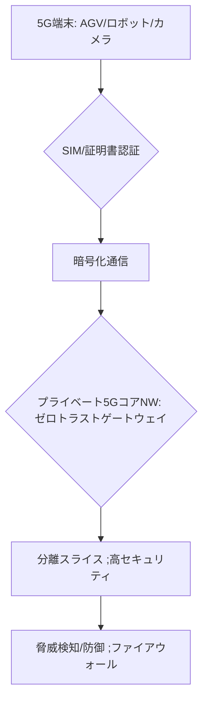

# T14-05-05 プライベート5Gセキュリティ・暗号化通信

## Summary（5つの要点）

1. **End-to-End暗号化**: **産業用5G端末**（AGV、ロボット）から**基地局、コアネットワーク**に至る**全ての通信経路**において、**機密性の高いデータ**を保護するための**高度な暗号化（AES-256など）**を適用する `(1)`。
2. **SIM/eSIMによる厳格な認証**: 端末認証に**物理SIMカード、またはeSIM**を利用し、**正規のデバイスのみ**がネットワークに接続できる**厳格な認証**を実施。**デバイス証明書**も活用し、**なりすまし**を防止。
3. **ゼロトラストモデルの適用**: **「ネットワーク内部も安全ではない」**という前提に基づき、**すべてのアクセス要求**に対して**端末、ユーザー、アプリケーション**の**正当性を確認**し、**最小限のアクセス権限**のみを付与する**ゼロトラストセキュリティモデル**を適用 `(2)`。
4. **ネットワークスライスと分離**: **ネットワークスライシング**（T14-05-03）を利用し、**高セキュリティが求められる制御系**と**一般データ系**の通信を**論理的に完全に分離**（隔離）し、**攻撃範囲を限定**する。
5. **脅威検知と防御**: 5Gネットワークの**コア部分（UPF/SMFなど）**を監視し、**マルウェア、DDoS攻撃**などの**ネットワーク層の脅威**をリアルタイムで検知・防御する**専用のセキュリティ機能**（ファイアウォール、IPS/IDS）を提供する。

#### 概念図

---

### 技術評価表（定量的な視点）
| 評価項目 | 評価 | 根拠 |
| :--- | :--- | :--- |
| 導入コスト | ⭐⭐⭐☆☆ | 5G専用セキュリティ製品、ゼロトラストプラットフォームの費用が発生 |
| 技術成熟度 | ⭐⭐⭐⭐☆ | 5GコアNWセキュリティは成熟。ゼロトラスト適用が進展中 |
| 日本の競争力 | ⭐⭐⭐☆☆ | コア技術はPalo Alto, Fortinetなど海外勢が先行。NTT Comなど運用で強み |
| 市場性 | ⭐⭐⭐⭐⭐ | **工場、病院**の**機密データ保護**と**インフラの安定稼働**に必須 |
| 品質保証の重要性 | ⭐⭐⭐⭐⭐ | **暗号化の堅牢性**と、セキュリティ機能による**低遅延性への影響**の最小化が鍵 |
---

## 日本の立ち位置・強み弱みのSummary

### 強み：日本企業や研究機関が持つ独自の技術、優位性などを箇条書きで記述。

* **通信事業者によるノウハウ**: **NTTコミュニケーションズ、KDDI**などの通信事業者が持つ**高度なネットワーク監視・運用ノウハウ**を、**ローカル5G**（T14-05-01）のセキュリティサービスに応用できる。
* **制御系セキュリティへの知見**: **三菱電機、日立**などの**FA（ファクトリーオートメーション）**ベンダーが持つ、**産業制御システム（OT）**の**特殊なセキュリティ要件**（リアルタイム性、可用性）への対応技術。
* **量子暗号技術の研究**: **NEC、東芝**などが**量子耐性暗号**（T14-01-04）の研究開発を進めており、将来の**究極のセキュリティ**への移行を見据えている。

### 弱み：日本が抱える規制、標準化の遅れ、海外依存などを箇条書きで記述。

* **コアセキュリティソフトウェアの海外依存**: 5Gコアネットワークに組み込まれる**専用のファイアウォール、IDS/IPS**などの**高度なセキュリティソフトウェア**は、**Palo Alto Networks、Fortinet**といった海外ベンダーへの依存度が高い。
* **ゼロトラスト導入の遅れ**: **ゼロトラストセキュリティモデル**の**組織全体**への**導入と運用**が、欧米企業に比べて遅れている。
* **法制度の複雑性**: **通信の秘密**、**個人情報保護法**、**重要インフラ防護**など、**複数の法制度**にまたがるセキュリティ要件への対応が複雑であり、**セキュリティ設計**の障壁となっている。

---

## 技術ロードマップ（短期/中期/長期）

### 短期目標（～2027年）

* **ローカル5G**の運用において、**SIM認証**と**ゼロトラスト原則**に基づく**アクセス制御**を標準化。
* **AI**を活用し、**大量の5G通信データ**から**不正アクセス、マルウェア感染**の兆候を**リアルタイムで検知**するシステムを導入。
* 5G-TSN統合（T14-05-04）における**制御系通信**の**セキュリティ強化ガイドライン**を策定。

### 中期目標（2028年～2031年）

* **量子耐性暗号（PQC）**アルゴリズムを**5G端末モジュール**（T14-05-02）と**コアネットワーク**に実装し、**将来の量子コンピュータ脅威**に対応。
* **ブロックチェーン**（T16-02-01）を応用し、**デバイス証明書、アクセス権限**の**分散型管理**を実用化。
* **ネットワークスライシング**（T14-05-03）を**セキュリティ境界**として活用する**高度な隔離技術**を標準化。

### 長期目標（2032年～2035年）

* 5Gネットワークが**完全なゼロトラスト**で運用され、**全ての通信がデフォルトで暗号化・認証**される**超安全な産業インフラ**が実現。
* **AI**がセキュリティインシデントを**自動で修復**し、**人間の介入なし**に**ネットワークの健全性**を維持する**自律的なセキュリティシステム**が確立。

### 📚 参照リンク

1. [5Gセキュリティとゼロトラスト - Palo Alto Networks](https://www.paloaltonetworks.jp/5g-security)
2. [5Gセキュリティの動向と脅威 - Fortinet](https://www.fortinet.com/)
3. [ローカル5Gにおけるセキュリティ対策 - NTTコミュニケーションズ](https://www.ntt.com/)
4. [3GPPにおける5Gセキュリティ標準化 - 3GPP](https://www.3gpp.org/)