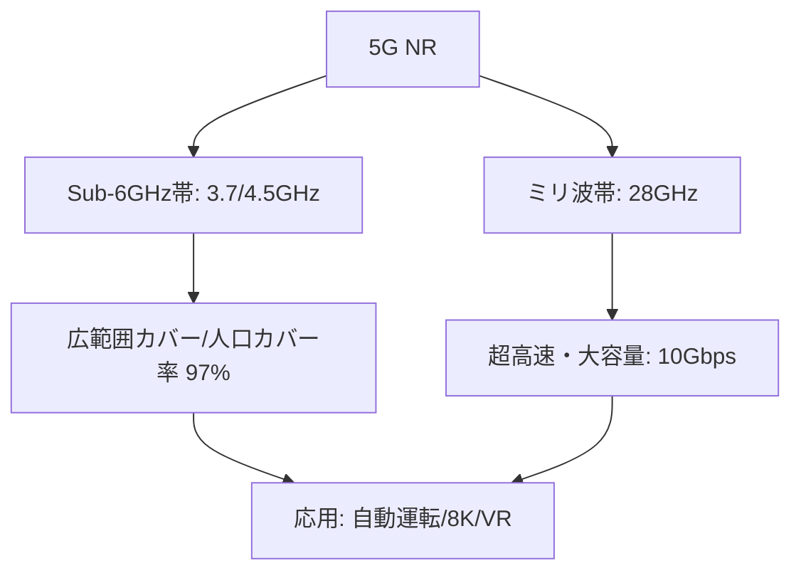

# T14-06-01 5G NR（New Radio）Sub-6GHz・ミリ波通信

## Summary（5つの要点）

1. **周波数帯の二重戦略**: 5G NRは、**Sub-6GHz帯**（3.7GHz、4.5GHz帯など）と**ミリ波帯**（28GHz帯）の2つの周波数帯を組み合わせて運用される `(3)`。
2. **Sub-6GHz（カバレッジ）**: 4Gに近い周波数特性を持ち、**広範囲なエリアカバー**（人口カバー）に適している。日本の5G普及目標（2025年度末97%）は、主にこの帯域で推進されている `(1, 5)`。
3. **ミリ波（超高速）**: **最大10Gbps**に達する**超高速・大容量通信**を実現するが、直進性が高く障害物に弱いため、スタジアム、駅、交差点などの局所的な高トラフィックエリアで利用される。
4. **日本の普及状況**: 総務省の「デジタル田園都市国家インフラ整備計画」に基づき、2025年度末の**全国人口カバー率97%**、**各都道府県90%以上**の目標が設定され、2023年度末時点で前倒し達成（98.1%） `(1, 5)`。
5. **技術的課題**: **ミリ波**対応端末の普及の遅れと、**Sub-6帯域**における衛星通信との**干渉調整**（2024年以降解消見込み）が、真の5G体験の拡大における課題となっている `(2)`。

#### 概念図

---

### 技術評価表（定量的な視点）
| 評価項目 | 評価 | 根拠 |
| :--- | :--- | :--- |
| 導入コスト | ⭐⭐⭐☆☆ | 基地局設置コストは高いが、4G設備共用やインフラシェアリングで低減 |
| 技術成熟度 | ⭐⭐⭐⭐☆ | Sub-6は成熟。ミリ波はスポット展開が主で、端末・応用が発展途上 |
| 日本の競争力 | ⭐⭐⭐⭐☆ | NTTドコモ、KDDI、ソフトバンク、楽天の4キャリア体制でインフラ整備は世界最速級 `(1)` |
| 市場性 | ⭐⭐⭐⭐⭐ | 自動運転（T18-05）、スマート工場（T14-05）、メタバース（T8-01）の基盤 |
| 品質保証の重要性 | ⭐⭐⭐⭐☆ | ミリ波の**カバレッジホール**（不感地帯）の解消、Sub-6の**干渉制御**が必須 |

---

## 日本の立ち位置・強み弱みのSummary

### 強み：日本企業や研究機関が持つ独自の技術、優位性などを箇条書きで記述。

* **高速なインフラ整備**: **デジタル田園都市国家インフラ整備計画**に基づき、人口カバー率目標を前倒しで達成するなど、**基地局設置のスピード**は世界トップクラス `(1, 5)`。
* **高品質なネットワーク運用**: NTTドコモ、KDDIなどのキャリアが持つ、**高密度な都市部**での**高品質なネットワーク運用・管理ノウハウ**が豊富。
* **ローカル5G制度**: **ローカル5G**（T14-05）の制度化により、産業用途での**Sub-6/ミリ波**の活用（工場、建設現場など）が他国に先駆けて進んでいる。

### 弱み：日本が抱える規制、標準化の遅れ、海外依存などを箇条書きで記述。

* **ミリ波の普及の遅れ**: ミリ波の**超高速性**を活かしたキラーアプリケーションが不足しており、対応端末の普及や**エリア展開**が限定的 `(2)`。
* **マネタイズの課題**: インフラ投資に対し、**5Gならではの収益モデル**（AR/VR、自動運転など）の確立が遅れており、**「なんちゃって5G」**（4G周波数の転用が中心）と揶揄される時期があった。
* **基地局設備の海外依存**: 基地局設備（特に無線部）において、**エリクソン、ノキア、サムスン**など海外ベンダーへの依存度が高い。

---

## 技術ロードマップ（短期/中期/長期）

### 短期目標（～2027年）

* **Sub-6帯域**の**衛星干渉問題**を完全に解消し、都市部以外での**5Gエリアの品質を大幅に向上** `(2)`。
* **ミリ波**対応の**スマートフォン、PC、VRデバイス**の普及を促進し、**スタジアム、駅、空港**での**超高速通信体験**を一般化。
* **5G Advanced**（Release 18以降）の導入を開始し、**AI/MLの無線制御**への統合、**Sidelink**（端末間直接通信）による**自動運転支援**を強化。

### 中期目標（2028年～2031年）

* **Sub-6**と**ミリ波**を**AIで動的に切り替える**高度な制御技術を確立し、**カバレッジと速度のシームレスな両立**を実現。
* **ミリ波**のエリア展開を**都市部の主要道路、屋内施設**に拡大し、**8K映像配信**（T14-03-01）や**メタバース**（T8-01）の基盤とする。
* **5G**と**衛星通信（NTN）**（T14-06-04）の**完全な統合**を実現し、**陸海空のシームレスなカバレッジ**を達成。

### 長期目標（2032年～2035年）

* 5G NRが**Beyond 5G/6G**（T14-06-02）への**スムーズな移行**を支える基盤として機能。
* **ミリ波**の**超広帯域**を活用した**リアルタイム・デジタルツイン**（T14-02-04）が社会インフラ（交通、防災）の標準となる。

### 📚 参照リンク

1. [5G人口カバー率が98.1％まで拡大 - ケータイ Watch](https://k-tai.watch.impress.co.jp/docs/column/mca/1622064.html)
2. [5G周波数は2025年度末に6GHz幅追加 「期待の」Sub6でエリア拡大 - ビジネスネットワーク](https://businessnetwork.jp/article/18241/)
3. [デジタル田園都市国家インフラ整備計画 - 総務省](https://www.soumu.go.jp/main_content/000944442.pdf)
4. [5Gビジネスの展望と今後のミリ波利用について - 総務省](https://www.soumu.go.jp/main_content/000860674.pdf)
5. [WX推進戦略アクションプランの進捗状況について - 総務省](https://www.soumu.go.jp/main_content/001011816.pdf)