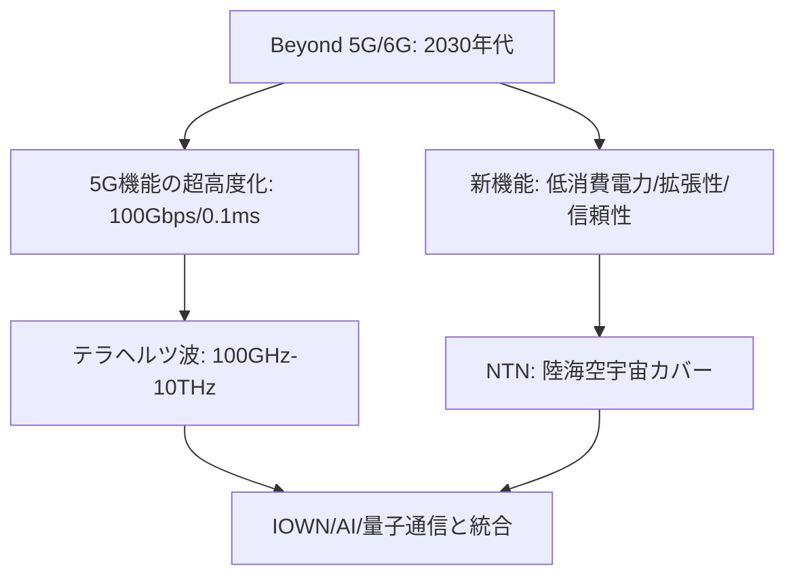

# T14-06-02 Beyond 5G（6G）研究開発

## Summary（5つの要点）

1. **国家戦略**: 日本政府は「**Beyond 5G推進戦略**」を策定し、**2030年の国際標準化**、**2035年頃の商用化**を目指し、研究開発基金（総務省/NICT）を通じて**NTT、KDDI、富士通、NEC**などの共同研究を強力に支援している `(1, 2)`。
2. **性能目標**: 5Gの**3機能（超高速・大容量、超低遅延、多数同時接続）**を**10倍～100倍**に高度化（例: **100Gbps超**、**0.1ms以下**の遅延）に加え、「**超低消費電力**」「**超安全・信頼性**」「**拡張性（陸海空宇宙）**」を新たな機能として追求する `(3)`。
3. **新周波数帯（テラヘルツ波）**: **100GHz～10THz**の**テラヘルツ波**を開拓し、**超広帯域**（例: 10GHz幅）を利用した**超高速通信**を実現する技術が中核となる。
4. **NTN（非地上ネットワーク）**: **衛星通信**（T14-06-04）や**HAPS**と地上網を統合し、**陸海空宇宙の全域をカバー**する**「国土100%カバー」**を目指す `(3)`。
5. **国際標準化と知財**: **必須特許（SEP）の10%以上**、**世界市場の30%程度**の確保を目標に掲げ、**国際標準化（3GPP）**と**知財戦略**を一体的に推進する `(1)`。

#### 概念図

---

### 技術評価表（定量的な視点）
| 評価項目 | 評価 | 根拠 |
| :--- | :--- | :--- |
| 導入コスト | ⭐⭐☆☆☆ | テラヘルツ波対応デバイス、光通信インフラ（IOWN）への莫大な投資が必要 |
| 技術成熟度 | ⭐⭐☆☆☆ | 基礎研究・要素技術開発段階。2025年以降に社会実装戦略を推進 `(4)` |
| 日本の競争力 | ⭐⭐⭐⭐⭐ | **NTT（IOWN構想）**、**総務省の基金**による**産学官連携**で世界をリード `(1, 2)` |
| 市場性 | ⭐⭐⭐⭐⭐ | 2030年代の**社会インフラ全て**の基盤となり、市場性は計り知れない |
| 品質保証の重要性 | ⭐⭐⭐⭐⭐ | **超安全・信頼性**が目標に掲げられ、**国家レベルのインフラ**としての品質が必須 |

---

## 日本の立ち位置・強み弱みのSummary

### 強み：日本企業や研究機関が持つ独自の技術、優位性などを箇条書きで記述。

* **国家レベルの戦略と投資**: 総務省/NICTによる**「革新的情報通信技術（Beyond 5G（6G））基金事業」**を通じて、**産学官（NTT、KDDI、富士通、NEC、楽天など）**が一体となった**オールジャパン体制**での研究開発が先行している `(2, 6)`。
* **NTTのIOWN構想**: 6Gの基盤として、**超低消費電力・超大容量**を実現する**光ベースのネットワーク基盤「IOWN」**の研究開発で世界をリードしている。
* **テラヘルツ波デバイス技術**: **100GHzを超える**未開拓の周波数帯を利用するための**半導体デバイス（InP、GaNなど）**や**アンテナ技術**の基礎研究で強みを持つ。

### 弱み：日本が抱える規制、標準化の遅れ、海外依存などを箇条書きで記述。

* **国際標準化競争の激化**: 5Gでの教訓から、**米国、中国、欧州、韓国**も国家戦略として6G開発に巨額の投資を開始しており、**必須特許（SEP）**を巡る国際競争が熾烈化している `(3)`。
* **半導体技術の課題**: **テラヘルツ波**を扱う**超高速・低消費電力半導体**の**製造プロセス**において、海外ファウンドリ（TSMC、Samsung）への依存が課題。
* **人材育成**: 6Gに必要な**AI、光技術、テラヘルツ波工学**など、**複合領域**の高度専門人材の育成が追いついていない `(5)`。

---

## 技術ロードマップ（短期/中期/長期）

### 短期目標（～2027年）

* **テラヘルツ波**を用いた**100Gbps級**の**無線伝送実験**に成功し、デバイスの基本性能を確立。
* **5G Advanced**（Release 18以降）の技術を**2025年以降順次社会実装**し、6Gへの橋渡しとする `(4)`。
* **NTN**（T14-06-04）による**陸海空のカバレッジ拡張**の基礎技術を実証。

### 中期目標（2028年～2031年）

* **6Gの国際標準化**（3GPP Release 20以降）の議論を主導し、**日本の技術提案（IOWN連携、テラヘルツ波）**を標準仕様に組み込み、**必須特許10%以上**を確保 `(1)`。
* **AI/ML**を**無線制御**に全面的に統合し、**ネットワークの自律運用**（スライシング、干渉回避）を実現。
* **6Gの試作機（プロトタイプ）**を開発し、限定エリアでの実証実験（フィールドトライアル）を開始。

### 長期目標（2032年～2035年）

* **2035年頃**を目標に、**6Gの商用サービス**を開始。
* **IOWN**（オールフォトニクス・ネットワーク）と6Gが完全に融合し、**超低消費電力**で**超高速**な**デジタルツイン社会**の通信インフラを実現。
* **量子暗号通信**（T14-01-04）と6Gを統合し、**究極のセキュリティ**を持つ通信網を構築。

### 📚 参照リンク

1. [Beyond 5G推進戦略 - 総務省](https://www.soumu.go.jp/main_content/000696613.pdf)
2. [Beyond 5G（6G）に向けた 情報通信技術戦略 - 産業技術総合研究所](https://www.jarec.or.jp/30th_jarec_symposium/pdf/workshop_8_15.pdf)
3. [Beyond 5G（6G）に向けた 新たな情報通信技術戦略の推進 - Kiai](https://www.kiai.gr.jp/jigyou/R4/PDF/1220p2.pdf)
4. [Beyond 5G（6G）に向けた情報通信技術戦略 - 宇宙航空研究開発機構](https://www.jarec.or.jp/31th_jarec_symposium/pdf/ws31_shiryo_09.pdf)
5. [Beyond 5G推進戦略の概要 - IEICE](https://www.ieice.org/jpn_r/activities/kikakusenryakushitsuevent/assets/pdf/20220907_03.pdf)
6. [革新的情報通信技術（Beyond 5G（6G））基金事業 - NTT Group](https://group.ntt/jp/newsrelease/2024/10/22/241022a.html)