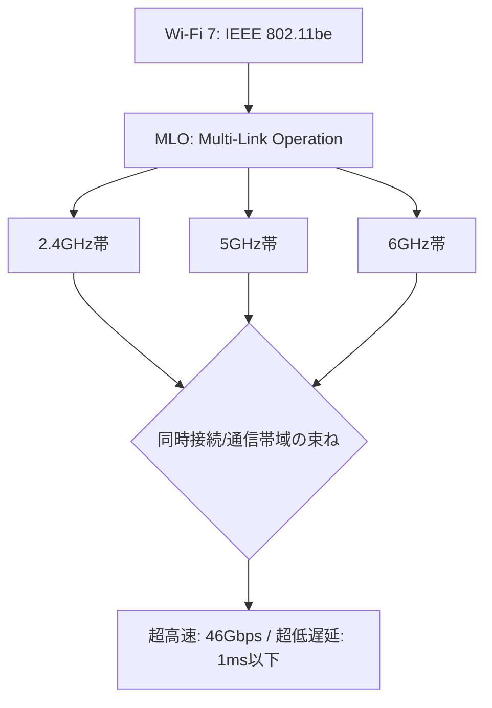

# T14-06-03 Wi-Fi 7（IEEE 802.11be）

## Summary（5つの要点）

1. **超高速・大容量**: Wi-Fi 6/6Eの次世代規格（IEEE 802.11be）。**最大46Gbps**の理論速度を実現し、Wi-Fi 6の約4.8倍の高速化を達成。
2. **日本の認可**: 日本では**2023年12月**に総務省が電波法施行規則を改正し、Wi-Fi 7の利用が**認可**された。2024年から対応ルーター・端末の普及が始まっている `(2, 4, 5)`。
3. **MLO（Multi-Link Operation）**: **2.4GHz、5GHz、6GHz**の**3つの周波数帯**を**同時に束ねて通信**するWi-Fi 7の**最重要技術**。これにより、**速度向上、遅延低減、安定性向上**を同時に実現する `(1, 3)`。
4. **低遅延化**: MLO技術により、**1ms（ミリ秒）以下**の**超低遅延**が可能となり、**リアルタイム性が要求されるVR/AR**、**クラウドゲーミング**、**産業用IoT**（T14-02）に最適 `(6)`。
5. **技術革新**: 従来の2倍の**320MHz幅チャネル**（6GHz帯）、より高密度な変調方式**4096QAM**を採用し、通信効率を最大化している `(2)`。

#### 概念図

---

### 技術評価表（定量的な視点）
| 評価項目 | 評価 | 根拠 |
| :--- | :--- | :--- |
| 導入コスト | ⭐⭐⭐⭐☆ | 2024年時点では対応機器が高価だが、急速に価格は下落する見込み |
| 技術成熟度 | ⭐⭐⭐⭐☆ | 規格は確定。チップセット（Qualcomm等）が出荷され、普及初期 `(6)` |
| 日本の競争力 | ⭐⭐⭐⭐☆ | 総務省による**6GHz帯の迅速な開放**と法改正（2023年12月）で世界と同時普及 `(2, 4)` |
| 市場性 | ⭐⭐⭐⭐⭐ | **VR/AR、8K配信、メタバース**など、次世代コンテンツの普及に不可欠 |
| 品質保証の重要性 | ⭐⭐⭐⭐⭐ | **MLO**の**安定動作**と**異なる周波数帯間のシームレスな切り替え**が必須 |

---

## 日本の立ち位置・強み弱みのSummary

### 強み：日本企業や研究機関が持つ独自の技術、優位性などを箇条書きで記述。

* **迅速な法整備**: 総務省が**2023年12月**にWi-Fi 7（320MHz幅）の利用を**世界とほぼ同時に認可**したことで、国内メーカー（エレコム、バッファローなど）が迅速に製品を投入できる環境を整備した `(2, 4)`。
* **高性能ルーターの開発力**: **エレコム、バッファロー、NEC**などの国内メーカーが、**MLO**や**4096QAM**に対応した**高性能なWi-Fi 7ルーター**を開発・市場投入している `(1)`。
* **端末・コンテンツとの連携**: **ソニー**（ゲーム、VR）、**シャープ**（8Kテレビ）など、Wi-Fi 7の**高速・低遅延**性能を活かせる**端末・コンテンツ**側との連携が強い。

### 弱み：日本が抱える規制、標準化の遅れ、海外依存などを箇条書きで記述。

* **コアチップセットの海外依存**: Wi-Fi 7の**主要チップセット**は、**Qualcomm、Broadcom、MediaTek**といった**海外ベンダー**に大きく依存している。
* **6GHz帯の利用制約**: 6GHz帯は**衛星通信**など既存の無線システムとの**干渉調整**が必要であり、屋外利用などに一部制約が残る可能性がある。
* **対応端末の普及の遅れ**: 2024年時点では、Wi-Fi 7の性能を最大限に引き出すための**対応スマートフォンやPC**がまだ**一部のハイエンド機種**に限られている `(6)`。

---

## 技術ロードマップ（短期/中期/長期）

### 短期目標（～2027年）

* **Wi-Fi 7対応ルーター**の**普及価格帯（1万円～2万円台）**への移行を完了し、**Wi-Fi 6/6Eからの置き換え**を加速。
* **スマートフォン、PC、VR/ARデバイス**の**標準搭載**規格となり、**MLO**による**安定した低遅延通信**を一般化。
* **8K映像**（T14-03-01）の**ワイヤレス伝送**を家庭内、オフィス内で安定的に実現。

### 中期目標（2028年～2031年）

* **MLO**技術をさらに高度化し、**5G**（T14-06-01）と**Wi-Fi 7**を**動的に束ねる**（ATSSS: Access Traffic Steering, Switching and Splitting）技術を実用化。
* **産業用IoT**（T14-02）分野において、**ローカル5G**（T14-05）を補完する**低コスト・低遅延な無線LAN**として活用。
* **AI**を活用して**電波干渉を予測・回避**し、**超高密度環境**（スタジアム、展示会）でも安定した通信品質を保証。

### 長期目標（2032年～2035年）

* **Wi-Fi 7**が**Beyond 5G/6G**（T14-06-02）と**シームレスに連携**し、**屋内・屋外**を問わず**ギガビット級の通信**が**途切れない**環境を実現。
* **ホログラフィック通信**や**触覚インターネット**（T8-01-05）の基盤インフラとして機能。

### 📚 参照リンク

1. [Wi-Fi 7とは？無線通信の新規格の特徴 - ELECOM](https://www.elecom.co.jp/pickup/contents/00107/)
2. [高速、安定、低遅延！ 次世代規格 Wi-Fi 7 とは？ - Android](https://www.android.com/intl/ja_jp/articles/431/)
3. [次世代のWi-Fi規格「Wi-Fi 7」のインパクト - NTTデータ・ルウィーブ](https://network.nttdata-luweave.com/column/4593/)
4. [Wi-Fi7とは？規格の詳細やWi-Fi6（6E）との違い - ARTERIA](https://www.arteria-net.com/business/column/wi-fi7)
5. [ついに解禁 「Wi-Fi 7」は何が優れているのか？ - NTT西日本](https://business.ntt-west.co.jp/bizclip/articles/bcl00154-039.html)
6. [Wi-Fi 7とは？速度や機能など旧規格との違いを解説 – TD SYNNEX BLOG](https://jp.tdsynnex.com/blog/network/what-is-wi-fi7/)