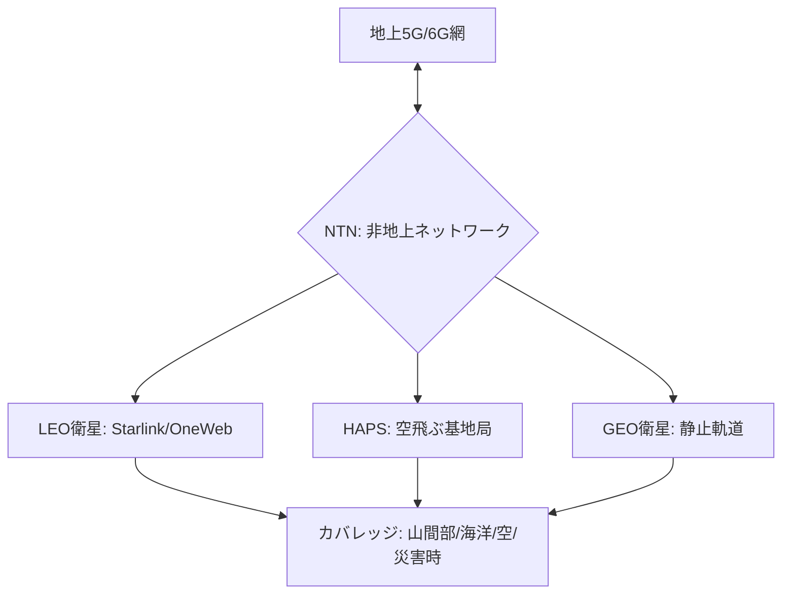

# T14-06-04 衛星通信・非地上ネットワーク（NTN）

## Summary（5つの要点）

1. **NTN（非地上ネットワーク）**: **低軌道（LEO）衛星**、静止衛星（GEO）、高高度プラットフォーム（HAPS）などを、**地上の5G/6Gネットワークと統合**する技術の総称 `(1)`。
2. **目的（カバレッジ拡張）**: 地上基地局の設置が困難な**山間部、離島、海洋、空**、そして**災害時**の通信インフラとして、**国土の100%カバー**を実現する。
3. **主要プレイヤー**: **Starlink（SpaceX）**、**OneWeb**、**Amazon Kuiper**などの**LEO衛星コンステレーション**が、**高速・低遅延**（Starlinkは約20ms～40ms）なインターネット接続をグローバルに提供 `(2)`。
4. **日本の連携戦略**: **KDDI**が**Starlink**と提携し、**法人・自治体向けサービス**や**au網のバックホール**（基地局との中継回線）に活用。**ソフトバンク**は**OneWeb**と提携し、同様のサービスを展開 `(2, 3)`。
5. **「空飛ぶ基地局」HAPS**: **ソフトバンク**（HAPSモバイル）などが研究開発を進める**HAPS（高高度プラットフォーム）**は、高度約20kmの成層圏から**直径200kmの広範囲**をカバーする「空飛ぶ基地局」として期待される。

#### 概念図

---

### 技術評価表（定量的な視点）
| 評価項目 | 評価 | 根拠 |
| :--- | :--- | :--- |
| 導入コスト | ⭐⭐☆☆☆ | 衛星打ち上げ、地上局建設、端末開発に莫大な初期投資が必要 |
| 技術成熟度 | ⭐⭐⭐⭐☆ | LEO衛星（Starlink）は商用サービスとして成熟。5Gとの統合は途上 |
| 日本の競争力 | ⭐⭐⭐⭐☆ | KDDI、ソフトバンクが**海外衛星事業者との戦略的提携**で先行 `(2, 3)` |
| 市場性 | ⭐⭐⭐⭐⭐ | **災害対策、航空・海洋通信、B2B**、**6Gの全域カバー**に不可欠 |
| 品質保証の重要性 | ⭐⭐⭐⭐☆ | 衛星の**高速移動**（LEO）、**天候**（降雨減衰）による**通信品質の安定化**が課題 |

---

## 日本の立ち位置・強み弱みのSummary

### 強み：日本企業や研究機関が持つ独自の技術、優位性などを箇条書きで記述。

* **迅速なアライアンス戦略**: **KDDI（Starlink）**、**ソフトバンク（OneWeb）**が、**グローバルなLEO衛星事業者**と**いち早く提携**し、**国内でのサービス展開**（法人向け、auバックホール）で先行している `(2, 3)`。
* **HAPS技術の研究開発**: **ソフトバンク（HAPSモバイル）**が**HAPS**の研究開発をリードしており、**LEOと地上網の中間**を補完する技術として期待される。
* **NTNと5Gの統合技術**: **NTT、KDDI**などが、**3GPP**（標準化団体）において**5G/6GとNTNを統合**するための**標準化活動**に積極的に貢献している。

### 弱み：日本が抱える規制、標準化の遅れ、海外依存などを箇条書きで記述。

* **衛星インフラの海外依存**: **Starlink、OneWeb、Kuiper**など、**メガコンステレーション**（大規模衛星群）の**インフラ構築と運用**は**米国企業**が完全に主導しており、日本はサービス利用・提携の立場に留まる。
* **端末コスト**: 衛星通信用の**地上端末（アンテナ）**がまだ高価であり、**一般消費者**への普及や、**スマートフォンへの直接通信（Direct to Cell）**の実用化に課題がある。
* **周波数・軌道の枯渇**: LEO衛星の数が急増しており、**衛星軌道**と**周波数**の**国際的な確保・調整**が困難になりつつある（**スペースデブリ問題**も含む）。

---

## 技術ロードマップ（短期/中期/長期）

### 短期目標（～2027年）

* **KDDI（Starlink）**、**ソフトバンク（OneWeb）**が、**法人・自治体向け**の**衛星ブロードバンドサービス**を全国の**不感地帯**で本格展開 `(2, 3)`。
* **スマートフォン**と**衛星**が**直接通信**（Direct to Cell）する**緊急メッセージサービス**（SOS、安否確認）を実用化。
* **HAPS**の**商用サービス**を開始し、広域エリアの通信カバレッジを確保。

### 中期目標（2028年～2031年）

* **NTN**を**5G Advanced/6G**の**標準機能**として**地上網と完全に統合**し、ユーザーは**地上と衛星を意識せず**にシームレスに通信可能になる。
* **LEO衛星通信**の**遅延**をさらに低減し、**高速移動体**（航空機、船舶、ドローン）での**リアルタイム通信**を標準化。
* **Amazon Kuiper**が日本市場に本格参入し、**衛星通信の価格競争**が本格化。

### 長期目標（2032年～2035年）

* **6G**（T14-06-02）と**NTN**が一体となり、**地球上のあらゆる場所**（陸海空宇宙）で**超高速・超低遅延**通信が可能な**「国土100%カバー」**インフラが完成 `(1)`。
* **衛星間光通信**が標準化され、**地上局を経由しない**超高速な**グローバル衛星ネットワーク**が実現。

### 📚 参照リンク

1. [Beyond 5G推進戦略 - 総務省](https://www.soumu.go.jp/main_content/000696613.pdf)
2. [KDDI 法人向け Starlink サービス - KDDI](https://www.kddi.com/business/starlink/)
3. [ソフトバンクの非地上ネットワーク（NTN）戦略 - SoftBank](https://www.softbank.jp/corp/technology/research/ntn/)
4. [NTTの6Gに向けたNTNの研究開発 - NTT R&D](https://www.rd.ntt/research/6g/)