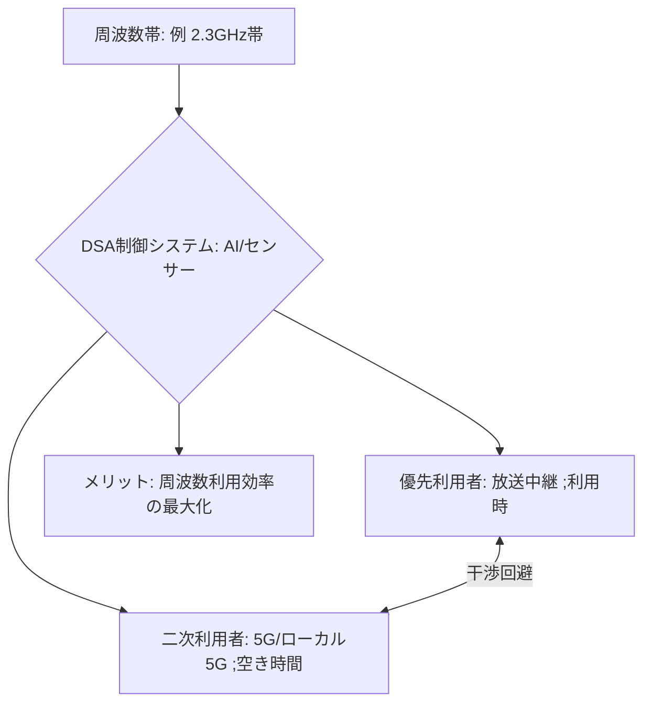

# T14-06-05 ダイナミック周波数共用（DSA: Dynamic Spectrum Access）

## Summary（5つの要点）

1. **周波数の効率的利用**: **限られた周波数リソース**を、**複数の通信事業者**や**異なる用途**（例: 放送と5G、ローカル5G間）で、**時間や場所に応じて動的に共用**する技術 `(1, 2)`。
2. **干渉の自動回避**: **AI**や**センサー**を用いて**電波の利用状況**をリアルタイムで監視し、**既存の利用者**（優先利用者）と**新規利用者**（二次利用者）が**互いに干渉しない**ように**周波数の割り当て**を**自動で調整**する。
3. **米国CBRS**: 米国で導入された**CBRS**（Citizens Broadband Radio Service）は、DSAの代表例であり、**軍事用レーダー**と**プライベートLTE/5G**が**3.5GHz帯**を共用する仕組みを確立している。
4. **日本の実例（KDDI）**: **KDDI**は2023年、**放送事業者**が中継に利用する**2.3GHz帯**を5Gに活用するため、**国内初となるDSA運用**を開始した `(1)`。
5. **日本の実例（ローカル5G）**: **ローカル5G**（T14-05）のエリアが近接する場合の**干渉調整**を自動化するため、**ソニー**などが**世界初となるDSA技術の実証実験**（2023年）を開始しており、周波数利用の円滑化が期待される `(2)`。

#### 概念図

---

### 技術評価表（定量的な視点）
| 評価項目 | 評価 | 根拠 |
| :--- | :--- | :--- |
| 導入コスト | ⭐⭐⭐☆☆ | リアルタイム監視システム、AI制御サーバー、対応基地局の導入が必要 |
| 技術成熟度 | ⭐⭐⭐⭐☆ | 米国CBRSで商用化。日本ではローカル5G、5G帯で実証・導入開始 `(1, 2)` |
| 日本の競争力 | ⭐⭐⭐⭐☆ | **KDDI、ソニー**による**世界初・国内初**の実証・運用実績で先行 `(1, 2)` |
| 市場性 | ⭐⭐⭐⭐⭐ | **周波数枯渇問題**を解決し、**Beyond 5G/6G**の基盤となる必須技術 |
| 品質保証の重要性 | ⭐⭐⭐⭐⭐ | **優先利用者（放送、軍事）**への**干渉を絶対に起こさない**信頼性が最重要 |

---

## 日本の立ち位置・強み弱みのSummary

### 強み：日本企業や研究機関が持つ独自の技術、優位性などを箇条書きで記述。

* **先行的な実証・運用**: **KDDI**による**放送波（2.3GHz帯）**とのDSA運用、**ソニー**らによる**ローカル5G間**のDSA実証など、**世界初・国内初**の先進的な取り組みでノウハウを蓄積している `(1, 2)`。
* **ローカル5G制度との親和性**: **ローカル5G**（T14-05）という**多様な事業者**が**同一周波数帯**を利用する制度が、DSA技術の**格好の実証・導入の場**となっている。
* **AI制御技術**: **AI**を活用した**電波伝搬予測**や**リアルタイム干渉回避アルゴリズム**の開発において、国内通信キャリアとベンダーが強みを持つ。

### 弱み：日本が抱える規制、標準化の遅れ、海外依存などを箇条書きで記述。

* **規制の複雑性**: 周波数は**電波法**で厳格に管理されており、**異なる免許主体間**で**動的に周波数を共用**するための**規制緩和**や**ガイドライン策定**に時間がかかる。
* **優先利用者との調整**: 既存の免許（放送、公共無線、衛星など）を持つ**優先利用者**の**運用を絶対に妨害しない**ための**技術的・制度的保証**のハードルが高い。
* **標準化への貢献**: 米国CBRSのような**包括的なDSAエコシステム**（制御局SAS、端末CPE）の**国際標準化**において、日本の**主導権**が課題。

---

## 技術ロードマップ（短期/中期/長期）

### 短期目標（～2027年）

* **ローカル5G**における**DSA技術**を**商用化**し、**都市部や工業地帯**での**干渉調整を自動化**するシステムを普及させる `(2)`。
* **KDDI**の**2.3GHz帯**DSA運用を全国に拡大し、**周波数利用効率を最大化**する `(1)`。
* **AI**を活用した**電波利用状況のリアルタイム監視・予測**の精度を向上。

### 中期目標（2028年～2031年）

* **DSA**の対象帯域を**6GHz帯**（Wi-Fi 7）や**Beyond 5G/6G**（T14-06-02）の**候補帯域**に拡大し、**周波数共用を前提とした**制度設計を完了。
* **AI**が**自律的**に**最適な周波数割り当て**を行い、**ネットワーク事業者間の周波数取引**を**自動化**するプラットフォームを構築。
* **NTN（衛星通信）**（T14-06-04）と**地上網**間での**国際的なDSA**の仕組みを確立。

### 長期目標（2032年～2035年）

* **周波数の「免許制」から「動的共用制」へ**のパラダイムシフトを主導し、**6Gインフラ**の**基盤技術**としてDSAを確立。
* **量子コンピューティング**（T14-01）を活用し、**国家レベル**での**超複雑な周波数割り当て最適化**を瞬時に実行。

### 📚 参照リンク

1. [国内初、ダイナミック周波数共用活用で2.3GHz帯を運用開始 - KDDI News Room](https://newsroom.kddi.com/news/detail/kddi_pr-946.html)
2. [首都高公募のローカル5G広域展開に向けたダイナミック周波数共用技術の実証実験に参画 - Sony](https://www.sony.com/ja/SonyInfo/News/Press/202305/23-0515/)
3. [CBRS（Citizens Broadband Radio Service）の概要 - U.S. FCC](https://www.fcc.gov/cbrs)
4. [Beyond 5Gに向けた周波数有効活用技術 - 総務省](https://www.soumu.go.jp/)