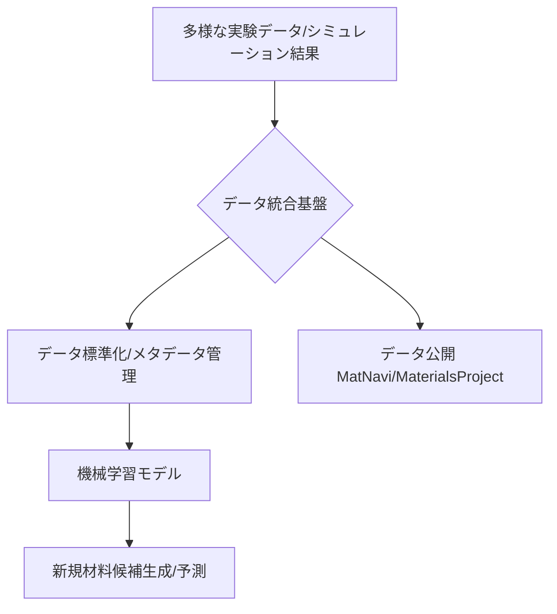

# T15-01-01 材料データベース・データ統合基盤

## Summary（5つの要点）

1. **MIの基盤**: 材料開発の加速に不可欠な基盤技術であり、物性・構造・製造条件・評価データを統合管理する `(1)`。
2. **国際連携**: NIMSの**MatNavi**、米国の**Materials Project**、欧州の**NOMAD**など、世界レベルの公開データベースが存在し、国際的なデータ連携が進む。
3. **データ統合の課題**: 異なるフォーマットのデータを**標準化**し、AI学習利用可能な形式に整備するプロセスが、産業界全体の共通課題。
4. **データ品質保証**: AIモデルの予測精度を担保するため、**メタデータ管理**と**データクオリティ保証**が最も重要な技術要素となる `(3)`。
5. **安全評価への応用**: 動物試験廃止の動きを背景に、毒性・安全性評価におけるMI活用（予測モデル構築）への期待が高まっている `(3)`。

#### 概念図

---

### 技術評価表（定量的な視点）
| 評価項目 | 評価 | 根拠 |
| :--- | :--- | :--- |
| 導入コスト | ⭐⭐⭐☆☆ | データの収集・標準化・インフラ構築に高コスト（既存システム統合コスト） |
| 技術成熟度 | ⭐⭐⭐⭐☆ | MatNaviなど実用的なデータベースが既に稼働。連携・標準化が次フェーズ |
| 日本の競争力 | ⭐⭐⭐⭐☆ | NIMS MatNaviなど世界レベルのDBを保有。品質の高いデータ蓄積は優位 |
| 市場性 | ⭐⭐⭐⭐⭐ | 全産業のMI導入の成否を握る根幹技術であり、市場創出効果が大きい |
| 品質保証の重要性 | ⭐⭐⭐⭐⭐ | データ品質がAI予測の信頼性を直接決定。メタデータのトレーサビリティ確保が必須 |

---

## 日本の立ち位置・強み弱みのSummary

### 強み：日本企業や研究機関が持つ独自の技術、優位性などを箇条書きで記述。

* **NIMS MatNaviの存在**: 信頼性の高い無機材料データ、特に既存の材料データベース補強に成功している `(2)`。
* **材料開発メーカーのデータ量**: 各社が長年にわたり蓄積した非公開の製造条件/物性データは質・量ともに世界有数。
* **計算科学との連携**: スーパーコンピュータ「富岳」などを活用した第一原理計算の結果をデータベースに取り込む体制が整っている。

### 弱み：日本が抱える規制、標準化の遅れ、海外依存などを箇条書きで記述。

* **データ統合の遅れ**: 企業間でデータのフォーマットやメタデータ定義が異なり、産業界全体でのデータ共有・統合が遅れている。
* **データの非公開性**: 知財保護の意識が高く、AI学習に不可欠な高品質な失敗データや中間データの公開が進んでいない。
* **MI人材不足**: データサイエンスと材料科学の両方に精通した人材が不足しており、データベースを有効活用できていない。

---

## 技術ロードマップ（短期/中期/長期）

### 短期目標（～2027年）

* 国内産業界向けのデータ標準化ガイドライン（メタデータ定義含む）の策定と普及。
* 既存の材料データベース（MatNavi等）と企業内データベースを連携させるAPI基盤の構築。
* 安全性・毒性評価に特化したMIデータベースの構築と動物試験代替モデルの精度向上 `(3)`。

### 中期目標（2028年～2031年）

* 製造プロセスデータ（プロセスインフォマティクス）と材料物性データの双方向連携システムの稼働。
* Materials ProjectやNOMADとのデータ互換性を確保し、国際的なデータエコシステムへの参画を強化。
* 非公開データに対する**連合学習（Federated Learning）**技術の導入による、知財を保護しつつ学習精度を向上。

### 長期目標（2032年～2035年）

* データベースが自動でデータ品質を検証・補正する**自律型データキュレーションシステム**の実現。
* データベースを通じてAIモデルと高スループット実験システムが直結する**自律的な材料開発ループ**を確立。
* 量子計算結果など超高精度データを統合した**マルチスケール材料データベース**の完成。

### 📚 参照リンク

1. [情報を制し 想像を超えろ - NIMS](https://www.nims.go.jp/nims/publicity/publication/nimsnow/vol19/hdfqf100000aoslh-att/hdfqf100000aosp0.pdf)
2. [経験とセンスからデータサイエンスへ、MIが変える新材料開発のパラダイム - 東京エレクトロン](https://www.tel.co.jp/museum/magazine/report/202212_01/)
3. [マテリアルズ・インフォマティクスの最新動向と今後の展望(2/3) | みずほリサーチ&テクノロジーズ](https://www.mizuho-rt.co.jp/publication/2021/articles_0065.html)