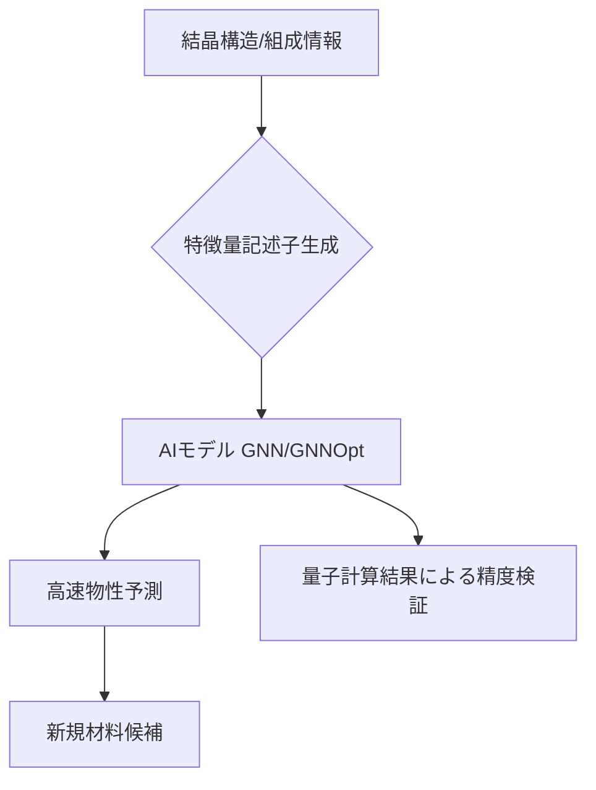

# T15-01-02 機械学習・AIによる物性予測モデル

## Summary（5つの要点）

1. **GNNの進化**: 複雑な材料の立体構造表現を克服するため、**Graph Neural Network (GNN)** を改良した新AIモデルが開発されている `(1)`。
2. **超高速予測の実現**: 東北大学/MITが開発した「**GNNOpt**」は、量子シミュレーションの**最大100万倍の速度**で高精度な**光学スペクトル予測**を可能にした `(1, 2)`。
3. **特徴量エンジニアリング**: 材料の組成記述子や構造記述子を自動生成・最適化する技術が、モデルの予測精度向上の鍵となる。
4. **応用分野の拡大**: **光起電力材料**、**量子材料**、**熱電変換材料**など、エネルギー応用に最適な新規材料開発を大幅に加速する `(1)`。
5. **実装環境**: Pythonライブラリ（scikit-learn、PyTorch）やMatminerなどのMI専用ツール群が整備され、産業界での実装が進む。

#### 概念図

---

### 技術評価表（定量的な視点）
| 評価項目 | 評価 | 根拠 |
| :--- | :--- | :--- |
| 導入コスト | ⭐⭐⭐☆☆ | オープンソースライブラリ利用可能。学習用データと計算資源（GPU）が必要 |
| 技術成熟度 | ⭐⭐⭐⭐☆ | 特定物性（光学、結晶安定性）で実用的な予測精度を達成し始めている |
| 日本の競争力 | ⭐⭐⭐⭐☆ | 東北大学/MIT共同研究など、最新GNNモデル開発で世界をリード `(1)` |
| 市場性 | ⭐⭐⭐⭐⭐ | 新材料開発期間の劇的短縮（1/10以下）に直結し、市場インパクトが大きい |
| 品質保証の重要性 | ⭐⭐⭐⭐☆ | 予測モデルの**信頼区間評価**、**不確実性定量化**が、実験計画の信頼性担保に必須 |

---

## 日本の立ち位置・強み弱みのSummary

### 強み：日本企業や研究機関が持つ独自の技術、優位性などを箇条書きで記述。

* **GNN等先端モデルの開発力**: 東北大学/MITによる「GNNOpt」など、複雑な構造を持つ材料にも適用可能な最先端AIモデルの開発で国際的な優位性を持つ `(1, 2)`。
* **シミュレーションデータとの融合**: 第一原理計算（富岳）による精度の高い学習データの蓄積と、AIによる計算コスト削減の連携体制。
* **特定産業分野での応用**: 自動車、電子部品メーカーが保有する非公開データを活用した、実用性の高い予測モデル構築が進む。

### 弱み：日本が抱える規制、標準化の遅れ、海外依存などを箇条書きで記述。

* **実証データの不足**: AI予測結果を検証するための**高スループット実験**との連携が海外（米国DOEなど）に比べて遅れがち。
* **モデルの解釈性**: ニューラルネットワーク特有の**ブラックボックス性**が、材料科学者への技術浸透と実用化の障壁となっている。
* **汎用モデルの不在**: 特定の物性・組成に特化したモデルが多い。未知の材料系に対して汎用的に高精度な予測を行うモデルは未確立。

---

## 技術ロードマップ（短期/中期/長期）

### 短期目標（～2027年）

* **GNNOpt**などの最新GNNモデルを、太陽電池材料や量子材料などの特定分野で実用化。
* 予測モデルの**不確実性定量化（UQ）**手法を導入し、AI予測の信頼区間を明確化。
* 既存の材料記述子を自動で最適化する**特徴量エンジニアリングAI**を標準機能化。

### 中期目標（2028年～2031年）

* 機械学習と第一原理計算を連携させた**マルチスケール予測モデル**を構築し、予測精度を95%以上に向上。
* 熱力学、速度論的安定性も考慮した、**合成可能性**を考慮した材料予測モデルの開発。
* AIモデルをオープンソース化し、産業界・学術界での利用を加速。

### 長期目標（2032年～2035年）

* 人間が介在しない、**完全自律型**の物性予測AIエージェント（特定の目標物性を入力すると自動で組成・構造を提案）の実現。
* **動的シミュレーション**（分子動力学）の予測をAIで高速化し、数十億原子規模の材料挙動をリアルタイムで予測。

### 📚 参照リンク

1. [材料発見を大幅にスピードアップできる AI モデルを開発 - 東北大学](https://www.tohoku.ac.jp/japanese/2024/10/press20241015-01-ai.html)
2. [材料発見を大幅にスピードアップできる AI モデルを開発 - プレスリリース](https://www.tohoku.ac.jp/japanese/newimg/pressimg/tohokuuniv-press20241015_01_ai.pdf)
3. [経験とセンスからデータサイエンスへ、MIが変える新材料開発のパラダイム - 東京エレクトロン](https://www.tel.co.jp/museum/magazine/report/202212_01/)