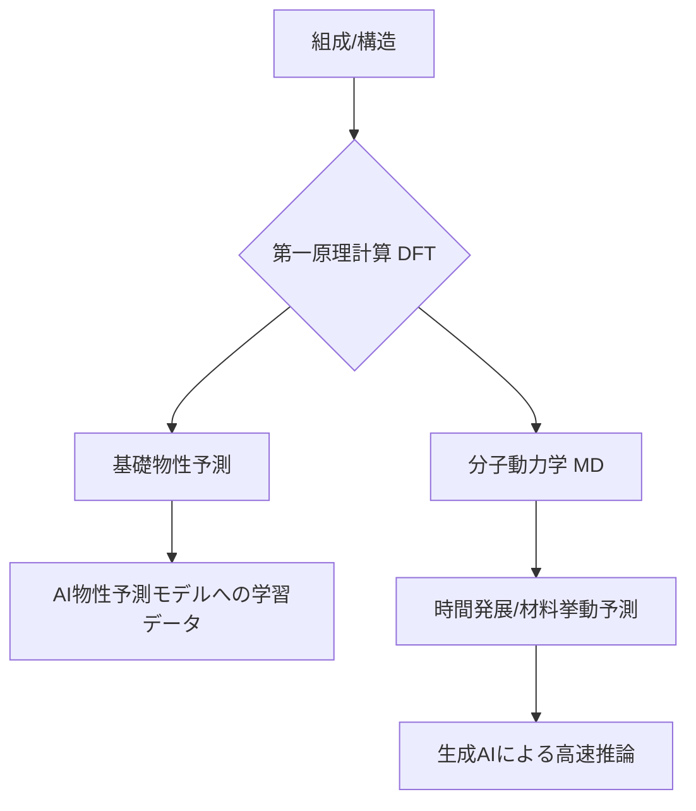

# T15-01-03 第一原理計算・分子動力学シミュレーション

## Summary（5つの要点）

1. **原子レベルの予測**: **密度汎関数理論 (DFT)** に基づき、電子状態、バンド構造など、材料の基礎物性を原子・分子レベルで高精度に予測する。
2. **富岳の活用**: スーパーコンピューター「**富岳**」を活用することで、大規模な分子動力学シミュレーション（タンパク質の動きなど）が可能となり、**IT創薬**などに応用されている `(1)`。
3. **AIによる加速**: シミュレーションと**生成AI**の融合が進展し、AIを用いることで物理シミュレーションよりも**遥かに速い未来予測**が可能となる `(2)`。
4. **計算コストの課題**: 大規模システムや長時間の現象（例: 疲労、劣化）の予測には、AIによる**ポテンシャル関数**の高速化・高精度化が不可欠。
5. **ソフトウェアの標準**: VASP、Quantum ESPRESSOなどの標準ソフトウェアが豊富に存在し、計算結果はMIデータベースの学習データとして活用される。

#### 概念図

---

### 技術評価表（定量的な視点）
| 評価項目 | 評価 | 根拠 |
| :--- | :--- | :--- |
| 導入コスト | ⭐⭐⭐⭐⭐ | 富岳などのHPC（High-Performance Computing）利用に高額な費用 |
| 技術成熟度 | ⭐⭐⭐⭐⭐ | DFT/MDは確立された手法であり、標準ソフトウェアが豊富に存在する |
| 日本の競争力 | ⭐⭐⭐⭐⭐ | スパコン「富岳」と理化学研究所の計算科学研究で世界最高水準 `(1, 2)` |
| 市場性 | ⭐⭐⭐⭐☆ | 新材料探索に加え、故障解析・製造プロセス最適化に活用される |
| 品質保証の重要性 | ⭐⭐⭐⭐☆ | 計算条件（基底関数、カットオフ）の選定が結果の信頼性を左右。パラメータ検証が必須 |

---

## 日本の立ち位置・強み弱みのSummary

### 強み：日本企業や研究機関が持つ独自の技術、優位性などを箇条書きで記述。

* **スーパーコンピュータ富岳の存在**: 世界最高水準の計算資源を活用し、大規模な材料シミュレーションを高速で実行可能 `(1, 2)`。
* **シミュレーションとAIの融合研究**: 理化学研究所などが主導し、AIを用いてシミュレーション結果を高速推論したり、未知の現象を予測する研究で先行 `(2)`。
* **ソフトウェア開発**: 計算科学分野の日本人研究者が開発したポテンシャル関数や解析ツールが、国際的に利用されている。

### 弱み：日本が抱える規制、標準化の遅れ、海外依存などを箇条書きで記述。

* **計算リソースの利用率**: 富岳などのHPCリソースが、民間企業の材料開発に十分に活用されていない（アカデミア中心）。
* **長期現象予測の限界**: 数十億原子スケール、マイクロ秒を超える時間スケールでの材料劣化や疲労といった現象の予測は、依然として計算機能力の限界がある。
* **人材の偏り**: 計算科学者に偏り、材料設計者との連携が不十分な場合があり、計算結果を実用的な材料設計に落とし込む知識が不足しがち。

---

## 技術ロードマップ（短期/中期/長期）

### 短期目標（～2027年）

* AIを活用した**分子動力学ポテンシャル関数**の自動生成と高精度化。
* 「富岳」の計算結果とMIデータベースを連携させ、学習データとしての**自動キュレーションシステム**を構築。
* DFT計算による触媒、電池材料の**反応経路探索**の自動化。

### 中期目標（2028年～2031年）

* 量子計算とDFTを組み合わせた**マルチフィジックスシミュレーション**の実現。
* AI/生成モデルを活用し、**物理シミュレーションを代替**する**超高速推論モデル**を実用化 `(2)`。
* 原子スケールからマクロスケールまでをシームレスに連携する**マルチスケールシミュレーションプラットフォーム**を構築。

### 長期目標（2032年～2035年）

* 計算コストが事実上ゼロとなる、**AI主導型**の原子・分子シミュレーション環境の完成。
* 実環境の温度・圧力・応力を反映した**リアルタイム**材料挙動シミュレーションを可能にする。

### 📚 参照リンク

1. [「富岳」を使ったシミュレーションとAIの融合による次世代IT創薬への取り組み - RIKEN R-CCS](https://www.r-ccs.riken.jp/highlights/pickup9/)
2. [“ 「富岳」×生成AI ”で生まれる技術革新や応用可能性 【理化学研究所計算科学研究センター 松岡 聡氏】 - SEIKATSU SHA DIGITAL MEDIA](https://seikatsusha-ddm.com/article/14195/)