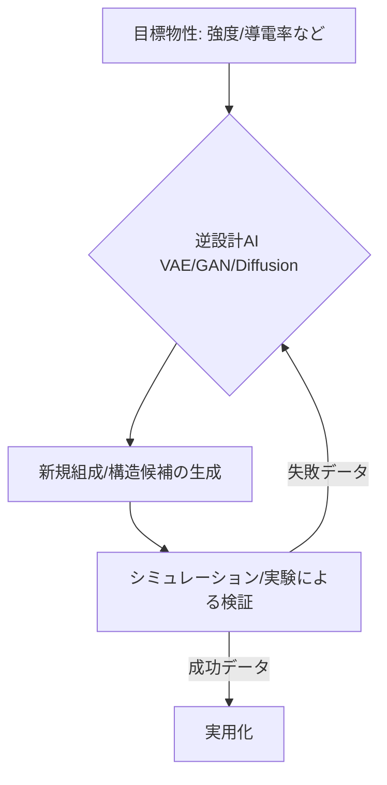

# T15-01-04 逆設計・生成モデル（Generative AI for Materials）

## Summary（5つの要点）

1. **逆設計のパラダイム**: 目的の物性（例: 触媒活性）をAIに入力することで、その特性を満たす**未知の組成や構造**を自動で**生成**する技術。
2. **Diffusion Modelの台頭**: 従来型のGANやVAEに加え、**拡散モデル (Diffusion Model)** が登場し、特に**微細構造画像**のような複雑なデータ生成において、**高品質で安定した学習**を実現 `(2, 3)`。
3. **微細構造設計への応用**: 材料の微細構造画像から特性に関わる特徴を抽出し、特定の特性を持つ**微細構造**をAIが生成することで、**設計空間の爆発的拡大**に貢献 `(3)`。
4. **GAN/VAEとの比較**: GANは高品質だが学習が不安定、VAEは多様性があるが品質が低い傾向に対し、拡散モデルは高品質と多様性・学習の安定性を両立する `(1, 2)`。
5. **応用分野**: 触媒、電池材料、新規有機化合物、高分子などの**分子構造設計**や、特定の機能を持つ**メタマテリアル**の探索に応用される。

#### 概念図

---

### 技術評価表（定量的な視点）
| 評価項目 | 評価 | 根拠 |
| :--- | :--- | :--- |
| 導入コスト | ⭐⭐⭐⭐☆ | 既存生成モデルを応用可能。大量の高品質な学習データと計算資源が必要 |
| 技術成熟度 | ⭐⭐⭐☆☆ | 画像・言語生成に比べ、材料科学分野では黎明期だが、進化速度が速い |
| 日本の競争力 | ⭐⭐⭐☆☆ | Google DeepMind, MITなどが研究をリード。日本はキャッチアップ段階 |
| 市場性 | ⭐⭐⭐⭐⭐ | 材料開発における**試行錯誤コスト**を根絶し、開発期間の短縮に貢献 |
| 品質保証の重要性 | ⭐⭐⭐⭐⭐ | 生成された材料候補が物理法則/合成可能性を満たすかの検証（第一原理計算等）が必須 |

---

## 日本の立ち位置・強み弱みのSummary

### 強み：日本企業や研究機関が持つ独自の技術、優位性などを箇条書きで記述。

* **画像生成AIの技術応用力**: 画像・イラスト生成で高い技術を持つAIベンダーが、微細構造画像や分子構造画像への生成AI応用研究を開始。
* **既存材料データの蓄積**: 自動車、化学、鉄鋼など、日本の基幹産業が持つ膨大な材料データは、生成モデルの学習基盤として極めて有用。
* **基礎研究の進展**: 京都大学、東京工業大学などのアカデミアが、VAEやGANを応用した分子設計の基礎研究で成果を挙げている。

### 弱み：日本が抱える規制、標準化の遅れ、海外依存などを箇条書きで記述。

* **海外ビッグテックの先行**: Google DeepMind, MITなど、大規模計算リソースと人材を持つ海外勢が、高性能な汎用生成モデルの開発をリード。
* **合成可能性の検証**: 生成AIが提案した組成・構造が、現実のラボで合成可能であるか（熱力学的/速度論的安定性）を検証する技術連携が不足。
* **実証データの不足**: 生成AIの学習に不可欠な**負のデータ**（失敗データ）の公開・共有が進んでいない。

---

## 技術ロードマップ（短期/中期/長期）

### 短期目標（～2027年）

* 拡散モデル（Diffusion Model）を材料の**微細構造設計**に適用するためのアルゴリズム開発と検証。
* VAE/GANを用いた**分子設計**において、目的物性と合成可能性を同時に満たす候補生成モデルの精度を向上。
* 逆設計モデルの提案結果を、第一原理計算で自動的に安定性を検証する**パイプライン**を構築。

### 中期目標（2028年～2031年）

* 生成AIが提案した新規材料候補を、高スループット実験で自動合成・評価する**閉ループシステム**を完成。
* 特定物性（例: 耐熱性、強度）をターゲットにした**業界特化型**の生成AIモデルを実用化。
* **条件付き生成**（Conditional Generation）により、製造条件まで含めてAIが提案できるように進化。

### 長期目標（2032年～2035年）

* 人間がアイデアを入力するだけで、組成、構造、製造プロセスまでを**完全自律的に設計**する**マテリアルズ・コパイロットAI**を実現。
* **マルチモーダル**な生成モデル（組成、構造、物性、論文テキストを同時に扱う）を構築。

### 📚 参照リンク

1. [拡散モデル（Diffusion model）とは？意味や定義、GANやVAEとの違いまでわかりやすく解説 - gen-ai-media](https://gen-ai-media.guga.or.jp/glossary/diffusion-model/)
2. [Diffusion model(拡散モデル)とは？仕組み、GANやVAEとの違い、企業導入メリット - AI Market](https://ai-market.jp/technology/diffusion-model/)
3. [生成AIは材料開発をどう変えるか？レビュー論文を読む - Qiita](https://qiita.com/k_t_09099/items/fcfc6ab02c75f98a5f84)