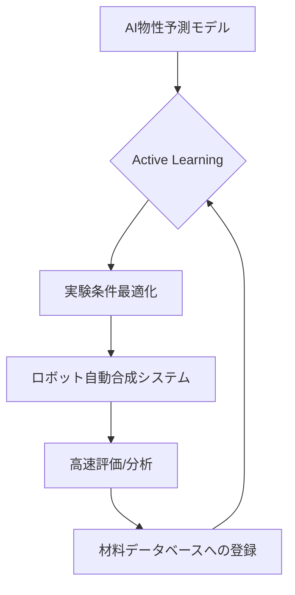

# T15-01-05 高スループット実験・自動合成システム

## Summary（5つの要点）

1. **MIの出口戦略**: AIが提案した新規材料候補を、短期間で合成・評価する**ロボット実験装置**であり、MIの成果を実証する上で不可欠な技術。
2. **実験効率の劇的向上**: 産総研の事例では、二酸化チタン薄膜の探索で従来の**10倍程度の実験効率**を達成し、全自動で自律的な研究スタイルを提唱している `(1)`。
3. **Active Learningの実現**: 実験結果を**リアルタイム**でAIモデルにフィードバックし、次の最適実験条件を自動決定する**能動学習（Active Learning）**を中核に持つ。
4. **応用事例**: **PEFC向け高性能触媒**の連続・自動合成に成功し、従来比10倍以上の高効率合成プロセスを実現した `(2)`。
5. **産業化への動き**: 産総研は「**AUTO工房**」を立ち上げ、材料研究の自動化・ハイスループット化を支援するシステムの構築・産業界への普及を進めている `(3)`。

#### 概念図

---

### 技術評価表（定量的な視点）
| 評価項目 | 評価 | 根拠 |
| :--- | :--- | :--- |
| 導入コスト | ⭐⭐⭐⭐⭐ | ロボットアーム、高精度測定装置、制御ソフトのシステムインテグレーションに高コスト |
| 技術成熟度 | ⭐⭐⭐⭐☆ | 触媒、高分子、薄膜合成で実証され、一部ラボで実用化段階 |
| 日本の競争力 | ⭐⭐⭐⭐☆ | 産総研、理研などが世界レベルの自動合成システムを開発し、国際的にも高い評価 `(1, 2)` |
| 市場性 | ⭐⭐⭐⭐⭐ | 新規材料開発の期間・コストを数分の一に短縮。MIの実装に直結 |
| 品質保証の重要性 | ⭐⭐⭐⭐⭐ | ロボットによる合成・測定の**再現性**と、結果データの**トレーサビリティ**確保が最重要 |

---

## 日本の立ち位置・強み弱みのSummary

### 強み：日本企業や研究機関が持つ独自の技術、優位性などを箇条書きで記述。

* **産総研による高度な実証**: 自律的な物質探索ロボットシステム、PEFC触媒の高効率合成など、世界トップレベルの自動実験システムの実証実績 `(1, 2)`。
* **ロボティクス・FA技術**: 日本の強みである産業用ロボット、ファクトリーオートメーション（FA）技術を応用できる土壌がある。
* **Active Learningの基礎研究**: MIと連携した能動学習（Active Learning）のアルゴリズム開発で先行。

### 弱み：日本が抱える規制、標準化の遅れ、海外依存などを箇条書きで記述。

* **システムインテグレーションの遅れ**: 合成・評価・分析の装置が個別最適化されており、AIと連携した**シームレスな統合システム**の構築が欧米に比べて遅れている。
* **データ標準化の遅れ**: ロボット実験装置から出力される生データのフォーマットが装置間で異なり、MIデータベースへの自動登録が困難。
* **初期導入コストの高さ**: システム構築に多大な初期投資が必要なため、大企業以外への普及が進んでいない。

---

## 技術ロードマップ（短期/中期/長期）

### 短期目標（～2027年）

* **産総研AUTO工房**の機能を拡充し、企業への自動化技術導入支援を加速 `(3)`。
* 高スループット実験システムのデータ出力形式を**MIデータベースの標準規格**に準拠させるための共通APIを開発。
* AI予測モデルと実験システムを連携させた**閉ループ実験**の適用分野を、触媒、高分子、薄膜以外の分野に拡大。

### 中期目標（2028年～2031年）

* 特定の物性（例: 導電率、熱伝導率）をターゲットとした**汎用型ラボオートメーションシステム**を市場に投入。
* **人間の介入を最小限**に抑えた、24時間365日稼働の**完全自律型マテリアルズ・ラボ**を企業ラボに実装。
* 遠隔操作・仮想環境シミュレーションによる**デジタルツインラボ**を実現。

### 長期目標（2032年～2035年）

* AIがターゲット物性・合成可能範囲を判断し、**自律的に研究計画・予算まで最適化**する**研究開発AIエージェント**の実現。
* 複数拠点の自動実験装置をネットワークで連携させ、**分散型ハイスループット実験**を可能にする。

### 📚 参照リンク

1. [自律的に物質探索を進めるロボットシステムを開発 - 産総研](https://www.aist.go.jp/aist_j/press_release/pr2020/pr20201119/pr20201119.html)
2. [産総研：連続・自動合成法でPEFC向け高性能触媒の合成に成功、高効率合成も実現](https://www.aist.go.jp/aist_j/press_release/pr2021/pr20211115/pr20211115.html)
3. [産総研が切り拓くラボラトリーオートメーションの新地平〜100℃以下で - オザワ科学](https://www.ozawasc.co.jp/column/p5431/)