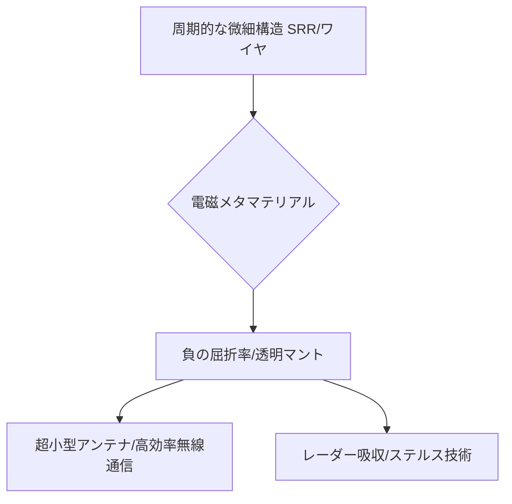

# T15-02-01 電磁メタマテリアル（負の屈折率・電磁波制御）

## Summary（5つの要点）

1. **負の屈折率の実現**: 自然界に存在しない**負の誘電率**（$\epsilon<0$）と**負の透磁率**（$\mu<0$）を同時に実現し、**負の屈折率**（$n<0$）を発現させる `(1, 2)`。
2. **透明マント・熱クローク**: 電磁波を構造の周囲に沿って迂回させることで、物体を不可視化する**透明マント（電磁波回折）**や、熱流を制御する**熱クローク**技術に応用される。
3. **応用周波数帯**: マイクロ波帯で実証された後、**可視光**領域での負の屈折率実現（約70nm）に向けた微細構造設計が進展し、**テラヘルツ波**領域での応用が期待される `(1)`。
4. **構造の種類**: 代表的な構造として、負の透磁率を実現する**SRR（Split Ring Resonator）**、負の誘電率を実現する**金属ワイヤ（EBG構造、マッシュルーム構造）**などがある `(2)`。
5. **実用化領域**: **超小型アンテナ**、**高効率な電磁ノイズ抑制技術**（EBG構造）、**高性能レーダー吸収材**（メタサーフェス）など、無線通信・防衛分野での実用化が進む。

#### 概念図

---

### 技術評価表（定量的な視点）
| 評価項目 | 評価 | 根拠 |
| :--- | :--- | :--- |
| 導入コスト | ⭐⭐⭐⭐☆ | 可視光領域はナノ加工技術に高コスト。マイクロ波帯は比較的容易 |
| 技術成熟度 | ⭐⭐⭐⭐☆ | マイクロ波帯では負の屈折率が確立。可視光領域は損失・実用化が課題 |
| 日本の競争力 | ⭐⭐⭐⭐☆ | 理化学研究所、NECなどがEBG構造、ノイズ抑制技術で優位性を持つ `(2)` |
| 市場性 | ⭐⭐⭐⭐⭐ | 5G/6G通信、テラヘルツ波センシング、防衛技術など、広範囲な市場創出効果 |
| 品質保証の重要性 | ⭐⭐⭐⭐⭐ | 微細構造の**加工精度**が特性に直結。製造後の**電磁波特性の再現性**確保が必須 |

---

## 日本の立ち位置・強み弱みのSummary

### 強み：日本企業や研究機関が持つ独自の技術、優位性などを箇条書きで記述。

* **EBG構造・ノイズ抑制技術**: NECなどがマッシュルーム構造を応用し、高周波回路における電磁ノイズ抑制技術で実用化に成功している `(2)`。
* **微細加工技術**: 半導体分野で培われたナノレベルの微細加工技術は、可視光・テラヘルツ波領域のメタマテリアル製造に不可欠な基盤技術。
* **テラヘルツ波研究**: 理化学研究所などがテラヘルツ波帯でのメタマテリアル応用研究で先行しており、次世代通信・センシングへの応用を目指す。

### 弱み：日本が抱える規制、標準化の遅れ、海外依存などを箇条書きで記述。

* **可視光領域での性能**: 損失（吸収）が大きく、負の屈折率の明確な実証や実用化で、欧米（Duke大学、MIT）に遅れをとる傾向にある。
* **基礎研究の拡散**: 研究がマイクロ波、テラヘルツ波、可視光と多岐にわたり、特定の応用分野への集中的なリソース投入が不足しがち。
* **製造コスト**: 高度なナノ加工技術に依存するため、量産化におけるコストダウンが課題。

---

## 技術ロードマップ（短期/中期/長期）

### 短期目標（～2027年）

* マイクロ波帯での**超小型・広帯域アンテナ**の実用製品化を加速し、5G/Beyond 5G端末への搭載を開始。
* EBG構造を用いた**高効率な電磁ノイズ抑制シート**を、自動車や産業機器へ本格導入。
* テラヘルツ波帯での**メタサーフェス**によるビーム走査、偏光制御の実証。

### 中期目標（2028年～2031年）

* **可視光領域**の**低損失**メタマテリアル（メタサーフェス）を開発し、超解像レンズ、ホログラフィックディスプレイへの応用を検証。
* メタマテリアルを用いた**高性能レーダー吸収材**（ステルス技術）のプロトタイプを開発。
* **熱クローク**など、電磁波と熱流を同時に制御する**多機能メタマテリアル**の基礎研究を確立。

### 長期目標（2032年～2035年）

* 可視光帯で機能する**真の透明マント**（完全回折）の基礎原理を確立し、応用技術を開発。
* **AI**を活用した**電磁メタマテリアルの逆設計**（目標特性から構造を自動生成）システムの完成。
* 量子コンピューティング技術と連携した、**超低消費電力**の電磁波制御デバイスの実現。

### 📚 参照リンク

1. [電磁メタマテリアルの研究動向 - 応用物理学会](https://annex.jsap.or.jp/photonics/kogaku/public/36-10-sougouhoukoku1.pdf)
2. [メタマテリアルを用いた電磁ノイズ抑制技術とその実用化 - NEC](https://jpn.nec.com/techrep/journal/recommend_year/2013/05.html)
3. [構造で光を操るメタマテリアルの実用化を目指す - 理化学研究所](https://www.riken.jp/medialibrary/riken/pr/publications/news/2017/rn201711.pdf)