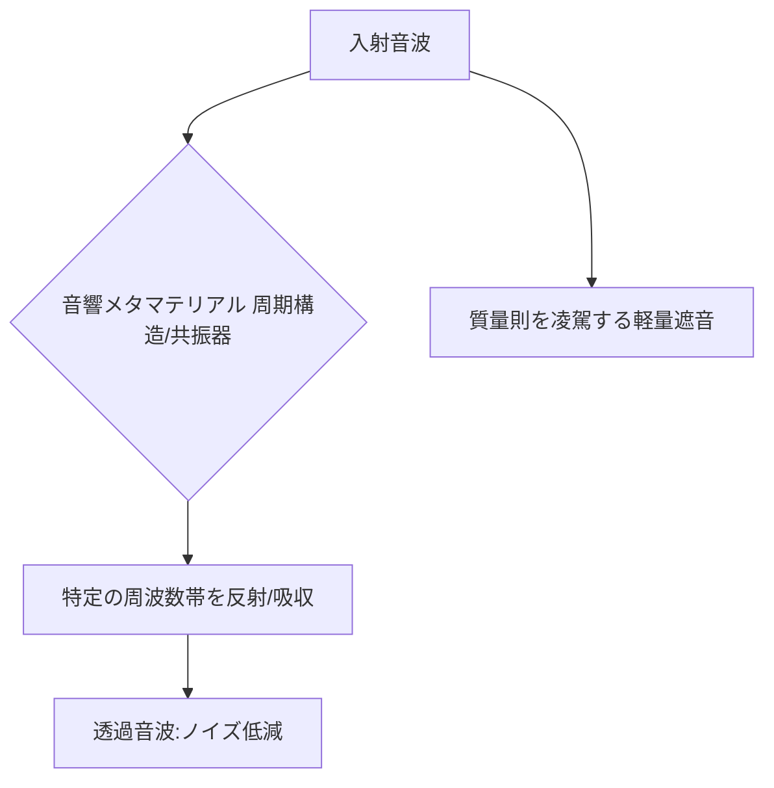

# T15-02-02 音響メタマテリアル（遮音・吸音制御）

## Summary（5つの要点）

1. **質量則の打破**: 従来の遮音材は重いほど性能が高い（質量則）が、音響メタマテリアルは**共振器構造**を用いることで、**質量則を凌駕**する軽量かつ高い遮音性能を実現する `(2, 5)`。
2. **原理**: 構造体内部の**共鳴・共振系**が、特定の周波数帯の音エネルギーを跳ね返したり（遮音）、熱エネルギーに変換したり（吸音）することで音波を制御する `(3)`。
3. **遮音と通気性の両立**: **開口部**を持つ構造でも高い遮音性能（例: 開口率50%で30dB低減）を発揮し、換気や通気が必要な環境での**騒音低減**を可能にする `(1)`。
4. **構造の種類**: **ハニカムと膜**の複合構造（遮音シート）、**ヘルムホルツ共振器**の周期配列などがあり、3Dプリンティング技術により複雑な内部構造を容易に製造できる。
5. **応用分野**: **自動車のロードノイズ低減**（軽量化）、**電動車**の静粛性向上、**建築物**の防音壁、**ドローン**などの特定周波数ノイズ抑制への応用が実用化段階 `(2, 4)`。

#### 概念図

---

### 技術評価表（定量的な視点）
| 評価項目 | 評価 | 根拠 |
| :--- | :--- | :--- |
| 導入コスト | ⭐⭐⭐⭐☆ | 3Dプリンティングによる製造コストは高いが、量産化で低減傾向 |
| 技術成熟度 | ⭐⭐⭐⭐☆ | 特定周波数帯での遮音・吸音は実用化レベル。広帯域制御は発展途上 |
| 日本の競争力 | ⭐⭐⭐⭐⭐ | 日産、三菱ケミカル、PxDTなど、自動車・素材メーカーによる実用化で世界をリード `(1, 2, 4)` |
| 市場性 | ⭐⭐⭐⭐⭐ | 自動車（EV）、航空機、建築、産業機器など、全ての騒音対策市場に適用可能 |
| 品質保証の重要性 | ⭐⭐⭐⭐⭐ | 構造の**寸法精度**が共振周波数に直接影響。3Dプリントプロセスの品質管理が必須 |

---

## 日本の立ち位置・強み弱みのSummary

### 強み：日本企業や研究機関が持つ独自の技術、優位性などを箇条書きで記述。

* **自動車産業での実用化**: 日産がロードノイズ低減、三菱ケミカルが超軽量シートを開発するなど、自動車分野での実用化と量産化が先行している `(2, 5)`。
* **産学連携**: 東北大学、工学院大学などのアカデミアと、スタートアップ（PxDT）や大手企業との連携が密接で、基礎研究から製品化までのスピードが速い `(1, 3)`。
* **低周波騒音対策**: 従来の材料では困難であった**低周波騒音**（ロードノイズなど）の遮音・抑制が実現可能であり、EVの静粛性向上に大きく貢献。

### 弱み：日本が抱える規制、標準化の遅れ、海外依存などを箇条書きで記述。

* **広帯域化の課題**: 現在は特定の周波数帯での遮音に優れるが、広範囲の騒音を万遍なく低減するための**多重共振器設計**や**広帯域制御技術**の開発が課題。
* **3Dプリンティングコスト**: 複雑な内部構造を製造するために3Dプリンティング技術が不可欠だが、量産コストが従来の材料成形法に比べて高い。
* **材料耐久性**: 自動車や建築での利用において、長期間の使用に対する**耐候性、耐久性**の検証が引き続き必要。

---

## 技術ロードマップ（短期/中期/長期）

### 短期目標（～2027年）

* 自動車（EV）への**超軽量遮音シート**の本格採用と量産化。
* 通気性と遮音性を両立した**換気・空調システム用ノイズフィルター**の実用化。
* 3Dプリンティングによる試作品の制作時間を短縮し、**音響メタマテリアルの逆設計**をAIで加速。

### 中期目標（2028年～2031年）

* 複数の共振器構造を統合し、**低周波から高周波までをカバーする広帯域遮音材**を開発。
* 構造振動の制振（力学メタマテリアル）と音響遮音を両立させた**多機能な複合材料**の実用化。
* 音波の流れを任意に曲げる**音響クローク（不可視化）**技術の基礎原理を確立。

### 長期目標（2032年～2035年）

* **アクティブ制御**（能動制御）と連携し、外部環境の変化に応じて音響特性をリアルタイムで変化させる**インテリジェントな音響メタマテリアル**の実現。
* 3Dプリンティングによる**オンデマンド生産**システムの確立により、カスタムメイドの騒音対策を普及。

### 📚 参照リンク

1. [ピクシーダストテクノロジーズ、”空気は通すが音は通さない”音響メタマテリアル遮音材の開発を発表 - PR TIMES](https://prtimes.jp/main/html/rd/p/000000080.000044679.html)
2. [軽量な遮音材料（音響メタマテリアル） | 日産自動車企業情報サイト](https://www.nissan-global.com/JP/INNOVATION/TECHNOLOGY/ARCHIVE/META_MATERIAL/)
3. [遮音性能向上を実現する 音響メタマテリアル - 工学院大学](https://www.kogakuin.ac.jp/research/seeds/fbb28u0000007htz-att/t5eu69000000et1r.pdf)
4. [音響メタマテリアル遮音・制振シート Reso-Core™（レゾコア）｜自動車関連ソリューション](https://mcc-ams.com/products/41/)
5. [軽さと静かさを両立した遮音材「音響メタマテリアルシート」を開発〜従来材の1/8 に軽量化 - 高分子学会](https://main.spsj.or.jp/koho/30p/30p_5.pdf)