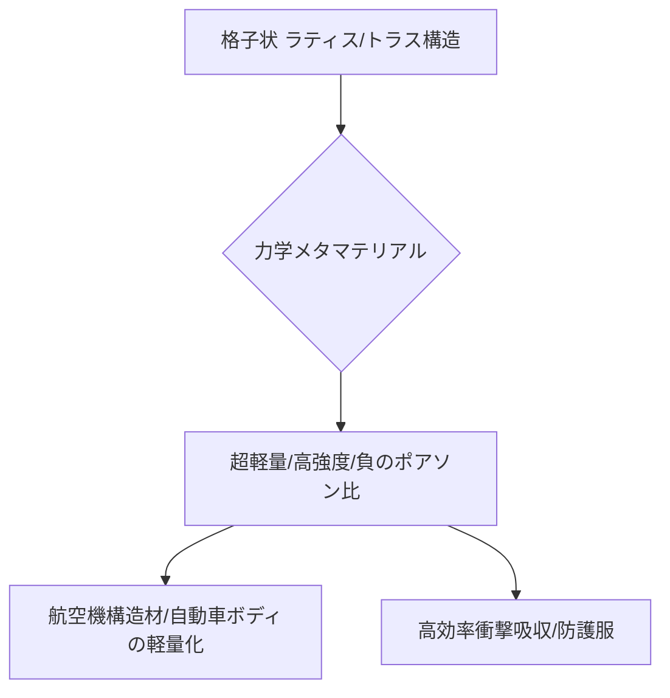

# T15-02-03 力学メタマテリアル（超軽量・高強度構造）

## Summary（5つの要点）

1. **構造による機能発現**: 格子状の**ラティス構造**や**トラス構造**を人工的に設計することで、素材自体の物性ではなく**構造の幾何学的特性**によって、超軽量・高強度・負のポアソン比などの特殊な力学特性を実現する。
2. **超軽量化**: 3Dプリンティング技術で内部を中空のラティス構造にすることで、比重を維持しつつ**超軽量化**と高い**剛性**を両立し、航空機・自動車分野の**燃費・航続距離向上**に貢献する。
3. **エネルギー吸収**: 衝撃を受けた際に構造全体が変形・崩壊することで、高い**衝撃吸収性能**を発揮。自動車の衝突安全部品や、防護服、ヘルメット、パッケージ材への応用が期待される。
4. **制振・騒音低減**: 構造振動の**バンドギャップ**（振動の伝播を禁止する周波数帯）を設計することで、特定の周波数・ノイズのみを遮断する**振動抑制**効果や**騒音低減構造**を実現する `(1)`。
5. **応用分野**: 航空機（JAXAでの研究）、自動車、建築構造材に加え、**医療用インプラント**（骨の機械特性模倣）など、生体材料分野への展開も進む。

#### 概念図

---

### 技術評価表（定量的な視点）
| 評価項目 | 評価 | 根拠 |
| :--- | :--- | :--- |
| 導入コスト | ⭐⭐⭐⭐☆ | 金属3Dプリンティング（AM）に高コスト。シミュレーション・設計コストも高い |
| 技術成熟度 | ⭐⭐⭐☆☆ | 基礎研究は進展。航空機・自動車への適用は信頼性・品質保証面で課題が残る |
| 日本の競争力 | ⭐⭐⭐☆☆ | 構造設計、3Dプリンティング技術で米国（MIT、Caltech）にキャッチアップ中。JAXAでの研究に期待 |
| 市場性 | ⭐⭐⭐⭐⭐ | 航空宇宙、自動車、建築、医療など、構造体の性能が求められる全産業がターゲット |
| 品質保証の重要性 | ⭐⭐⭐⭐⭐ | 内部欠陥（多孔性、熱応力）が強度に直結。非破壊検査、トポロジー最適化の信頼性検証が必須 |

---

## 日本の立ち位置・強み弱みのSummary

### 強み：日本企業や研究機関が持つ独自の技術、優位性などを箇条書きで記述。

* **JAXAでの研究**: 宇宙構造物への適用を目指した、超軽量・高剛性のラティス構造の研究開発を推進。
* **構造解析・シミュレーション技術**: 日本が強みを持つ有限要素法（FEM）などのシミュレーション技術は、複雑な力学メタマテリアル設計に不可欠。
* **金属AM技術との融合**: 金属3Dプリンティング（Additive Manufacturing: AM）技術を持つ国内企業との連携により、複雑な内部構造体の製造能力を持つ。

### 弱み：日本が抱える規制、標準化の遅れ、海外依存などを箇条書きで記述。

* **品質保証・規格化の遅れ**: 航空機や自動車といった高信頼性が求められる分野での適用にあたり、メタマテリアル特有の構造体の**信頼性評価基準**や**非破壊検査技術**の標準化が遅れている。
* **設計ツールの不足**: トポロジー最適化と3Dプリンティング技術を統合した、設計から製造までを一貫して行う**ソフトウェアエコシステム**の構築が欧米に比べて不足。
* **基礎研究の絶対量**: MIT、Caltech、ケンブリッジ大学など、海外のトップ研究機関に比べ、負のポアソン比など基礎的な力学特性の探索研究の絶対量が不足。

---

## 技術ロードマップ（短期/中期/長期）

### 短期目標（～2027年）

* 3Dプリンティングによる**特定機能部品（例: 緩衝材、制振部材）**の試作・評価を自動車・家電分野で加速。
* 力学メタマテリアルの**信頼性評価手法**（疲労、破壊靭性）を確立し、国際標準化に提案。
* **トポロジー最適化**技術と3Dプリンティングの連携ツールを業界標準化。

### 中期目標（2028年～2031年）

* 航空機、自動車の**主要構造部材**（例: ブラケット、ボディフレームの一部）に力学メタマテリアルを本格導入し、**20%以上の軽量化**を実現。
* 応力・振動環境に応じて構造が変化する**適応型力学メタマテリアル**の基礎技術を確立。
* **衝撃吸収性能**を極限まで高めた**防護服、ヘルメット**の商用化。

### 長期目標（2032年～2035年）

* AIが目標強度・軽量化率・コストを入力すると、最適なラティス構造を自動生成する**完全自律型設計システム**の実現。
* 構造体全体にわたって物性を空間的に制御できる**傾斜機能メタマテリアル**を航空宇宙分野へ適用。

### 📚 参照リンク

1. [メカニカルメタマテリアルによる振動抑制を可能とする超軽量構造の研究開発 - NEDO](https://wakasapo.nedo.go.jp/seeds/seeds-1249/)
2. [未来を変える「材料」超軽量で強靭、金属3Dプリンターで創る“逆転の発想” - NHK](https://www.nhk.or.jp/gendai/articles/4513/)
3. [3Dプリンティング技術を活用した多孔質超軽量高強度材料の開発 - JAXA](https://www.tenmon.jaxa.jp/news/info/20210323.html)