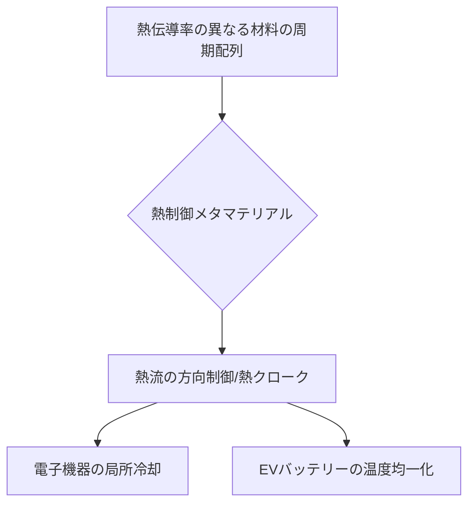

# T15-02-04 熱制御メタマテリアル（熱流制御・断熱）

## Summary（5つの要点）

1. **熱流の任意制御**: 熱伝導率を空間的に変化させる**周期構造**や**複合材料**の設計により、熱の流れを特定の方向に導いたり、特定の場所から熱を隠したりする（**熱クローク**）ことが可能となる `(1)`。
2. **熱伝導率の極限制御**: グラフェン、CNT（カーボンナノチューブ）、エアロゲルなど、**熱伝導率が高い材料と低い材料**を周期的に組み合わせることで、従来の材料では実現できない**超高効率な熱輸送**または**超断熱性能**を実現する。
3. **熱クロークの原理**: 物体の周囲に特殊なメタマテリアル層を配置し、熱が内部を迂回するように設計することで、外部から熱を隠し、**熱的に不可視化**する `(1)`。
4. **応用分野**: **電子機器の局所冷却**（ホットスポット対策）、**バッテリーの熱マネジメント**（EV、蓄電池）、**超高効率断熱材**（建築、宇宙船）、**熱電変換デバイス**の効率向上など、エネルギーマネジメント分野で広範に応用される。
5. **技術的課題**: 熱の波（フォノン）は電磁波より波長が短く、乱雑な動きをするため、精密な制御には**ナノスケール**の構造制御が必要とされる。

#### 概念図

---

### 技術評価表（定量的な視点）
| 評価項目 | 評価 | 根拠 |
| :--- | :--- | :--- |
| 導入コスト | ⭐⭐⭐⭐☆ | ナノ構造体の製造、複合材料の積層技術にコストがかかる |
| 技術成熟度 | ⭐⭐⭐☆☆ | 熱クロークは原理実証段階。断熱材、放熱材への応用は実用化が近い |
| 日本の競争力 | ⭐⭐⭐⭐☆ | 東京大学、シンガポール国立大学など、国際的な研究連携が進展。グラフェンなどの高機能素材技術に強み `(1)` |
| 市場性 | ⭐⭐⭐⭐⭐ | EV、5G/6G機器、データセンターなど、熱マネジメントが必須の産業で市場価値が高い |
| 品質保証の重要性 | ⭐⭐⭐⭐⭐ | 熱伝導率の**空間的均一性/再現性**が重要。製造プロセスでの**ナノ構造の欠陥管理**が必須 |

---

## 日本の立ち位置・強み弱みのSummary

### 強み：日本企業や研究機関が持つ独自の技術、優位性などを箇条書きで記述。

* **ナノマテリアル技術**: グラフェン、CNTなどの高熱伝導性材料や、シリカエアロゲルなどの超断熱材の開発技術で世界をリードしており、メタマテリアルの構成要素として優位性を持つ。
* **東京大学などの研究成果**: 熱流を迂回させる**熱クローク**の原理実証など、基礎研究で国際的な成果を挙げている `(1)`。
* **電子機器・自動車分野の応用ニーズ**: 自動車（EV）、電子部品メーカーが、高性能な熱マネジメント技術を強く求めており、産業界との連携が進みやすい。

### 弱み：日本が抱える規制、標準化の遅れ、海外依存などを箇条書きで記述。

* **製造の複雑さ**: ナノスケールでの熱伝導率の空間制御は製造が複雑であり、量産技術の確立が欧米・アジア諸国に比べて遅れている。
* **標準化の不足**: 熱クロークなどの新しい概念に対して、**性能評価基準**や**測定手法**の標準化が不足している。
* **大規模熱マネジメントへの応用**: 建築物や大規模発電プラントなど、大規模な熱流制御への応用実証が限定的。

---

## 技術ロードマップ（短期/中期/長期）

### 短期目標（～2027年）

* **EVバッテリーのモジュール単位**での温度均一化を実現する**熱制御シート**の実用化。
* CPU/GPUのホットスポットを効率的に冷却するための**局所冷却デバイス**を開発。
* **フォノン輸送シミュレーション**とAIを連携させ、ナノ構造体の熱伝導率を高速で予測。

### 中期目標（2028年～2031年）

* 特定領域の熱を外部に漏らさない**小型熱クローク**（熱的に不可視化）技術を開発し、精密機器保護への応用を検証。
* 超断熱性能を持つ**熱制御メタマテリアル**を建築分野に導入し、省エネ性能を劇的に向上。
* 廃熱を効率的に回収・利用するための**熱流集中デバイス**を開発。

### 長期目標（2032年～2035年）

* 外部環境の変化（温度、日射量）に応じて熱制御特性を**リアルタイムで変化させる**インテリジェントな**能動型熱メタマテリアル**を実現。
* 熱の量子論的性質（フォノン）を制御し、**極限的な熱輸送効率**を持つ材料を開発。

### 📚 参照リンク

1. [人工材料「メタマテリアル」で熱流を思いのままに制御 - 東京大学](https://www.t.u-tokyo.ac.jp/press/pr2018-09-002)
2. [熱を光のように操る熱フォノン制御技術 - 産総研](https://www.aist.go.jp/aist_j/aistinfo/aist_today/vol09_02/vol09_02_p16_p19.pdf)
3. [熱輸送を操る人工材料の開発と応用 - O plus E](https://optronics-media.com/wp-content/uploads/2021/08/Oe_202108_2_2.pdf)