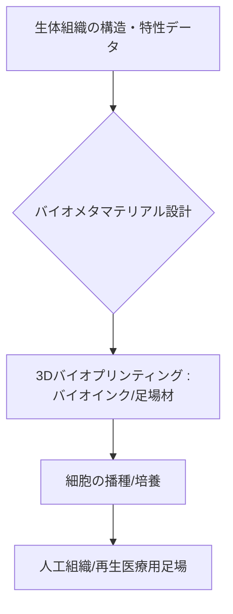

# T15-02-05 バイオメタマテリアル（人工組織・再生医療用足場）

## Summary（5つの要点）

1. **生体組織の機能模倣**: 生体組織（骨、軟骨、血管）特有の**多孔構造**、**機械特性**（弾性率、剛性）を、メタマテリアルの概念に基づき人工的に正確に模倣した**足場材（Scaffold）**として機能する `(1)`。
2. **3Dバイオプリンティング**: 細胞を含むバイオインク（コラーゲン、ゼラチンなど）を、インクジェット、押出、光造形などの3Dプリンティング技術で**三次元的に積層**し、複雑な組織構造を作製する `(2, 4)`。
3. **細胞成長の最適化**: 足場材の**孔径、弾性率、生分解速度**といった物理的環境を生体内に合わせて精密に制御することで、移植された細胞の増殖・分化を促し、組織の自然な再生を支援する `(1, 3)`。
4. **応用事例**: **人工骨組織**（悪性腫瘍切除後の骨再生）、**人工軟骨**、**人工血管**、**細胞シート**など、外科的治療や移植医療を代替する技術として注目される `(1, 3)`。
5. **創薬応用**: ヒトの臓器や組織に近い**生体模倣モデル**を3Dプリントし、薬剤の作用や毒性をテストする**動物実験代替モデル**として活用される `(2)`。

#### 概念図

---

### 技術評価表（定量的な視点）
| 評価項目 | 評価 | 根拠 |
| :--- | :--- | :--- |
| 導入コスト | ⭐⭐⭐⭐☆ | 3Dバイオプリンター、バイオインク、クリーンルーム環境など高コスト |
| 技術成熟度 | ⭐⭐⭐☆☆ | 基礎研究は進展。臨床応用は角膜、皮膚など一部。複雑臓器は途上 |
| 日本の競争力 | ⭐⭐⭐⭐⭐ | iPS細胞研究、細胞シート技術、高分子化学で世界をリード。リコーなどがバイオ3Dプリンターを開発 `(1, 4)` |
| 市場性 | ⭐⭐⭐⭐⭐ | 再生医療、創薬、個別化医療、細胞培養食品など、バイオ産業全体を革新する基盤技術 |
| 品質保証の重要性 | ⭐⭐⭐⭐⭐ | 細胞生存率、分化誘導の再現性、生体適合性（毒性・免疫応答）の厳格な検証が必須 |

---

## 日本の立ち位置・強み弱みのSummary

### 強み：日本企業や研究機関が持つ独自の技術、優位性などを箇条書きで記述。

* **iPS細胞研究の優位性**: 京都大学iPS細胞研究所など、iPS細胞から目的細胞を分化させる技術は世界最高水準であり、バイオメタマテリアルと組み合わせることで人工組織構築に直結する `(1)`。
* **高分子化学・バイオマテリアル開発**: 生体適合性の高い合成高分子、生体由来材料を用いた足場材（Scaffold）の研究・実用化が進んでいる `(1)`。
* **独自の3Dバイオプリンティング技術**: リコーなどがプリンター技術を応用し、細胞にやさしく高精度な配置が可能なバイオ3Dプリンターを開発している `(4)`。
* **細胞シート技術**: 東京女子医科大学発の細胞シートは、Scaffold-freeの代表例であり、独自の技術として臨床応用実績を持つ `(1)`。

### 弱み：日本が抱える規制、標準化の遅れ、海外依存などを箇条書きで記述。

* **複雑臓器の構築**: 肝臓や腎臓のような複雑な血管構造を持つ大型臓器の完全な機能再現は、依然として技術的課題が多く、米国（CELLINK、TissueLabs）などがリードする部分もある `(5)`。
* **薬事承認の遅延**: 再生医療製品としての承認プロセスが複雑かつ長期にわたり、新しい材料や技術の臨床応用スピードが海外に比べて遅れる傾向がある。
* **バイオインクの開発競争**: 世界初の市販化は日本企業だが、多様な細胞種に対応した高性能なバイオインクの開発競争は海外勢（CELLINKなど）も激しい `(2, 4)`。

---

## 技術ロードマップ（短期/中期/長期）

### 短期目標（～2027年）

* 3Dバイオプリンターによる**動物実験代替モデル**（創薬スクリーニング用ヒト組織モデル）の実用化を加速。
* **個別化医療**に向けた、患者由来細胞を用いた足場材の機械特性・多孔構造の最適化技術を確立。
* **生分解性**を精密に制御した人工骨、人工軟骨足場材の臨床研究を開始。

### 中期目標（2028年～2031年）

* 複数の細胞種とバイオマテリアルを同時に配置する**マルチマテリアル3Dバイオプリンティング**により、血管網を持つ**機能的な小型組織（例: ミニ肝臓）**の構築を実現。
* 足場材の機械刺激が細胞の分化を促す**メカノバイオロジー**を活用した**力学制御型足場材**の臨床応用。
* 生体内で自己組織化を促す**4Dプリンティング**（時間経過で形状・機能が変化）デバイスの開発。

### 長期目標（2032年～2035年）

* 臨床使用に耐えうる**完全な機能を持つ人工臓器（腎臓、心臓など）**を3Dバイオプリンティングで構築し、移植医療を革新。
* AIを活用し、患者の疾患状態と生体情報に基づいて最適な足場材・細胞・成長因子を設計する**自律型バイオファブリケーションシステム**の実現。

### 📚 参照リンク

1. [細胞とバイオマテリアルの組み合わせによる人工組織構築と再生医療への応用 - 日本機械学会](https://www.jsme.or.jp/publish/kaisi/130202t_.pdf)
2. [バイオ3Dプリンターとは？医療革命の担い手として期待されるテクノロジーの概要・仕組み・将来性などを培養装置メーカーが紹介します - 東海ヒット](https://www.tokaihit-excyte.com/post/202340522)
3. [バイオマテリアル（医用材料） | 日本人工臓器学会](https://www.jsao.org/public/what/what02/)
4. [バイオ3Dプリンター | リコーグループ 企業・IR](https://jp.ricoh.com/technology/tech/110_3d_bio_printer)
5. [次世代の再生医療を支えるバイオ3Dプリンタ | 3DP id.arts](https://idarts.co.jp/3dp/tissuepro/)