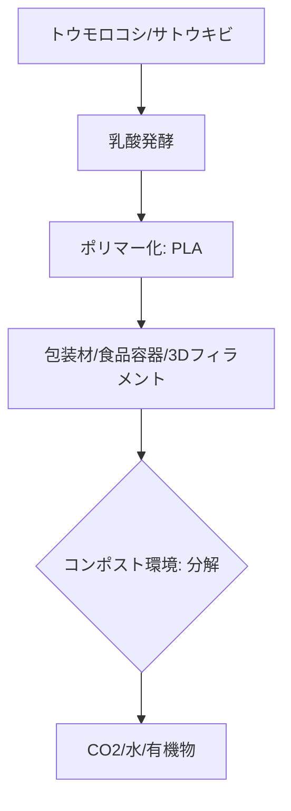

# T15-03-01 ポリ乳酸: Polylactic Acid

## Summary（5つの要点）

1. **バイオマス由来**: トウモロコシ、サトウキビなどの**再生可能な植物資源**から製造される**バイオマスプラスチック**であり、石油資源への依存を低減する。
2. **分解環境**: 一般に土壌中の微生物によって分解される**生分解性**を持つが、**コンポスト（堆肥化）環境**（高温多湿）下で最も早く（数ヶ月〜数年）分解が進む。
3. **応用範囲の広さ**: 既存のプラスチック成形技術（射出成形、押出成形、ブロー成形）が利用可能であり、**食品容器**、**包装フィルム**、**3Dプリンター用フィラメント**などに広く使われる。
4. **耐熱性の課題**: ガラス転移温度（Tg）が約60℃と低く、**耐熱性**がポリエチレンなどに比べて劣るため、高温下での利用や熱殺菌が必要な製品への適用が課題となる。
5. **主要メーカー**: NatureWorks（米国）が最大のサプライヤーであり、日本国内では**トヨタ紡織、ユニチカ**などがPLAの改質・製品開発に注力している。

#### 概念図

---

### 技術評価表（定量的な視点）
| 評価項目 | 評価 | 根拠 |
| :--- | :--- | :--- |
| 導入コスト | ⭐⭐⭐⭐☆ | 汎用プラスチックより高いが、生分解性プラの中では比較的安価（PHAより低コスト） |
| 技術成熟度 | ⭐⭐⭐⭐⭐ | 大規模量産化技術が確立。市場でのシェアは生分解性プラの中でトップ |
| 日本の競争力 | ⭐⭐⭐☆☆ | 原料・ポリマー製造は米国NatureWorksがリード。日本は改質・応用で強み |
| 市場性 | ⭐⭐⭐⭐⭐ | 欧州、米国で法規制による需要が高く、市場は急成長中（年平均15%超） |
| 品質保証の重要性 | ⭐⭐⭐⭐☆ | 分解性（コンポスト条件）の規格適合性、耐熱性向上のための改質技術の信頼性確保 |

---

## 日本の立ち位置・強み弱みのSummary

### 強み：日本企業や研究機関が持つ独自の技術、優位性などを箇条書きで記述。

* **改質技術**: PLAの低耐熱性・脆性を改善するための**アロイ化、結晶化促進技術**で、トヨタ紡織、ユニチカなど日本企業が優位性を持つ。
* **高機能化**: 高度な成形加工技術により、透明性、バリア性などを向上させた高機能なPLAフィルム・シートの開発が進む。
* **バイオマス由来の推進**: バイオマス由来材料の普及を政策的に推進しており、PLAの利用拡大に適した環境がある。

### 弱み：日本が抱える規制、標準化の遅れ、海外依存などを箇条書きで記述。

* **ポリマー原料の海外依存**: 世界最大のPLAメーカーであるNatureWorksに原料供給を依存しており、サプライチェーンのリスクがある。
* **コンポストインフラの遅れ**: PLAの分解に最適な**産業用コンポスト施設**の整備が欧州に比べ遅れており、分解されないまま焼却・埋め立てされるケースが多い。
* **耐熱性・力学特性の限界**: 自動車部品など高性能な用途への適用には、さらなる耐熱性・強度向上が求められる。

---

## 技術ロードマップ（短期/中期/長期）

### 短期目標（～2027年）

* PLAの**耐熱性**（Tg $60^\circ 	ext{C} 	o 100^\circ 	ext{C}$）を向上させる改質技術の確立と、家電・自動車内装部品への適用。
* **産業用コンポスト施設**の地域別導入モデルの確立と、PLA製品の回収・資源循環システムの構築。
* **多層フィルム**におけるPLAのバリア性向上技術の開発。

### 中期目標（2028年～2031年）

* 石油由来の汎用プラスチック（PP、PS）と**同等以上の耐熱性・力学特性**を持つPLA複合材料の商業化。
* PLAの**低コスト化**に向けた発酵プロセスの効率改善と大規模生産体制の確立。
* **海洋分解性**を付与するためのPLA改質技術（アロイ化）の研究開発。

### 長期目標（2032年～2035年）

* PLAを中心とした**バイオプラの完全循環システム**（廃棄物処理、リサイクル、コンポスト）の社会インフラとしての確立。
* AIを活用したPLAの**分子設計**（耐熱性、分解速度の制御）システムの実現。

### 📚 参照リンク

1. [ポリ乳酸（PLA）とは？メリット・デメリット、今後の展望を解説 - ユニチカ](https://www.unitika.co.jp/plastics/pla/)
2. [Ingeo™ PLA | NatureWorks](https://www.natureworksllc.com/)
3. [PLAの特長と応用｜生分解性プラ協](https://www.jba.or.jp/bioplastic/)
4. [マテリアルズ・インフォマティクスを活用した生分解性プラスチックの探索 - 産総研](https://www.aist.go.jp/aist_j/research_results/pr/2022/20220616/20220616.html)