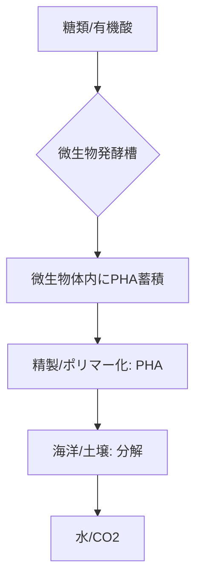

# T15-03-02 ポリヒドロキシアルカン酸: Polyhydroxyalkanoates

## Summary（5つの要点）

1. **微生物合成**: バクテリアなどの**微生物**が、栄養源（糖類、有機酸）を分解・代謝する過程で体内に**エネルギー貯蔵物質**として生産・蓄積する**天然由来のポリマー**。
2. **完全生分解性**: **土壌中、淡水中、そして海洋中**の微生物によって完全に分解される、非常に高い生分解性を持つ `(1)`。**マイクロプラスチック化しない**ため、海洋汚染対策として最も期待されている。
3. **多様な物性**: 分子構造の側鎖長を変えることで、**硬いプラスチック**（PHB）から**柔軟なエラストマー**（PHBV、PHBH）まで、多様な物性を発現できる。
4. **応用分野**: **医療用縫合糸**（生体適合性）、**農業用マルチフィルム**（回収不要）、**ストロー**、**食品包装材**など、環境中への流出リスクが高い用途での活用が期待される `(2)`。
5. **最大の課題**: 微生物による発酵生産プロセスに依存するため、**製造コスト**がPLAや汎用プラスチックに比べて**2〜3倍**と非常に高いことが、普及の最大の障壁となっている `(1)`。

#### 概念図

---

### 技術評価表（定量的な視点）
| 評価項目 | 評価 | 根拠 |
| :--- | :--- | :--- |
| 導入コスト | ⭐⭐☆☆☆ | 製造コストが非常に高く、低コスト化が最大の課題 |
| 技術成熟度 | ⭐⭐⭐☆☆ | 少量生産は可能だが、大規模量産化（数万トン/年）は途上 |
| 日本の競争力 | ⭐⭐⭐⭐⭐ | **カネカ**が世界トップレベルのPHA生産・改質技術を持つ `(1)` |
| 市場性 | ⭐⭐⭐⭐☆ | 環境規制強化で需要は高いが、高コストのため市場普及は限定的 |
| 品質保証の重要性 | ⭐⭐⭐⭐⭐ | 微生物発酵プロセスの**ロット間品質安定性**、海洋環境での**分解速度の制御**が必須 |

---

## 日本の立ち位置・強み弱みのSummary

### 強み：日本企業や研究機関が持つ独自の技術、優位性などを箇条書きで記述。

* **カネカのPHBH技術**: 高い柔軟性と分解性を持つ独自のPHA（PHBH）を開発し、世界で唯一の商業生産体制を持つ `(1)`。
* **微生物培養技術**: 日本が得意とする発酵・微生物工学技術は、PHAの**生産効率向上**に直結し、コストダウンの鍵を握る。
* **医療分野での実績**: 医療用縫合糸などの生体吸収性材料としての臨床実績があり、高付加価値用途への応用が進んでいる。

### 弱み：日本が抱える規制、標準化の遅れ、海外依存などを箇条書きで記述。

* **高コストの課題**: 発酵槽の建設、培養・精製プロセスが高コストであり、汎用プラスチックとの価格競争力が極めて低い。
* **原料制約**: 食料資源（トウモロコシ等）との競合を避けるため、非食料系バイオマス（セルロース等）を原料とする技術開発が必要。
* **製造規模**: 海外のスタートアップ（Danimer Scientific、Full Cycle Bioplastics）が大口需要に応えるべく大規模投資を加速しており、生産規模でキャッチアップが必要。

---

## 技術ロードマップ（短期/中期/長期）

### 短期目標（～2027年）

* PHAの**生産効率を現状の2倍**に向上させる微生物育種・発酵プロセス技術の確立。
* **海洋分解性**が求められるストロー、カトラリー、農業用フィルムなどの特定用途への採用を拡大。
* **非食料系バイオマス**（メタン、廃食用油など）を原料とする生産技術のパイロットプラントでの実証。

### 中期目標（2028年～2031年）

* PHAの**製造コストをPLAレベル**にまで引き下げ、汎用プラスチックの代替を本格化。
* 自動車、電子機器の**高機能部品**への適用に向けた、PHAの耐熱性・力学特性の改質。
* **マルチマテリアル3Dプリンティング**に利用可能な、PHAをベースとした生体適合性インクの開発。

### 長期目標（2032年～2035年）

* 海洋汚染ゼロを目指し、**環境流出リスクの高い全てのプラスチック**をPHA系素材に置き換えるための大規模サプライチェーンを確立。
* AIによる**微生物の代謝経路最適化**と**PHA分子設計**の完全自動化。

### 📚 参照リンク

1. [カネカ生分解性ポリマーPHBH™️ | カネカ](https://www.kaneka.co.jp/product/material/phbh/)
2. [プラスチック代替材料としてのポリヒドロキシアルカン酸の応用 - 日本医療機器学会](https://www.jsmbme.jp/pdf/4804/48040417.pdf)
3. [生分解性プラスチックの市場動向 - みずほリサーチ&テクノロジーズ](https://www.mizuho-rt.co.jp/publication/2021/articles_0065.html)