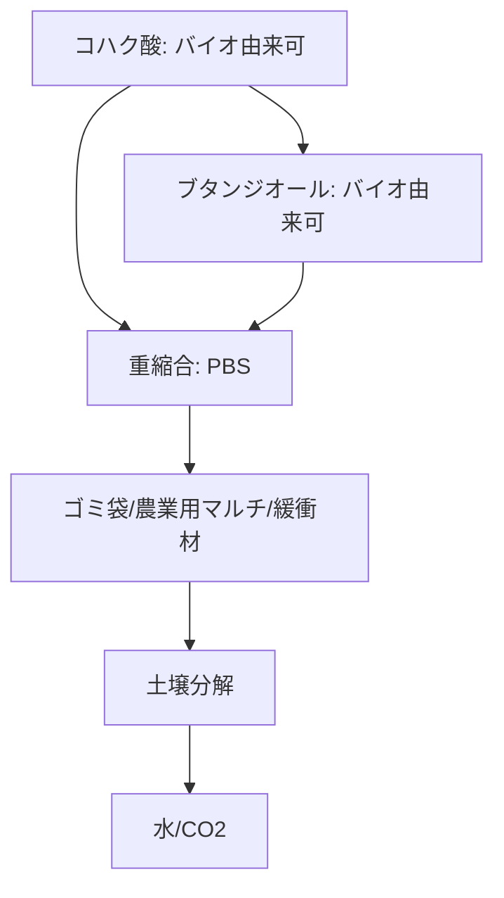

# T15-03-03 ポリブチレンサクシネート: Polybutylene Succinate

## Summary（5つの要点）

1. **組成と起源**: **コハク酸**（サクシネート）と**ブタンジオール**を重縮合させたポリエステル系プラスチック。コハク酸はバイオマス由来（微生物発酵）で製造可能であり、**バイオPBS**として展開される `(1)`。
2. **優れた加工性**: 汎用プラスチック（PE、PP）と類似した**高い柔軟性**と**加工性**を持ち、押出成形、射出成形、ブロー成形が容易である。
3. **耐熱性**: PLAが60℃程度であるのに対し、PBSは融点約115℃、耐熱温度100℃程度と**高い耐熱性**を持ち、高温環境下での利用や熱殺菌が必要な用途に適する `(2)`。
4. **分解特性**: 土壌中の微生物によって分解される生分解性を持つ。分解速度はPLAに比べやや遅いが、**農業用マルチフィルム**など、回収が困難な用途で有用性が高い。
5. **主要メーカー**: **三菱ケミカル**が主要なサプライヤーであり、特にバイオマス由来の**BioPBS™**の製造・普及に注力。BASF（ドイツ）、PTT MCC（タイ）なども生産。

#### 概念図

---

### 技術評価表（定量的な視点）
| 評価項目 | 評価 | 根拠 |
| :--- | :--- | :--- |
| 導入コスト | ⭐⭐⭐☆☆ | PLAよりやや高価だが、PHAより安価。汎用プラスチックの2倍程度 |
| 技術成熟度 | ⭐⭐⭐⭐☆ | 連続重合による量産技術が確立。成形加工も容易 |
| 日本の競争力 | ⭐⭐⭐⭐⭐ | 三菱ケミカルがバイオPBSの製造・応用開発で世界をリード `(1)` |
| 市場性 | ⭐⭐⭐⭐☆ | 高い耐熱性・柔軟性により、PLAでは代替できない用途に強み |
| 品質保証の重要性 | ⭐⭐⭐⭐☆ | 農業用フィルムでは使用期間と分解期間のバランス設計が重要 |

---

## 日本の立ち位置・強み弱みのSummary

### 強み：日本企業や研究機関が持つ独自の技術、優位性などを箇条書きで記述。

* **三菱ケミカルのBioPBS™**: バイオ由来原料を使用した高性能なPBSを世界市場に供給しており、技術力と供給能力で優位性を持つ `(1)`。
* **用途開発力**: 高い耐熱性、柔軟性、加工性の良さを活かし、食品トレー、緩衝材、農業用フィルムなど幅広い分野での用途開発が進んでいる。
* **バイオコハク酸技術**: バイオコハク酸の製造技術は日本国内でも進展しており、原料のバイオマス化を推進する基盤がある。

### 弱み：日本が抱える規制、標準化の遅れ、海外依存などを箇条書きで記述。

* **分解速度の課題**: 海洋分解性はPHAに比べて劣り、海洋プラスチック汚染対策としての訴求力が弱い。
* **原料バイオマス化率**: ブタンジオールの一部は依然として石油由来であり、**完全バイオマス化**（カーボンニュートラル）の実現が今後の課題。
* **市場認知度**: PLAに比べて一般消費者の市場認知度が低く、普及のための啓発活動が必要。

---

## 技術ロードマップ（短期/中期/長期）

### 短期目標（～2027年）

* **バイオPBSの完全バイオマス化**（ブタンジオールのバイオ由来化）に向けた技術確立。
* PBS/PLAなどの**アロイ化**により、耐熱性・柔軟性・分解性のバランスを最適化した複合材料の実用化。
* 農業用フィルムの**分解速度制御技術**を確立し、製品ライフサイクル全体での最適化を実現。

### 中期目標（2028年～2031年）

* PBSをベースとした**海洋分解性プラスチック**の開発と国際標準規格（ISO 19679）への適合。
* 汎用プラスチック（PE、PP）と**同等以下の価格**での大規模量産体制を確立。
* 自動車、建築分野での**高性能部品**への適用を目的とした、さらなる高強度・高耐熱改質技術の開発。

### 長期目標（2032年～2035年）

* PBS系素材を核とした**環境負荷ゼロ**の梱包・農業資材のサプライチェーンを確立。
* 製造プロセス全体をAIで最適化し、**低コスト・高品質**なバイオPBSを安定供給するシステムを実現。

### 📚 参照リンク

1. [バイオマス由来の生分解性プラスチック「BioPBS™」 - 三菱ケミカル](https://www.m-chemical.co.jp/products/PBS/index.html)
2. [生分解性プラスチックの素材と市場の動向 - 住友化学](https://www.sumitomo-chem.co.jp/rd/report/theses/docs/202102_02.pdf)
3. [生分解性プラスチックの種類と特性 - JBA](https://www.jba.or.jp/bioplastic/)