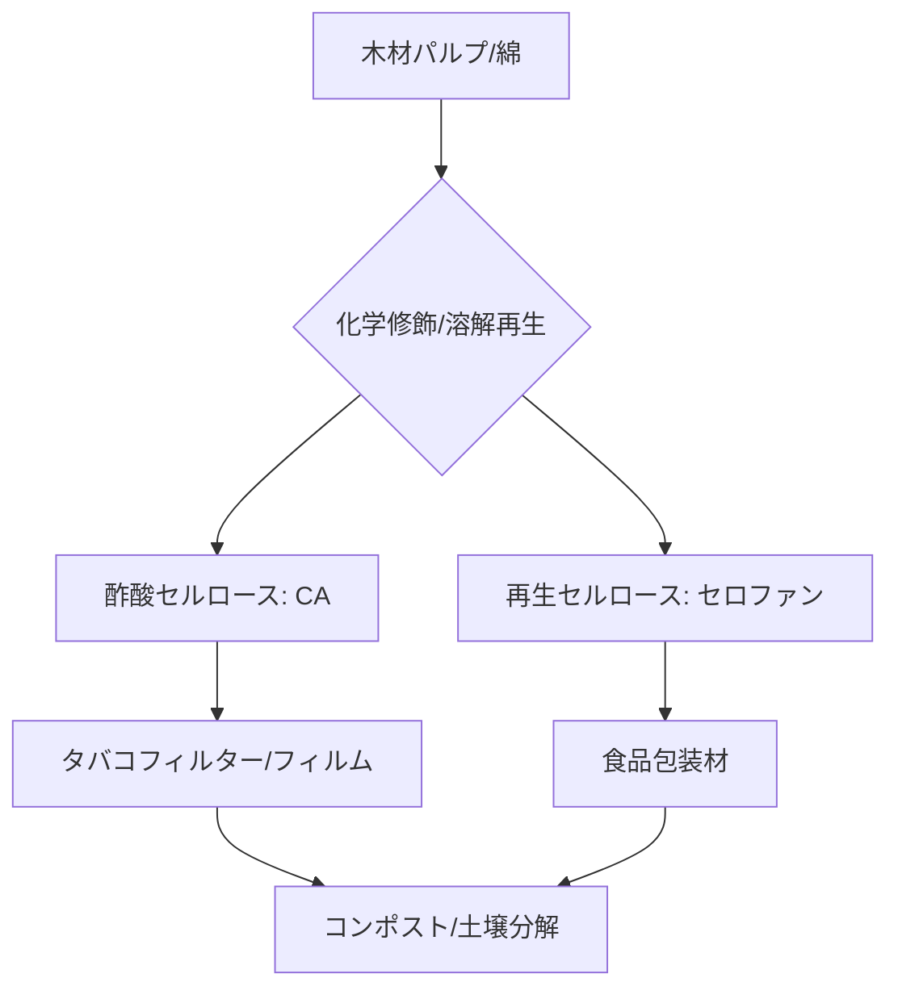

# T15-03-04 セルロース系プラスチック: 酢酸セルロース・再生セルロース

## Summary（5つの要点）

1. **天然高分子由来**: 木材パルプ、綿など**豊富に存在するセルロース**を原料とする。セルロースは地球上で最も豊富な天然高分子であり、持続可能性が高い。
2. **酢酸セルロース**: セルロースを酢酸で化学修飾し、熱可塑性を持たせたプラスチック。高い**透明性**と**光学的特性**を持ち、主に**タバコフィルター**、液晶保護フィルム、眼鏡フレームに使用される `(1)`。
3. **再生セルロース（セロファン）**: セルロースを一度溶解し、再成形したフィルム。高い**ガスバリア性**と**生分解性**（コンポスト、土壌）を持ち、主に食品包装材（セロファン）として使われる `(2)`。
4. **分解特性の多様性**: 酢酸セルロースは分解速度が遅く、タバコフィルターの海洋流出による**マイクロプラスチック問題**が課題となっている。分解速度の制御技術が重要。
5. **主要メーカー**: **ダイセル**（酢酸セルロースの製造・応用）が日本国内で主要なプレイヤー。海外ではEastman Chemical（米国）が大規模生産を行う。

#### 概念図

---

### 技術評価表（定量的な視点）
| 評価項目 | 評価 | 根拠 |
| :--- | :--- | :--- |
| 導入コスト | ⭐⭐⭐⭐☆ | PLAとほぼ同等。タバコフィルターなど大量生産用途で低コスト化達成 |
| 技術成熟度 | ⭐⭐⭐⭐⭐ | 100年以上の歴史を持つ確立された化学プロセス |
| 日本の競争力 | ⭐⭐⭐⭐☆ | ダイセルが酢酸セルロースで世界市場の大きなシェアを持つ `(1)` |
| 市場性 | ⭐⭐⭐⭐☆ | タバコ規制や環境規制により、高分解性製品への切り替え需要が高い |
| 品質保証の重要性 | ⭐⭐⭐⭐☆ | 酢酸度合い、分子量が物性に直結。タバコフィルターの**高分解化**と**製品性能維持**の両立が重要 |

---

## 日本の立ち位置・強み弱みのSummary

### 強み：日本企業や研究機関が持つ独自の技術、優位性などを箇条書きで記述。

* **ダイセルの高機能セルロース技術**: 酢酸セルロースの製造プロセスと応用技術において、国際的な競争力を維持している `(1)`。
* **高性能フィルム技術**: セルロースナノファイバー（CNF）やセルロース微粒子など、セルロースのナノ材料化技術で世界をリードし、機能性フィルムへの応用が進んでいる。
* **豊富なバイオマス資源**: 日本は森林資源が豊富であり、セルロース原料の**国産化**に向けた取り組みが進めやすい。

### 弱み：日本が抱える規制、標準化の遅れ、海外依存などを箇条書きで記述。

* **タバコフィルターの分解性**: 酢酸セルロース製のタバコフィルターは分解速度が遅く、環境問題の主要因の一つであり、**完全生分解性**への移行が急務。
* **完全溶解技術の課題**: セルロースを水や一般的な有機溶媒で溶解し、安価に成形する技術（新規溶媒系）の開発が、コスト削減と環境負荷低減の鍵。
* **再生セルロースフィルムの市場規模**: セロファンは優れた生分解性を持つが、プラスチック包装材の台頭により市場規模が縮小傾向にある。

---

## 技術ロードマップ（短期/中期/長期）

### 短期目標（～2027年）

* 酢酸セルロース製**タバコフィルター**の**高分解性化**（分解速度を数ヶ月レベルに短縮）に向けた改質技術の確立。
* セルロース系プラスチックの**海洋分解性**評価と、国際標準規格（ISO 19679）への適合を推進。
* セルロースナノファイバー（CNF）を複合化した**高強度・高耐熱**セルロースプラスチックの試作。

### 中期目標（2028年～2031年）

* **毒性のない新規溶媒**を用いた、環境負荷の低い**再生セルロース繊維・フィルム**の量産技術確立。
* 汎用プラスチック（PC、PMMA）と同等以上の**光学特性・強度**を持つセルロース系透明材料の開発。
* **衣料用繊維**としてのセルロース系プラスチック（リヨセルなど）の高性能化と市場拡大。

### 長期目標（2032年～2035年）

* **完全生分解性**かつ**高機能性**（熱安定性、バリア性）を両立させたセルロースベースの**次世代汎用プラスチック**を開発。
* AIを活用したセルロース系材料の**分子構造・修飾設計**と**プロセス最適化**の実現。

### 📚 参照リンク

1. [酢酸セルロース製品 | 株式会社ダイセル](https://www.daicel.com/cellulose/cellulose/ca/index.html)
2. [生分解性フィルム セロファン | 富士フイルム](https://www.fujifilm.com/jp/ja/rd/report/technical-report-2015-4/pdf/ff_tr004_14.pdf)
3. [セルロースプラスチックの最前線 - 化学工業日報](https://www.chemicaldaily.co.jp/cellolose-plastic/)