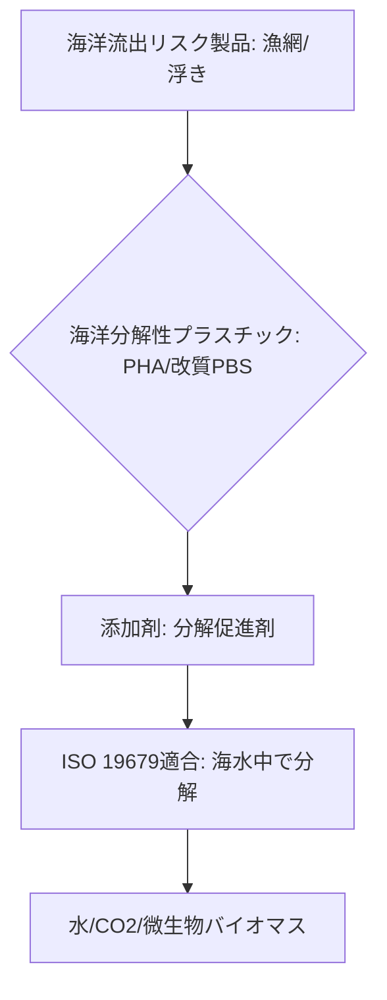

# T15-03-05 海洋分解性プラスチック・添加剤技術

## Summary（5つの要点）

1. **目的**: 海洋環境（低温、低栄養、低酸素）での分解性を高めたプラスチック。特に**漁具（漁網、ロープ）**など、海洋へ流出するリスクの高い製品への適用が主要な目的。
2. **国際標準規格**: 海洋分解性の証明には、国際標準規格である**ISO 19679**（海水・底泥中での最終生分解度試験）への適合が必須であり、技術開発の大きな指針となっている `(1)`。
3. **代表的素材**: **PHA**（ポリヒドロキシアルカン酸）や、改質された**PBS**（ポリブチレンサクシネート）が主要な候補。特にPHAは天然由来で海洋分解性が高い。
4. **分解促進技術**: プラスチックの分解を加速させるための**分解促進剤**（微生物を誘引する物質、酵素）の添加技術が研究されているが、その安全性や分解メカニズムの評価が重要となる `(3)`。
5. **日本の強み**: **東洋紡**などが海洋分解性の漁網・ロープを開発し、実海域での実証実験を進めている `(2)`。**群栄化学工業**は分解促進剤を開発。

#### 概念図

---

### 技術評価表（定量的な視点）
| 評価項目 | 評価 | 根拠 |
| :--- | :--- | :--- |
| 導入コスト | ⭐⭐☆☆☆ | PHAベースは高コスト。添加剤技術は比較的低コストだが、分解性が不十分な場合がある |
| 技術成熟度 | ⭐⭐⭐☆☆ | 漁具などの特定用途で実用化開始。汎用化にはコストと分解性の両立が必要 |
| 日本の競争力 | ⭐⭐⭐⭐⭐ | 海洋資材メーカー（東洋紡など）による実証実験と製品化で世界をリード `(2)` |
| 市場性 | ⭐⭐⭐⭐⭐ | 海洋プラスチック規制が国際的に強化されており、市場創出が期待される |
| 品質保証の重要性 | ⭐⭐⭐⭐⭐ | 海水中での分解速度と、**製品としての強度・耐久性**の両立を保証することが最も重要 |

---

## 日本の立ち位置・強み弱みのSummary

### 強み：日本企業や研究機関が持つ独自の技術、優位性などを箇条書きで記述。

* **実海域での実証実績**: 東洋紡など国内企業が、海洋分解性漁網の実海域での耐久性・分解性評価を重ねており、実用化技術でリードしている `(2)`。
* **PHAの技術的優位性**: T15-03-02で述べた通り、カネカのPHAなど、海洋分解性に優れた素材の技術基盤を持つ。
* **国際標準化への貢献**: ISO 19679（海洋分解性の評価方法）の策定において、日本の研究機関・企業が積極的に貢献しており、技術的知見を反映している `(1)`。

### 弱み：日本が抱える規制、標準化の遅れ、海外依存などを箇条書きで記述。

* **添加剤技術の限界**: 分解促進剤（D2Wなど）を添加したプラスチックは、完全な分解が保証されず、ISOなどの規格で「生分解性」として認められないケースがあり、技術的議論が続いている `(3)`。
* **コスト競争力**: 海洋分解性の高いPHAは高価であるため、漁業用途などでの**経済性**確保が困難。
* **分解性のばらつき**: 海洋環境は場所や水深によって温度、塩分、微生物叢が大きく異なり、**分解速度の再現性**を確保するのが難しい。

---

## 技術ロードマップ（短期/中期/長期）

### 短期目標（～2027年）

* **海洋分解性漁具**（漁網、ロープ）の本格的な商用化と普及を加速。
* 海洋分解性プラスチックの**ISO 19679適合**製品を増やし、国際市場での信頼性を獲得。
* **分解促進剤**を用いる場合の**完全分解メカニズム**と**環境安全性**に関する科学的エビデンスを確立。

### 中期目標（2028年～2031年）

* **PHAベース**の海洋分解性プラスチックの**製造コストを大幅に低減**し、汎用漁具・浮きへの適用を拡大。
* **海水温度、水深**などの環境条件に応じた分解速度を精密に制御できる**スマート分解性プラスチック**の開発。
* 船舶塗料、養殖資材など、**海洋インフラ材**への応用を拡大。

### 長期目標（2032年～2035年）

* 海洋流出リスクの高いプラスチック製品を**全面的に海洋分解性素材へ転換**するための、国際的なサプライチェーンと規制枠組みを確立。
* **分解後の生成物**が海洋生態系に完全に無害であることを証明する**ライフサイクルアセスメント**（LCA）を確立。

### 📚 参照リンク

1. [海洋生分解性プラスチックの認証制度と市場動向 - JORA](https://www.jora.jp/pdf/2021/4/2021_04_04.pdf)
2. [海洋生分解性プラスチックの漁具・資材への適用 - 東洋紡](https://www.toyobo.co.jp/news/2021/pdf/20210216_01.pdf)
3. [海洋生分解性プラスチックと国際標準化の動向 - JBPC](https://www.jbpc.gr.jp/news/data/2020/20200827_2.pdf)
4. [海洋生分解性プラスチックの研究開発 - 産業技術総合研究所](https://www.aist.go.jp/aist_j/aistinfo/aist_today/vol19_06/vol19_06_p14_p15.pdf)