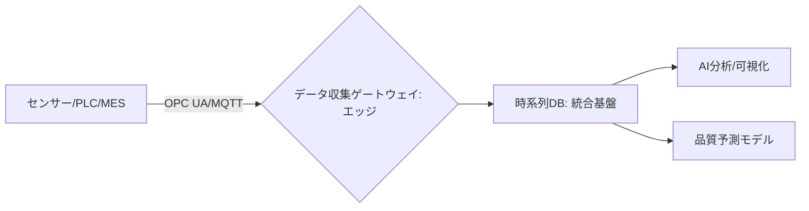

# T15-04-01 製造プロセスデータ収集・統合基盤

## Summary（5つの要点）

1. **リアルタイム収集**: 工場内のセンサー、PLC（Programmable Logic Controller）、MES（製造実行システム）など、あらゆる機器から**温度、圧力、流量**といったプロセス変数を**高頻度**で収集する。
2. **時系列データ基盤**: 収集したデータを**時系列データベース**（InfluxDB、TimescaleDBなど）に蓄積する。これにより、高速な書き込みと読み出し、期間指定での効率的な分析を可能にする。
3. **異種機器の統合**: 異なるメーカー、異なる世代の機器間でデータ通信を可能にするため、**OPC UA**（Open Platform Communications Unified Architecture）などの**通信規格**や、MQTTなどの軽量プロトコルを活用する。
4. **データクオリティ保証**: 収集データの**欠損、異常値、ノイズ**を検知・処理し、データ分析・AIモデル構築に耐えうる**高品質なデータ**を保証する仕組み（データクレンジング、メタデータ管理）が不可欠。
5. **エッジ・クラウド連携**: データをその場で処理する**エッジコンピューティング**と、広域・大量データ分析を行う**クラウドプラットフォーム**（Azure Data Explorer、AWS IoT Analyticsなど）を連携させるアーキテクチャが主流。

#### 概念図

---

### 技術評価表（定量的な視点）
| 評価項目 | 評価 | 根拠 |
| :--- | :--- | :--- |
| 導入コスト | ⭐⭐⭐⭐☆ | 初期投資は大きいが、汎用的なIoT/クラウドサービスでコストは低下傾向 |
| 技術成熟度 | ⭐⭐⭐⭐⭐ | OPC UA、時系列DBは実用段階。大手メーカーで導入実績多数 |
| 日本の競争力 | ⭐⭐⭐☆☆ | 既存工場のIoT化は進むが、データ統合基盤の標準化・オープン化で海外に後れ |
| 市場性 | ⭐⭐⭐⭐⭐ | 製造業DXの基盤であり、全ての産業で不可欠な投資対象 |
| 品質保証の重要性 | ⭐⭐⭐⭐⭐ | **データの完全性**と**トレーサビリティ**の根幹であり、最重要 |

---

## 日本の立ち位置・強み弱みのSummary

### 強み：日本企業や研究機関が持つ独自の技術、優位性などを箇条書きで記述。

* **現場のセンサー密度**: 製造現場における**高精度なセンサー**と**緻密な制御**（PLC）の導入実績は世界トップクラスであり、収集できるデータ量が豊富。
* **現場の知見**: 職人や技術者が持つプロセス制御の**暗黙知**をデータ構造化する知見が豊富。
* **既存システムの信頼性**: 既存のMES、SCADAなどの制御システムの**信頼性、安定性**が高い。

### 弱み：日本が抱える規制、標準化の遅れ、海外依存などを箇条書きで記述。

* **データサイロ化**: 機器メーカーや部門ごとにシステムが独立しており、データ連携・統合が困難（**データのサイロ化**）。
* **OPC UAの普及遅れ**: 欧米に比べ、異なるメーカー間のデータ連携規格であるOPC UAの**導入・活用**が遅れている。
* **レガシーシステム**: 長期間稼働している**レガシーシステム**からのデータ抽出・変換に多大なコストと工数がかかる。

---

## 技術ロードマップ（短期/中期/長期）

### 短期目標（～2027年）

* OPC UA対応機器の全社的な導入と、**標準プロファイル**に基づくデータモデルの定義。
* エッジAIと時系列データベースを連携させた**リアルタイム監視システム**の構築。
* データクオリティを自動で評価し、欠損・異常値を補正する**データ前処理パイプライン**の標準化。

### 中期目標（2028年～2031年）

* **部門横断、工場横断**でのデータ統合基盤を確立し、全社的なプロセスインフォマティクスを推進。
* クラウドサービスを活用した**データレイク**（大規模データ基盤）を構築し、機械学習モデルの訓練環境を整備。
* 異なるシステム間のデータ連携を自動化する**データオーケストレーション技術**の確立。

### 長期目標（2032年～2035年）

* 製造現場のデータをリアルタイムで**仮想空間（デジタルツイン）**に同期する基盤を確立。
* データ統合基盤自体をAIが最適化・自己修復する**自律型データプラットフォーム**の実現。

### 📚 参照リンク

1. [OPC UAとは - OPC Foundation](https://www.opcfoundation.org/)
2. [製造現場のIoTとデータ活用 - 経済産業省](https://www.meti.go.jp/shingikai/sankoshin/sangyo_gijutsu/pdf/005_03_02.pdf)
3. [時系列データベースの活用事例 - InfluxData](https://www.influxdata.com/)
4. [プロセスインフォマティクスによる製造業のDX - 日本化学会](https://www.chemistry.or.jp/journal/index.php?entry_id=314)