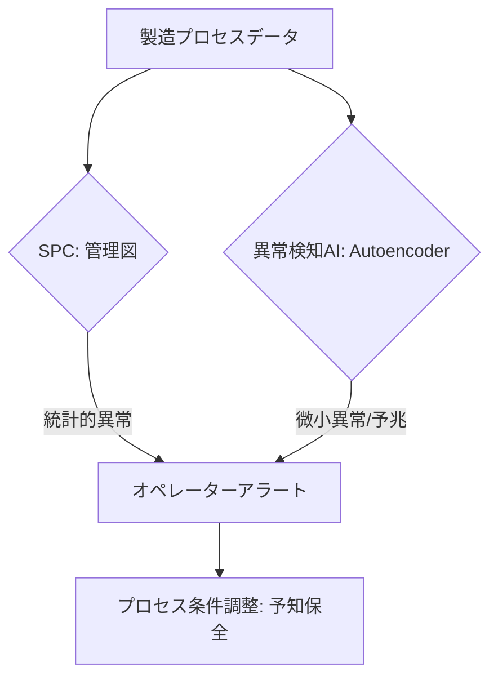

# T15-04-02 統計的プロセス管理: SPC・異常検知AI

## Summary（5つの要点）

1. **SPC（統計的プロセス管理）**: 製造プロセスの**変動**をリアルタイムで監視し、**管理図**（X-R管理図、CUSUM管理図など）を用いてプロセスが統計的に安定した状態（管理状態）にあるかを判定する `(1)`。
2. **異常検知AI**: 過去の正常な運転データを学習させた**機械学習モデル**（Autoencoder、Isolation Forest、One-Class SVM）により、人間が気づきにくい**微小なプロセス異常**や**傾向変化**を自動で検出する。
3. **予兆検知**: 異常が発生する**直前のプロセスデータ**の特徴を捉えることで、**故障や不良品発生の予兆**を数時間～数日前に検知し、オペレーターに警告する。
4. **感度・精度の両立**: 異常検知AIの課題は、**誤検知（False Positive）**を抑えつつ、**見逃し（False Negative）**を最小限にする**感度と精度のバランス**をとること `(2)`。
5. **自動フィードバック**: 予兆検知に基づき、PLCや制御システムと連携し、**製造条件**（温度、圧力など）を**自動で微調整**することで、プロセスを常に最適状態に保つ**クローズドループ制御**への応用が進む。

#### 概念図

---

### 技術評価表（定量的な視点）
| 評価項目 | 評価 | 根拠 |
| :--- | :--- | :--- |
| 導入コスト | ⭐⭐⭐☆☆ | SPCは導入容易だが、AIの実装と運用に高度な専門知識が必要 |
| 技術成熟度 | ⭐⭐⭐⭐☆ | SPCは成熟。AI異常検知は実証フェーズから実運用へ移行中 |
| 日本の競争力 | ⭐⭐⭐⭐⭐ | **SQC（統計的品質管理）**の歴史と実績があり、AIとの融合で強み |
| 市場性 | ⭐⭐⭐⭐⭐ | 予知保全、品質向上、コスト削減に直結し、製造業で最優先の投資対象 |
| 品質保証の重要性 | ⭐⭐⭐⭐⭐ | **不良ゼロ**を目指すための最前線技術であり、品質保証の核となる |

---

## 日本の立ち位置・強み弱みのSummary

### 強み：日本企業や研究機関が持つ独自の技術、優位性などを箇条書きで記述。

* **統計的品質管理の土壌**: 戦後から続く**QCサークル活動**や、統計的手法を用いた品質管理（SPC/SQC）の**現場への浸透度**が高い。
* **高精度センサー技術**: 異常の予兆を捉えるための高精度なセンサー（振動、音響、熱画像）技術に優位性を持つ。
* **製造ノウハウの活用**: 熟練技術者による**「勘と経験」**に基づく異常判断基準を形式知化し、AIモデルの学習データとして活用する取り組みが進んでいる。

### 弱み：日本が抱える規制、標準化の遅れ、海外依存などを箇条書きで記述。

* **解釈可能性（XAI）の課題**: 異常検知AIが「なぜ異常と判断したか」の**根拠を現場オペレーターに分かりやすく説明**する技術（XAI）の開発が遅れている。
* **学習データ不足**: 正常時データは豊富だが、**異常時データ**の取得が難しく、AIモデルの精度向上の障壁となっている。
* **多品種少量生産への適用**: プロセスが頻繁に変わる多品種少量生産ラインでは、**モデルの再学習**と**運用負荷**が課題。

---

## 技術ロードマップ（短期/中期/長期）

### 短期目標（～2027年）

* 既存のSPC管理図に、**AI異常検知モデル**（Autoencoderなど）を組み込み、**検知率を20%向上**。
* AI異常検知の結果と、熟練技術者の判断を比較検証する**ハイブリッド監視システム**を全ラインに導入。
* 予兆検知後の**自動アラート発報**と、オペレーターへの**対処ガイド**提示システムの構築。

### 中期目標（2028年～2031年）

* AI異常検知モデルに**説明可能性（XAI）**を導入し、異常要因を自動で**推定・可視化**する機能を実現。
* 予兆検知に基づき、**プロセス条件を自動で補正・調整**する**クローズドループ制御**を主要プロセスで実用化。
* センサーデータと検査データに基づく**品質異常の因果関係**を特定するモデルの開発。

### 長期目標（2032年～2035年）

* AIがプロセス全体の状態を理解し、**自律的にプロセスを最適化・修復**する**自己治癒型製造システム**の実現。
* **デジタルツイン**と連携し、異常発生のメカニズムをシミュレーション上で再現・検証するシステムを構築。

### 📚 参照リンク

1. [SPC（統計的プロセス管理）とは - JUSE](https://www.juse.or.jp/)
2. [製造プロセスにおける異常検知技術とAI活用 - 富士電機](https://www.fujielectric.co.jp/techno_rev/detail/269/)
3. [AIを活用した予知保全・異常検知技術の動向 - 産総研](https://www.aist.go.jp/aist_j/research_results/pr/2021/20210714/20210714.html)