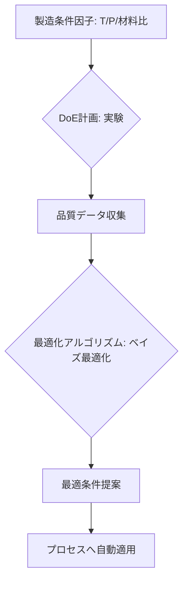

# T15-04-03 プロセス条件最適化・実験計画法: DoE

## Summary（5つの要点）

1. **DoE（実験計画法）**: 製造条件（因子）と製品品質（応答）の関係を効率的に解析するため、**最小限の実験回数**で、各因子が品質に与える影響度（主効果、交互作用）を定量的に評価する統計的手法 `(1)`。
2. **最適条件の探索**: 実験データに基づき、**応答曲面法**や**回帰モデル**を構築し、目的とする品質基準（例: 強度最大、コスト最小）を達成する**プロセス条件の最適点**を導出する。
3. **ベイズ最適化**: 特に実験コストが高い、あるいはシミュレーションに時間がかかる場合に有効。過去の実験結果を考慮し、次に**最も価値のある実験条件**をAIが提案することで、最適解を**少ない試行回数**で探索する。
4. **多目的最適化**: 品質、コスト、環境負荷、生産効率など、**複数の目的関数**が相反する場合に、それらを同時に最適化する**パレート最適解**を探索する（例: 強度を最大化しつつ、コストを最小化）。
5. **ソフトウェア活用**: Minitab、JMPなどの統計ソフトウェアや、Pythonライブラリ（scikit-optimize、GPyOpt）を用いて、複雑なDoE計画の作成から、データ解析、最適化モデル構築までを効率的に実行する。

#### 概念図

---

### 技術評価表（定量的な視点）
| 評価項目 | 評価 | 根拠 |
| :--- | :--- | :--- |
| 導入コスト | ⭐⭐⭐☆☆ | ソフトウェアライセンス、高度な専門知識（統計学、AI）が必要 |
| 技術成熟度 | ⭐⭐⭐⭐☆ | DoEは成熟。ベイズ最適化は研究から産業応用へ移行中 |
| 日本の競争力 | ⭐⭐⭐⭐⭐ | **田口メソッド**（品質工学）は日本発であり、現場での普及実績が高い `(1)` |
| 市場性 | ⭐⭐⭐⭐⭐ | 製造業の新製品開発、生産性向上、歩留まり改善に不可欠 |
| 品質保証の重要性 | ⭐⭐⭐⭐⭐ | 品質規格を満たすための**ロバストな製造条件**設定に直結する |

---

## 日本の立ち位置・強み弱みのSummary

### 強み：日本企業や研究機関が持つ独自の技術、優位性などを箇条書きで記述。

* **田口メソッドの豊富な実績**: **品質工学**に基づくDoE手法（田口法）は、少ない実験回数でロバストな設計を達成する手法として、自動車、電機、化学分野で世界的に高く評価され、日本企業が豊富なノウハウを持つ `(1)`。
* **製造プロセスの高度な理解**: 化学、素材、精密加工分野で、プロセス変動の要因や、因子間の交互作用に関する**深い現場知見**を持つ。
* **ベイズ最適化の応用**: 材料開発（MI）分野で先行したベイズ最適化技術を、プロセス最適化（PI）へ展開する研究が活発。

### 弱み：日本が抱える規制、標準化の遅れ、海外依存などを箇条書きで記述。

* **統計ソフトウェア依存**: DoEの解析に、MinitabやJMPなどの**海外製統計ソフトウェア**への依存度が高い。
* **多変数・多目的最適化の難しさ**: 複雑な化学プロセスや多段階プロセスでの**10変数以上**の因子を同時に扱う最適化技術の導入が遅れている。
* **シミュレーションとの統合不足**: DoEの実験結果を**デジタルツイン**や**プロセスシミュレーション**と統合し、**仮説検証を自動化**する仕組みの構築が遅れ。

---

## 技術ロードマップ（短期/中期/長期）

### 短期目標（～2027年）

* ベイズ最適化による**次期実験条件の自動提案システム**を開発・導入し、**実験期間を30%削減**。
* DoE結果を基に構築した応答曲面モデルを、**プロセス監視システム**と連携させ、最適な運転範囲を可視化。
* 既存の製造履歴データ（過去の実験データ）を活用し、**仮想的なDoE**を実施する技術の確立。

### 中期目標（2028年～2031年）

* プロセスシミュレーション（T15-04-04）とベイズ最適化を統合した**ハイブリッド最適化モデル**の確立。
* 生産性、歩留まり、エネルギー消費量を同時に最適化する**AIによる多目的最適化システム**の商業運用。
* 最適化結果をPLCに自動で書き込み、プロセスを**自律調整**する**クローズドループ最適化**の実現。

### 長期目標（2032年～2035年）

* AIが目的関数と制約条件を理解し、**プロセスを自動で設計・改善**する**自己進化型製造システム**の確立。
* 製造現場の**職人の暗黙知**を最適化モデルに組み込み、**知識の再現性・継承性**を確保。

### 📚 参照リンク

1. [品質工学（タグチメソッド）とは - 日本品質管理学会](https://www.jsqc.org/)
2. [実験計画法（DoE）入門 - Minitab](https://www.minitab.com/en/what-is/doe/)
3. [ベイズ最適化の産業応用 - 応用数理学会](http://www.jsiam.org/)
4. [ベイズ最適化による材料・プロセス開発 - 富士フイルム](https://www.fujifilm.com/jp/ja/rd/report/technical-report-2021-03/pdf/ff_tr021_04.pdf)