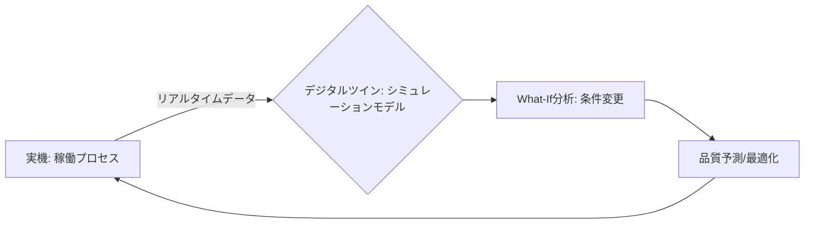

# T15-04-04 デジタルツイン・プロセスシミュレーション

## Summary（5つの要点）

1. **デジタルツインの構築**: 稼働中の製造プロセスを、センサーデータと物理モデルに基づき、**仮想空間に鏡像**として再現する技術。仮想ツイン（デジタルツイン）は**リアルタイム**で実機と同期する `(1)`。
2. **仮想試行（What-If Analysis）**: 仮想ツイン上で、**新しい製造条件**（温度、配合比など）や**設備変更**の影響を、実機を止めずに事前にシミュレーション・予測する。
3. **物理シミュレーション統合**: プロセスを支配する**物理法則**（流体の流れCFD、熱の伝播、化学反応速度）を解析ソフトウェア（ANSYS、COMSOLなど）でモデル化し、製品の最終品質を予測する `(2)`。
4. **開発期間の短縮**: 実機での**トライ＆エラー**（試行回数）を大幅に削減し、**新製品開発期間**や**プロセス改善期間**を数ヶ月から数週間へ短縮する。
5. **故障・異常の再現**: 異常検知システム（T15-04-02）で検出された異常を、デジタルツイン上で再現し、**異常発生の根本原因**を深掘りすることで、対策の確実性を高める。

#### 概念図

---

### 技術評価表（定量的な視点）
| 評価項目 | 評価 | 根拠 |
| :--- | :--- | :--- |
| 導入コスト | ⭐⭐☆☆☆ | シミュレーションソフト、高性能HPC、モデル構築工数が高額 |
| 技術成熟度 | ⭐⭐⭐⭐☆ | 自動車・航空宇宙で先行。化学・素材プロセスへの適用が拡大中 |
| 日本の競争力 | ⭐⭐⭐☆☆ | 個別のシミュレーション技術は高いが、デジタルツイン統合で欧米に後れ |
| 市場性 | ⭐⭐⭐⭐⭐ | 製造業DXの中核技術であり、投資額は急増中 |
| 品質保証の重要性 | ⭐⭐⭐⭐⭐ | 仮想空間での品質検証により、製品の信頼性を設計段階で保証する |

---

## 日本の立ち位置・強み弱みのSummary

### 強み：日本企業や研究機関が持つ独自の技術、優位性などを箇条書きで記述。

* **物理シミュレーション技術の蓄積**: 自動車、電機、化学プラントにおける**CAE（Computer Aided Engineering）**の歴史が長く、複雑な物理現象のモデリング技術に優れる。
* **現場の物理プロセス理解**: 熟練のエンジニアによる**装置構造や材料特性**に関する深い知識が、精度の高いデジタルツインモデル構築の基盤となる。
* **マテリアルズインフォマティクス（MI）連携**: MI（T15-01）で得られた**高精度な材料物性値**を、プロセスシミュレーションの入力値として活用する試みが進んでいる。

### 弱み：日本が抱える規制、標準化の遅れ、海外依存などを箇条書きで記述。

* **シミュレーションソフトの海外依存**: ANSYS、COMSOL、Siemens Simcenterなどの**海外ベンダー製ソフトウェア**への依存度が高い。
* **モデル構築の工数**: 現実の複雑なプロセスを再現するための**高精度なモデル構築**に、多大な時間と専門知識が必要。
* **リアルタイム同期の遅れ**: 実機からの**リアルタイムデータ**をシミュレーションにフィードバックし、ツインを動的に更新する技術の導入が遅れている。

---

## 技術ロードマップ（短期/中期/長期）

### 短期目標（～2027年）

* **主要な製造プロセス**（反応器、押出機など）のデジタルツインモデルを構築し、**オフラインシミュレーション**を開始。
* デジタルツインによる**仮想試行**の結果を、DoE（T15-04-03）の初期実験計画に組み込み、実験回数を削減。
* センサーデータを活用し、デジタルツインの**パラメータを自動で調整**するキャリブレーション技術を開発。

### 中期目標（2028年～2031年）

* 実機と**リアルタイムで同期**するデジタルツインを確立し、**故障予兆検知**（T15-04-02）や**プロセス自動調整**（T15-04-03）に活用。
* AI（機械学習モデル）と物理シミュレーションを融合した**ハイブリッドツイン**を開発し、シミュレーションの高速化と精度向上を両立。
* **サプライチェーン全体**（材料入荷〜製品出荷）を繋ぐデジタルツイン連携基盤を構築。

### 長期目標（2032年～2035年）

* デジタルツインがプロセス設計から運用、保守までを**自律的に最適化**する**自己進化型スマートファクトリー**の実現。
* 仮想ツイン上で品質保証試験を完了させ、**実機での品質検査を最小限**にする仕組みを確立。

### 📚 参照リンク

1. [デジタルツインとは？ - ANSYS](https://www.ansys.com/en-jp/about-ansys/what-is-a-digital-twin)
2. [COMSOLによるプロセスシミュレーションの事例](https://www.comsol.jp/)
3. [製造業におけるデジタルツイン活用事例 - Siemens](https://www.sw.siemens.com/ja-JP/digital-twin/)