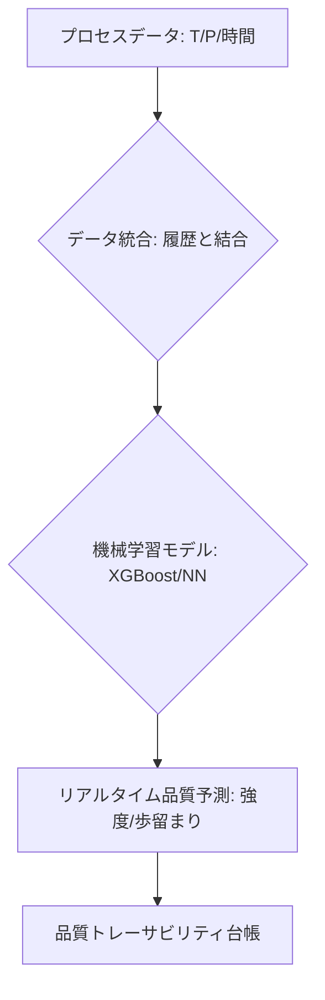

# T15-04-05 品質予測モデル・プロセス-品質相関分析

## Summary（5つの要点）

1. **目的**: 製造プロセスデータ（温度、圧力、時間など）をインプットとして、最終製品の**品質特性**（強度、寸法精度、表面粗さ、歩留まりなど）を**リアルタイム**または**製造完了前**に予測する。
2. **機械学習モデル**: 線形回帰、サポートベクター回帰、そして特に高い予測精度を示す**勾配ブースティング**（XGBoost、LightGBM）や**ニューラルネットワーク**（NN）などの回帰モデルが活用される `(1)`。
3. **プロセス-品質相関分析**: 予測モデルの構築過程で、どのプロセス変数が最終品質に**最も強い影響**を与えているかを特定する（特徴量の重要度分析）。これにより、**クリティカルなプロセスパラメータ**（CPP）を特定し、重点的な管理を可能にする。
4. **仮想センシング（ソフトセンサー）**: 実際には測定が困難・高コスト・時間遅延がある品質項目（例: 化学反応の収率）を、測定容易なプロセスデータから間接的に予測する**仮想センサー**として機能する。
5. **トレーサビリティ**: 製造履歴データと予測品質データを紐づけ、製品ロットごとの**品質の保証値**（予測値と信頼区間）を提供。これにより、顧客への**高い品質トレーサビリティ**と、問題発生時の迅速な原因究明を実現する。

#### 概念図

---

### 技術評価表（定量的な視点）
| 評価項目 | 評価 | 根拠 |
| :--- | :--- | :--- |
| 導入コスト | ⭐⭐⭐☆☆ | モデル開発・運用コストはかかるが、ソフトウェアはオープンソース活用可能 |
| 技術成熟度 | ⭐⭐⭐⭐☆ | 予測モデルは実用段階。精度向上のための因果推論が研究段階 |
| 日本の競争力 | ⭐⭐⭐⭐☆ | 高精度なプロセスデータと品質検査データを武器にモデル構築が進む |
| 市場性 | ⭐⭐⭐⭐⭐ | 品質不良の削減、歩留まり向上、製造リードタイム短縮に直結 |
| 品質保証の重要性 | ⭐⭐⭐⭐⭐ | 品質検査の**全数検査・リアルタイム化**を実現する代替手段 |

---

## 日本の立ち位置・強み弱みのSummary

### 強み：日本企業や研究機関が持つ独自の技術、優位性などを箇条書きで記述。

* **高品質な検査データ**: 日本の製造業は最終製品の**品質検査体制**が厳格であり、予測モデルの訓練に必要な**教師データ（品質実績値）**の信頼性が高い。
* **暗黙知の形式知化**: 熟練の技術者が持つ「この条件で品質が悪化する」といった**暗黙知**を、予測モデルの特徴量エンジニアリングに組み込む知見が豊富。
* **マテリアルズインフォマティクス（MI）からの応用**: MIで培ったAI物性予測技術を、製造プロセスデータに適用する展開力が高い。

### 弱み：日本が抱える規制、標準化の遅れ、海外依存などを箇条書きで記述。

* **相関分析から因果推論への移行遅れ**: 予測精度は高いが、「なぜこのプロセスで品質が変化したのか」という**因果関係**を明確にするための**因果推論**技術の産業応用が遅れている。
* **モデル運用・保守の課題**: 一度構築したモデルが、プロセスの軽微な変更（原料、環境）で精度が低下する**モデルドリフト**への対応・自動再学習の仕組みが不十分。
* **データの分断**: 製造条件データ（T15-04-01）と最終検査データ（品質実績）の**データ連携・統合**がスムーズに行えない現場が多い。

---

## 技術ロードマップ（短期/中期/長期）

### 短期目標（～2027年）

* **主要製品の品質予測モデル**を構築し、**予測精度（R2値）80%以上**を達成。
* 予測結果を基に、品質不良のリスクが高いロットを自動で特定し、**全数検査**に回す仕組みを導入。
* 予測モデルの特徴量重要度分析を基に、**最も影響の大きいプロセス変数**（CPP）を特定し、管理限界を設定。

### 中期目標（2028年～2031年）

* 予測結果の**信頼区間**（予測の不確実性）を算出・提示し、品質保証への活用を本格化。
* **因果推論モデル**を導入し、品質変化の**根本原因**を製造条件データから自動で特定するシステムを実現。
* 予測品質を最大化するように、プロセス設定値を自動で調整する**予測ベースの自動制御システム**を実用化。

### 長期目標（2032年～2035年）

* **デジタルツイン**と連携し、プロセスデータだけでなく、仮想空間での挙動も考慮した**超高精度な品質保証モデル**を確立。
* **サプライチェーン全体**のデータ（原料、設備、環境）を統合し、製品の**ライフサイクル全体**の品質を予測・保証するシステムを実現。

### 📚 参照リンク

1. [機械学習による品質予測モデルの構築 - 富士通](https://www.fujitsu.com/jp/documents/magazine/pdf/vol74-3/v74-3-06.pdf)
2. [製造業におけるAI品質予測の応用 - 日立](https://www.hitachi.co.jp/rd/portal/contents/data/research/2021/05/210519/)
3. [勾配ブースティング（XGBoost/LightGBM）の解説 - Preferred Networks](https://preferred.jp/)
4. [仮想センシング（ソフトセンサー）技術の応用 - 科学技術振興機構](https://www.jst.go.jp/)
5. [Scikit-learn: 機械学習ライブラリ](https://scikit-learn.org/stable/]