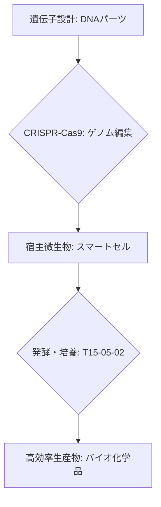

# T15-05-01 代謝工学・遺伝子組換え微生物設計

## Summary（5つの要点）

1. **定義**: 微生物（大腸菌、酵母、藍藻など）が持つ**代謝経路**（物質を分解・合成する化学反応ネットワーク）を、**遺伝子編集**により改変し、目的の物質を**高効率**かつ**大量**に生産させる技術 `(1)`。
2. **設計ツール**: **合成生物学**の原則に基づき、DNA部品（プロモーター、遺伝子、ターミネーター）を標準化された手法（BioBrick、Golden Gate Assembly）で組み立て、細胞に導入する `(2)`。
3. **ゲノム編集**: **CRISPR-Cas9**システムなどの**高精度なゲノム編集技術**を活用し、代謝のボトルネックとなる酵素遺伝子を破壊したり、目的物質の生産に関わる遺伝子を強化したりする。
4. **生産物質**: **バイオ燃料**（ブタノール、エタノール）、**ファインケミカル**（コハク酸、イソプレン）、**医薬品原料**、**機能性タンパク質**（酵素）など、幅広い高付加価値物質の生産が可能。
5. **最適化**: 単なる遺伝子操作に留まらず、**オミクスデータ**（ゲノム、トランスクリプトーム、メタボローム）を解析し、細胞の応答を理解することで、設計された細胞（**スマートセル**）の性能を最大化する。

#### 概念図

---

### 技術評価表（定量的な視点）
| 評価項目 | 評価 | 根拠 |
| :--- | :--- | :--- |
| 導入コスト | ⭐⭐⭐⭐☆ | ゲノム編集・合成DNA費用は低下傾向だが、設計・解析に高度な人材が必要 |
| 技術成熟度 | ⭐⭐⭐⭐☆ | 医薬品（インスリンなど）、アミノ酸、一部のバイオ化学品で商用生産実績あり |
| 日本の競争力 | ⭐⭐⭐⭐⭐ | 発酵技術、ゲノム編集技術（理研、神戸大、味の素、協和キリン）で世界トップクラス `(1)` |
| 市場性 | ⭐⭐⭐⭐⭐ | 石油化学品の代替、医薬品開発の加速により、市場規模は年率20%超で拡大 |
| 品質保証の重要性 | ⭐⭐⭐⭐⭐ | 遺伝子組換え体の**安全性**（封じ込め）、**生産効率の安定性**の確保が必須 |

---

## 日本の立ち位置・強み弱みのSummary

### 強み：日本企業や研究機関が持つ独自の技術、優位性などを箇条書きで記述。

* **発酵・微生物工学の伝統と実績**: **アミノ酸生産**（味の素、協和キリン）などで培った高度な**代謝制御技術**と**大規模発酵ノウハウ**は、スマートセル設計の基礎となる。
* **ゲノム編集技術の基礎研究**: **CRISPR-Cas9**やその他の新規ゲノム編集技術の**基礎研究**で理化学研究所、神戸大学などが世界をリードしている `(1)`。
* **オミクス解析技術**: **メタボローム解析**などの高度な**定量分析技術**が、細胞内部の代謝状態を詳細に把握し、設計フィードバックの精度を高める。

### 弱み：日本が抱える規制、標準化の遅れ、海外依存などを箇条書きで記述。

* **バイオファウンドリの自動化**: 設計から製造・評価（Design-Build-Test-Learn）のサイクルを自動化・高速化する**バイオファウンドリ**（T15-05-05）の導入規模・スピードで米国（Ginkgo Bioworks）に後れを取っている。
* **合成生物学ツールの標準化**: BioBrickなどの合成生物学向け**標準化されたDNAパーツ**の共有・活用エコシステムが未成熟。
* **資金調達規模**: 大規模な設備投資や長期の研究開発が必要なバイオものづくり分野への**リスクマネー供給**が欧米スタートアップに比べて限定的。

---

## 技術ロードマップ（短期/中期/長期）

### 短期目標（～2027年）

* **CRISPR-Cas9**システムを用いた**複数遺伝子の同時・高精度編集技術**の標準化。
* 代謝工学とAI（機械学習）を組み合わせた**ターゲット物質の代謝経路自動探索システム**のプロトタイプ開発。
* **バイオ燃料**や**高付加価値な香料・色素**の生産効率を**現状の30%向上**させるスマートセルを開発。

### 中期目標（2028年～2031年）

* AIとロボットを活用した**自動化バイオファウンドリ**を構築し、設計-製造-評価のサイクルタイムを**数週間に短縮**。
* スマートセルを用いて、**石油化学プロセス**を代替する**汎用化学品**（アジピン酸、ブタジエンなど）の**コスト競争力**を持つ生産技術を確立。
* ゲノム編集された細胞の**安全性、環境影響評価**に関する**国際標準プロトコル**を確立。

### 長期目標（2032年～2035年）

* AIが目的（例: 「このコストでこの機能を持つ物質」）を入力するだけで、**細胞設計からプロセスまでを自律的に最適化**する**自律型バイオ生産システム**を実現。
* **非食料系バイオマス**（木質バイオマス、CO2）を原料として利用可能なスマートセルの実用化。

### 📚 参照リンク

1. [バイオものづくり・合成生物学の動向 - 経済産業省](https://www.meti.go.jp/shingikai/sankoshin/seizo_sangyo/pdf/001_03_02.pdf)
2. [CRISPR-Cas9の仕組みと応用 - 理化学研究所](https://crispr.riken.jp/)
3. [代謝工学によるバイオ生産 - 味の素](https://www.ajinomoto.co.jp/rd/column/014/)
4. [スマートセルインダストリーの創出 - JST](https://www.jst.go.jp/start/research/h28/smartcell/)