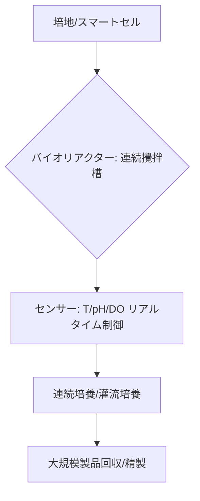

# T15-05-02 バイオリアクター・大規模培養技術

## Summary（5つの要点）

1. **定義**: 遺伝子組換えされた**スマートセル**（T15-05-01）を、**工業スケール**（数千～数十万リットル）で、製品を効率的に生産するために必要な環境下で増殖・維持するための装置とプロセス技術 `(1)`。
2. **精密制御**: **温度、pH、溶存酸素濃度、栄養塩濃度**などのプロセスパラメーターを、PID制御やモデル予測制御（MPC）により**精密にリアルタイムで制御**し、微生物の生産効率を最大化する。
3. **高生産性培養**: **連続培養**（ケモスタット）、**灌流培養**などの技術により、従来の**バッチ式培養**よりも高密度で細胞を維持し、長期間にわたって安定して製品を回収することで、**生産性を大幅に向上**させる `(2)`。
4. **スケールアップ**: ラボスケール（数リットル）での最適培養条件を、パイロットスケール、そして**大規模プラントスケール**へと**物理法則**（攪拌、酸素移動、熱伝達）を考慮して忠実に再現する**スケールアップ技術**が重要。
5. **応用**: **医薬品（抗体、ワクチン）、アミノ酸、バイオプラスチック原料、酵素**などのバイオ製品のコストと供給量を決定する中核技術。サントリー（抗体）、味の素（アミノ酸）、カネカ（PHA）などが応用。

#### 概念図

---

### 技術評価表（定量的な視点）
| 評価項目 | 評価 | 根拠 |
| :--- | :--- | :--- |
| 導入コスト | ⭐⭐☆☆☆ | 大規模プラント建設、滅菌システム、精密制御機器に莫大な初期投資が必要 |
| 技術成熟度 | ⭐⭐⭐⭐⭐ | 医薬品（抗体）、アミノ酸生産で長年の実績があり、プロセスは成熟 |
| 日本の競争力 | ⭐⭐⭐⭐⭐ | アミノ酸、抗体医薬の分野で培われた**高度な制御・スケールアップ技術**を持つ `(1)` |
| 市場性 | ⭐⭐⭐⭐⭐ | バイオ化学品、医薬品、培養肉など、全てのバイオものづくり製品の量産化に必須 |
| 品質保証の重要性 | ⭐⭐⭐⭐⭐ | 培養ロット間の**品質安定性**（均一性、コンタミ防止）を保証する根幹技術 |

---

## 日本の立ち位置・強み弱みのSummary

### 強み：日本企業や研究機関が持つ独自の技術、優位性などを箇条書きで記述。

* **発酵プラントの運用ノウハウ**: 味の素、協和キリンなどの企業が、数十万リットル級の**大規模発酵槽**の**長期安定運転**と**コンタミフリー**制御に関する世界トップクラスのノウハウを持つ。
* **精密センサー・制御技術**: 日本製の**高精度なpH・DOセンサー**や、**プロセス制御システム（DCS）**は、バイオリアクターの精密運転を支える。
* **灌流培養技術**: 細胞培養肉（T15-05-04）などの分野で、高密度細胞培養を可能にする**灌流培養**や**培地回収**技術の研究が進展している。

### 弱み：日本が抱える規制、標準化の遅れ、海外依存などを箇条書きで記述。

* **大規模設備投資の遅れ**: 新規のバイオ化学品生産に向けた**ギガファクトリー級**の**大型バイオリアクター**への投資で、海外のスタートアップや大手化学メーカーに比べてスピードが遅れている。
* **連続生産プロセスの国際標準化**: 医薬品製造ではバッチ式が主流であり、**連続生産**や**モジュール式プラント**の設計・規制対応で、欧米の規制当局・企業に後れを取る可能性がある。
* **原料コスト**: 発酵原料となる**糖類やバイオマス**の安定調達・低コスト化において、大規模農業国に比べて不利な状況がある。

---

## 技術ロードマップ（短期/中期/長期）

### 短期目標（～2027年）

* **プロセスインフォマティクス**（T15-04）を活用し、リアルタイムデータに基づく**培養プロセスの最適化**と**収率5%向上**を達成。
* **小型・モジュール化されたバイオリアクター**を開発し、多品種少量生産や分散型生産に対応。
* **培養液の組成分析**をインラインで実施する**高精度な分析技術（PAT）**を導入。

### 中期目標（2028年～2031年）

* AI（機械学習）とシミュレーションを統合した**デジタルツイン**（T15-04-04）を構築し、**スケールアップ失敗リスクをゼロ**に近づける。
* **連続培養**システムを医薬品、バイオ化学品の主要生産プロセスとして確立し、**コストを20%削減**。
* **非食料系バイオマス**（CO、CO2、メタン）を利用できる**ガス発酵リアクター**の大型化・実用化。

### 長期目標（2032年～2035年）

* AIが培養の状態を判断し、**自律的にプロセスを最適化・修復**する**自己制御型スマートリアクター**の実現。
* 生産コストが石油化学品と**同等以下の競争力**を持つ**バイオプラントネットワーク**を世界中に展開。

### 📚 参照リンク

1. [バイオテクノロジーによる化学産業の革新 - 住友化学](https://www.sumitomo-chem.co.jp/rd/report/theses/docs/202102_02.pdf)
2. [大規模バイオリアクターによる物質生産 - JBA](https://www.jba.or.jp/)
3. [培養プロセスにおけるインフォマティクス技術の活用 - 協和キリン](https://www.kyowakirin.co.jp/rd/technology/biotechnology/)