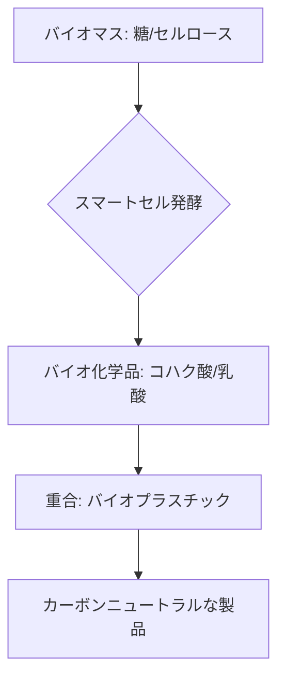

# T15-05-03 バイオプラスチック・バイオ化学品生産

## Summary（5つの要点）

1. **定義**: 微生物（スマートセル）の**発酵プロセス**（T15-05-01, T15-05-02）を利用し、**再生可能なバイオマス**を原料として、石油由来の汎用化学品・プラスチック原料を代替する物質を生産する `(1)`。
2. **主要製品**: **バイオプラスチック原料**（乳酸 $	o$ PLA、ヒドロキシアルカン酸 $	o$ PHA、コハク酸 $	o$ PBS）、**汎用化学品**（1,3-プロパンジオール、ブタジエン）、**アミノ酸**などが含まれる。
3. **カーボンニュートラル**: 原料のバイオマスが生育過程で**CO2を吸収**するため、製品を燃焼・分解しても大気中のCO2濃度を実質的に増加させない**カーボンニュートラル**な製造プロセスを実現する `(1)`。
4. **コスト競争力**: 技術の最大の課題は、**石油化学プロセス**と比較して**製造コストが高い**点にある。収率向上、分離精製プロセスの効率化、安価な原料の活用が不可欠。
5. **主要企業**: Genomatica（米国）、Amyris、Metabolixなどがバイオ化学品で先行。日本国内では、**カネカ**（PHA）、**三菱ケミカル**（バイオPBS）、**味の素**（アミノ酸）などが強みを持つ。

#### 概念図

---

### 技術評価表（定量的な視点）
| 評価項目 | 評価 | 根拠 |
| :--- | :--- | :--- |
| 導入コスト | ⭐⭐☆☆☆ | 大規模プラント建設、発酵技術開発、分離精製に高額な投資が必要 |
| 技術成熟度 | ⭐⭐⭐⭐☆ | 乳酸、アミノ酸、1,3-プロパンジオールは既に商用生産。汎用化学品は途上 |
| 日本の競争力 | ⭐⭐⭐⭐☆ | PHA、アミノ酸などの**高付加価値品**で強み。汎用品で国際競争に直面 |
| 市場性 | ⭐⭐⭐⭐⭐ | 環境規制、脱炭素の流れで需要が急増。年平均25%の成長率予測 |
| 品質保証の重要性 | ⭐⭐⭐⭐⭐ | 製品の**純度**、**バイオマス由来率**のトレーサビリティ保証が必須 |

---

## 日本の立ち位置・強み弱みのSummary

### 強み：日本企業や研究機関が持つ独自の技術、優位性などを箇条書きで記述。

* **高付加価値バイオ化学品**: アミノ酸、機能性糖類、PHAなどの**高付加価値な発酵製品**の分野で、高い技術力とグローバルシェアを持つ。
* **分離精製技術**: 発酵液から目的物質を**高純度**で、かつ**低エネルギー**で取り出す**膜分離、晶析、クロマトグラフィー**などの高度な分離精製技術に優位性を持つ。
* **CO2/非食料原料技術**: **CO2**や**木質バイオマス**など、安価で持続可能な原料を利用するスマートセルの開発が進展している。

### 弱み：日本が抱える規制、標準化の遅れ、海外依存などを箇条書きで記述。

* **コスト競争力**: 製造コストが石油化学品に比べ依然高く、**政府支援**や**大規模化**がなければ、市場での汎用化が難しい `(1)`。
* **原料依存**: 大規模生産に必要な**糖類（トウモロコシ、サトウキビ）**の多くを海外からの輸入に依存している。
* **バイオファウンドリの活用遅れ**: 合成生物学（T15-05-05）やAI（T15-05-01）を活用した**研究開発のスピード**で、海外のバイオスタートアップに劣後している。

---

## 技術ロードマップ（短期/中期/長期）

### 短期目標（～2027年）

* **バイオコハク酸、バイオ乳酸**などの汎用中間体の**製造コストを10%削減**するプロセス技術を確立。
* **非食料系バイオマス**（廃木材、セルロース）を原料とする**前処理技術**と、スマートセルの利用効率向上。
* **PHAベース**の海洋分解性プラスチック（T15-03-02）の**大規模量産プラント**の設計・着工。

### 中期目標（2028年～2031年）

* **バイオ化学品**（例: ブタジエン、イソプレン）の**製造コストを石油化学品と競合可能な水準**にまで引き下げる。
* **サプライチェーン全体**（原料調達、生産、輸送）での**CO2排出量**を可視化・最適化するシステムを導入。
* 発酵、分離精製、重合の**全工程をデジタルツイン**（T15-04-04）で統合し、生産を自律制御。

### 長期目標（2032年～2035年）

* **全ての汎用化学品**をバイオものづくりで代替する技術を確立し、**石油化学産業からの完全な脱却**を目指す。
* **カーボンリサイクル技術**（CO2を原料とする生産）を大規模化し、真の**負の排出**（Carbon Negative）を実現。

### 📚 参照リンク

1. [バイオものづくり推進に向けたロードマップ - 経済産業省](https://www.meti.go.jp/policy/mono_info_service/monodukuri/bio/bio-shoshikihyo.html)
2. [バイオマスプラスチックの動向と戦略 - 科学技術振興機構](https://www.jst.go.jp/crds/report/report2020/CRDS-FY2020-RR-02.pdf)
3. [バイオコハク酸の製造プロセス - 三菱ケミカル](https://www.m-chemical.co.jp/products/PBS/index.html)