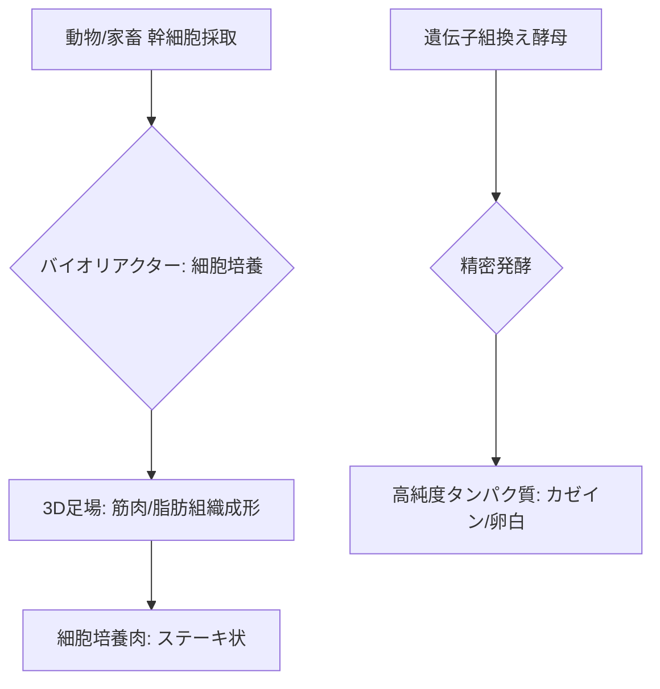

# T15-05-04 細胞培養肉・精密発酵タンパク質

## Summary（5つの要点）

1. **細胞培養肉**: 動物から採取した**幹細胞**を、バイオリアクター（T15-05-02）内で**培養液**を用いて大量に増殖させ、最終的に**食肉**（筋肉、脂肪、結合組織）を形成させる技術 `(1)`。
2. **精密発酵タンパク質**: 微生物（酵母、菌類など）に、**動物由来の特定のタンパク質**（牛乳のカゼイン、卵白のアルブミン、成長因子など）の遺伝子を組み込み（T15-05-01）、発酵により**高純度**で生産する技術 `(2)`。
3. **環境負荷の低減**: 従来の畜産に比べ、**土地利用、水消費、温室効果ガス排出**を大幅に削減可能であり、持続可能な食料供給システムとして期待される。
4. **最大の課題（コスト）**: 細胞培養肉の**培養液**（FBS、成長因子など）のコストが極めて高く、**量産化**と**低コスト化**（特に成長因子の再利用）が技術的な最大の課題 `(1)`。
5. **応用と規制**: 細胞培養肉は**シンガポール**、**米国**で販売承認済み。精密発酵によるタンパク質は既に**Perfect Day**などが牛乳タンパク質として商業化。日本国内では**インテグリカルチャー**などが研究開発を進める。

#### 概念図

---

### 技術評価表（定量的な視点）
| 評価項目 | 評価 | 根拠 |
| :--- | :--- | :--- |
| 導入コスト | ⭐⭐☆☆☆ | 培養肉は培養液コストが非常に高額。精密発酵も初期設備投資が必要 |
| 技術成熟度 | ⭐⭐⭐☆☆ | 精密発酵は商業化開始。培養肉はパイロットスケールから量産移行期 |
| 日本の競争力 | ⭐⭐⭐☆☆ | 細胞培養肉はインテグリカルチャーなど有力企業が挑戦中。海外勢に後れ `(1)` |
| 市場性 | ⭐⭐⭐⭐⭐ | 世界の代替タンパク質市場は急成長。特に動物性タンパク質の代替需要が高い |
| 品質保証の重要性 | ⭐⭐⭐⭐⭐ | 食品としての**安全性**、**栄養価**、**味・食感**の再現性の保証が必須 |

---

## 日本の立ち位置・強み弱みのSummary

### 強み：日本企業や研究機関が持つ独自の技術、優位性などを箇条書きで記述。

* **培養技術の基礎**: **再生医療**分野で培った**細胞大量培養**、**3D組織構築**に関する高い技術力（iPS細胞研究など）が応用可能 `(1)`。
* **インテグリカルチャーのコスト削減技術**: 安価な培養液を利用する**汎用大規模細胞培養システム（CulNet System™）**の開発で、培養肉のコスト問題解決に貢献。
* **発酵食品のノウハウ**: 味噌、醤油、酒などの伝統的な**発酵技術**の知見が、精密発酵による新規食品開発に活かせる。

### 弱み：日本が抱える規制、標準化の遅れ、海外依存などを箇条書きで記述。

* **規制環境**: 細胞培養肉は**食品衛生法**における**安全性審査**の枠組みが途上であり、商業化のスピードでシンガポール、米国に後れを取っている。
* **培養液コスト**: 成長因子を低コストで得るための**非血清培地**の開発や、培地の**再利用技術**での国際競争が激化。
* **消費者受容性**: 培養肉・精密発酵製品に対する**消費者や畜産業界**の**理解**と**受容**を促進するための取り組みが課題。

---

## 技術ロードマップ（短期/中期/長期）

### 短期目標（～2027年）

* **細胞培養肉**（鶏肉、魚介類）の**製造コストを現状の1/10**に削減する培養液・プロセス技術の実証。
* **精密発酵タンパク質**（牛乳、卵白）の**安全性評価**を完了し、特定用途（乳製品代替など）での販売承認を取得。
* **食感、風味**を天然肉に近づけるための**細胞種の組み合わせ**と**3D組織化技術**の研究開発。

### 中期目標（2028年～2031年）

* 細胞培養肉の**ギガファクトリー**を設計・建設し、**天然肉と価格競争力のある水準**での量産を開始。
* **バイオリアクター**（T15-05-02）を培養肉向けに最適化し、**連続培養**による超高密度・高収率生産を実現。
* **魚介類、希少動物**の細胞培養肉・培養魚介類の商業化。

### 長期目標（2032年～2035年）

* 細胞培養肉と精密発酵タンパク質が、世界の**動物性タンパク質の主要な供給源**となる社会インフラを確立。
* **AI**を活用して、栄養価、風味、食感を**自在に設計**できる**カスタマイズ型食肉**の生産システムを実現。

### 📚 参照リンク

1. [培養肉の現状と課題 - インテグリカルチャー](https://www.integriculture.com/technology)
2. [精密発酵の技術と未来 - Perfect Day](https://perfectday.com/)
3. [細胞農業の国際動向と国内の取り組み - 農林水産省](https://www.maff.go.jp/j/syouan/seisaku/tokutei_kouza/attach/pdf/cell-1.pdf)