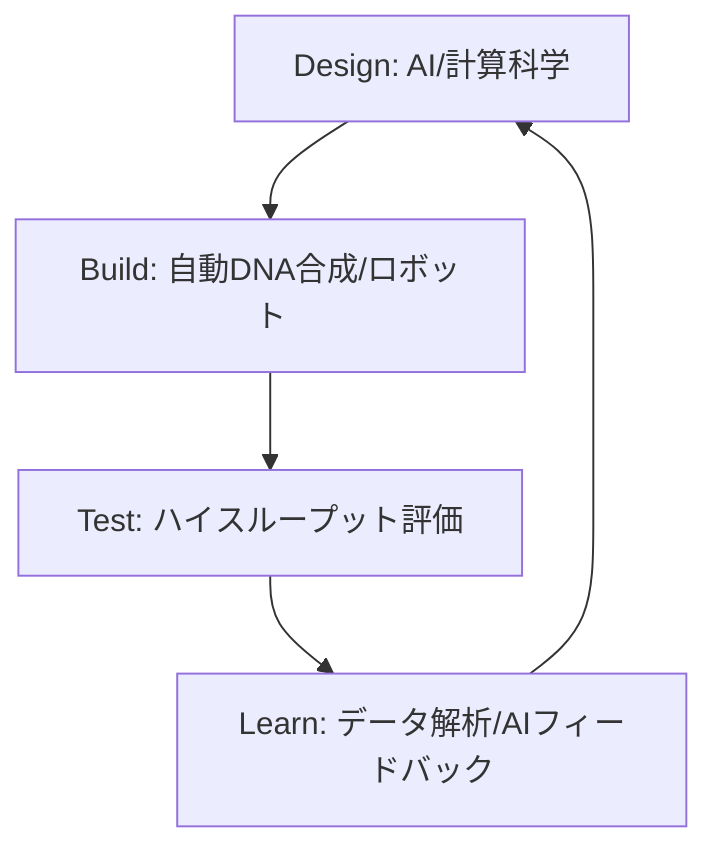

# T15-05-05 合成生物学・バイオファウンドリ

## Summary（5つの要点）

1. **合成生物学**: 生物を単なる天然の存在としてではなく、**設計図（DNA）**に基づいて機能を**プログラム**できる**工学的なシステム**として捉え、人工的に細胞や生命システムを創り出す学問・技術 `(1)`。
2. **バイオファウンドリ**: 合成生物学の**設計-製造-評価-学習（DBTL: Design-Build-Test-Learn）**サイクルを、**ロボット、液体ハンドリングシステム、AI**を用いて**高度に自動化**したプラットフォーム `(2)`。
3. **DBTLサイクル**: **Design**（AIによる遺伝子回路設計）$	o$ **Build**（自動DNA合成・アセンブリ）$	o$ **Test**（ハイスループットな表現型評価）$	o$ **Learn**（データ解析とAIによる設計改善）のサイクルを高速で回す。
4. **高速化**: 従来のラボでの手作業に比べ、**数千〜数万種類**の遺伝子構成の細胞を**数週間**で評価可能。スマートセル（T15-05-01）の開発期間を劇的に短縮する。
5. **主要プレイヤー**: **Ginkgo Bioworks**（米国）が世界最大規模のバイオファウンドリを持ち、化学品、医薬品、食品など幅広い分野で細胞開発を受託。Zymergen（米国）、理化学研究所（日本）などが続く。

#### 概念図

---

### 技術評価表（定量的な視点）
| 評価項目 | 評価 | 根拠 |
| :--- | :--- | :--- |
| 導入コスト | ⭐⭐☆☆☆ | 大規模な自動化設備、AIソフトウェア、専門人材に巨額な初期投資が必要 |
| 技術成熟度 | ⭐⭐⭐⭐☆ | 米国では既に商業サービスとして成立。日本は研究・パイロット導入段階 |
| 日本の競争力 | ⭐⭐⭐☆☆ | 個別の要素技術は高いが、**DBTLサイクル全体の統合・自動化**で米国に後れ `(2)` |
| 市場性 | ⭐⭐⭐⭐⭐ | あらゆる物質生産、創薬、食品開発の**研究開発のインフラ**となる |
| 品質保証の重要性 | ⭐⭐⭐⭐⭐ | **DNA合成の正確性**、ハイスループット評価の**信頼性・再現性**の保証が必須 |

---

## 日本の立ち位置・強み弱みのSummary

### 強み：日本企業や研究機関が持つ独自の技術、優位性などを箇条書きで記述。

* **要素技術の優位性**: **ロボティクス、自動化装置**（液体ハンドリング）、**次世代シーケンサー**、**ハイスループット分析技術**など、ファウンドリを構成する個別の要素技術は高い水準にある。
* **理化学研究所の取り組み**: **理化学研究所**などが、小規模ながらもバイオファウンドリ機能を構築し、合成生物学研究の推進役となっている。
* **バイオデータサイエンス人材**: **AI**と**生物学**の境界領域を担う**バイオインフォマティクス人材**の育成が進んでいる。

### 弱み：日本が抱える規制、標準化の遅れ、海外依存などを箇条書きで記述。

* **ファウンドリの大規模化の遅れ**: 米国のGinkgo Bioworksのような**資本力**と**大規模な設備**を持つ**受託ファウンドリ**が日本に不在。
* **標準化とデータ共有**: DBTLサイクルで得られた**データの形式**や**遺伝子パーツ**の**標準化**と、企業・研究機関間での**データ共有**エコシステムの構築が遅れている。
* **ビジネスモデルの転換**: 自社内での閉鎖的な研究開発から、ファウンドリを活用した**オープンイノベーション型**の研究開発モデルへの転換が遅れている。

---

## 技術ロードマップ（短期/中期/長期）

### 短期目標（～2027年）

* **国内の主要研究機関・企業**に、**標準化されたモジュール型バイオファウンドリ**（小規模）の導入を推進。
* AI（機械学習）を活用した**Designフェーズ**を強化し、**細胞設計の成功率を2倍**に向上。
* **合成DNAの低コスト化**技術を確立し、Buildフェーズのボトルネックを解消。

### 中期目標（2028年～2031年）

* 産学官連携による**大規模なオープン・バイオファウンドリ**を構築し、国内外からの受託開発サービスを開始。
* DBTLサイクル全体をAIが制御する**自律的な実験計画・実行システム**を実現。
* **デジタルツイン**（T15-04-04）と連携し、**培養プロセス**（T15-05-02）まで含めた**細胞工場全体の最適化**を自動で実行。

### 長期目標（2032年～2035年）

* バイオファウンドリが、**医薬品、化学品、食品**の**研究開発期間を1/10**に短縮する**基幹インフラ**として機能。
* AIが設計した**人工生命体**を、環境中で安全かつ自律的に機能させるための**倫理・規制枠組み**を確立。

### 📚 参照リンク

1. [合成生物学とその産業応用 - 経済産業省](https://www.meti.go.jp/shingikai/sankoshin/seizo_sangyo/pdf/001_03_02.pdf)
2. [Ginkgo Bioworks: The Organism Company](https://www.ginkgobioworks.com/)
3. [バイオファウンドリの現状と展望 - 理化学研究所](https://www.riken.jp/)
4. [合成生物学技術の国際比較 - JST](https://www.jst.go.jp/crds/report/report2020/CRDS-FY2020-RR-02.pdf)