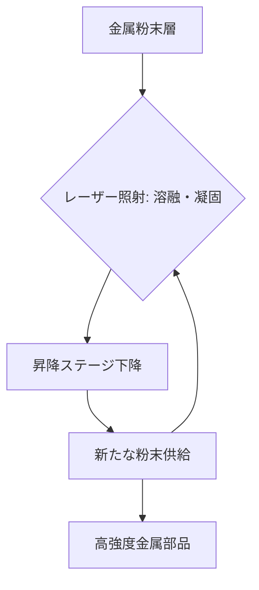

# T15-06-01 金属3Dプリンティング（レーザー粉末床溶融結合法：L-PBF）

## Summary（5つの要点）

1. **基本原理（L-PBF）**: **レーザー粉末床溶融結合法（L-PBF）**は、敷き詰められた金属粉末に高出力レーザーを照射し、層状に**溶融と凝固**を繰り返すことで、三次元形状の金属部品を製造する `(1)`。
2. **設計自由度と軽量化**: 従来の切削加工では不可能な**複雑な内部流路**や、強度を保ちつつ質量を極限まで削減する**ラティス（格子）構造**を一体成形できる。
3. **高機能材料対応**: チタン合金（Ti-6Al-4V）、インコネル（耐熱合金）、アルミ合金など、**難削材**とされる高機能金属材料の造形が可能。航空機エンジン部品や医療インプラントに不可欠。
4. **部品点数削減**: 複数の部品を**一体成形**することで、組み立て工程や溶接が不要となり、**部品点数を大幅に削減**し、信頼性を向上させる。
5. **品質管理の重要性**: 造形時の**温度、レーザー出力、酸素濃度**などのプロセスパラメーターが製品の**内部欠陥**や**機械的特性**に直結するため、リアルタイムモニタリングと品質保証が極めて重要 `(2)`。

#### 概念図

---

### 技術評価表（定量的な視点）
| 評価項目 | 評価 | 根拠 |
| :--- | :--- | :--- |
| 導入コスト | ⭐⭐☆☆☆ | 装置本体、金属粉末、周辺設備、保守に高額な費用 |
| 技術成熟度 | ⭐⭐⭐⭐☆ | 航空宇宙・医療分野で実用化済み。量産適用が拡大中 |
| 日本の競争力 | ⭐⭐⭐⭐☆ | 高精度な装置メーカー（ソディック、松浦機械）が存在。材料技術に強み |
| 市場性 | ⭐⭐⭐⭐⭐ | 複雑部品、軽量化ニーズの強い産業で、年率20%超の成長予測 |
| 品質保証の重要性 | ⭐⭐⭐⭐⭐ | 欠陥が許されない**航空宇宙・医療**用途が主であり、最重要 |

---

## 日本の立ち位置・強み弱みのSummary

### 強み：日本企業や研究機関が持つ独自の技術、優位性などを箇条書きで記述。

* **高精度な装置技術**: **ソディック、松浦機械**など、工作機械の精密制御技術を持つメーカーが、**レーザーの高精度制御**と**造形精度**に優れたL-PBF装置を提供している。
* **材料開発力**: **高機能な金属粉末**（チタン、ニッケル基超合金）の開発力があり、高付加価値な造形材料を提供できる。
* **医療・金型分野での実績**: **歯科・整形外科インプラント**や、**冷却水路内蔵金型**など、特殊用途での適用実績が豊富。

### 弱み：日本が抱える規制、標準化の遅れ、海外依存などを箇条書きで記述。

* **量産化への移行遅れ**: 試作・少量生産用途が中心であり、**自動車産業などでの量産部品**への本格適用が欧米に比べて遅れている `(1)`。
* **ソフトウェア依存**: **造形シミュレーション、プロセス最適化**に必要なソフトウェア（ANSYS Additive、EOSPRINTなど）を海外ベンダーに依存している。
* **専門人材不足**: 3D-AM特有の**設計（DfAM）**、**品質保証**、**プロセス管理**を行える技術者・エンジニアの育成が急務。

---

## 技術ロードマップ（短期/中期/長期）

### 短期目標（～2027年）

* **リアルタイムプロセスモニタリング**（温度、溶融池形状）技術を導入し、**造形中の欠陥を自動検知**。
* AI（機械学習）を活用した**最適な造形パラメータ**（レーザー走査速度、出力）の自動設定システムの確立。
* **ハイブリッドAM**（切削加工とAMの複合機）の導入を拡大し、高精度な仕上げ加工を実現。

### 中期目標（2028年～2031年）

* **連続生産・大規模製造**に対応可能な**マルチレーザー/大型L-PBF装置**を開発し、量産用途への適用を本格化。
* **造形品の認証・品質保証**に関する国際標準（ISO/ASTM）に基づいた国内認証スキームを確立。
* **リサイクル粉末**の品質を担保する技術を確立し、材料コストを削減。

### 長期目標（2032年～2035年）

* AMプロセス全体をAIが制御し、**造形から検査までを無人化**した**自律型AMファクトリー**の実現。
* 応力解析、温度解析をリアルタイムで行い、**欠陥の発生を予測・修正**しながら造形する**クローズドループ制御**を確立。

### 📚 参照リンク

1. [金属積層造形（AM）技術の動向 - 経済産業省](https://www.meti.go.jp/policy/mono_info_service/monodukuri/am_shishin.html)
2. [EOS社による金属3Dプリンティング技術解説](https://www.eos.info/en/additive-manufacturing/metal-3d-printing)
3. [金属3Dプリンタの最新事例 - ソディック](https://www.sodick.co.jp/)
4. [航空宇宙分野における金属AMの応用 - GE Additive](https://www.ge.com/additive/)