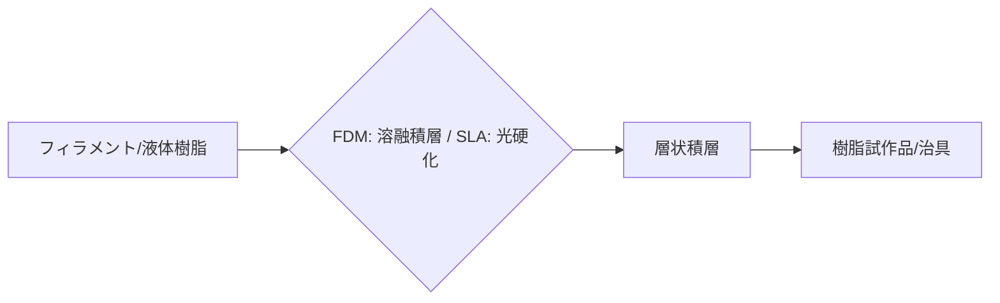

# T15-06-02 樹脂3Dプリンティング（光造形・材料押出法）

## Summary（5つの要点）

1. **光造形法（SLA/DLP）**: 液体状の**紫外線硬化樹脂**にレーザー（SLA）やプロジェクター光（DLP）を照射し、硬化させて造形。**高精度（±0.1mm以下）**かつ**滑らかな表面仕上げ**が得られ、試作品や歯科、ジュエリー分野で主流 `(1)`。
2. **材料押出法（FDM/FFF）**: **熱可塑性樹脂フィラメント**を熱で溶融し、ノズルから押し出しながら積層する。装置・材料コストが比較的低く、**大型造形**や**治具・工具**の製造に広く利用される。
3. **高性能樹脂対応**: ナイロン、ABS、PC（ポリカーボネート）、PEEK（高性能ポリマー）など、**高い耐熱性や機械的強度**を持つエンプラ・スーパーエンプラに対応した材料が開発されている。
4. **多品種少量生産**: 金型が不要なため、**カスタム医療器具**（補聴器、義肢）、**治具、最終製品**の多品種少量生産に極めて有効。
5. **速度とコストのバランス**: DLP方式（面露光）や高速FDMの技術進化により、造形速度が向上。低コストなFDMから高精度なSLA/DLPまで、用途に応じて技術を選択できる `(1)`。

#### 概念図

---

### 技術評価表（定量的な視点）
| 評価項目 | 評価 | 根拠 |
| :--- | :--- | :--- |
| 導入コスト | ⭐⭐⭐⭐⭐ | FDMは数万円～、SLA/DLPも低価格化。最も導入しやすい技術 |
| 技術成熟度 | ⭐⭐⭐⭐⭐ | 試作・教育分野で完全に成熟。最終部品用途が拡大中 |
| 日本の競争力 | ⭐⭐⭐☆☆ | 装置ハードウェアはStratasys, Formlabsなど米国勢が優勢。材料開発に強み |
| 市場性 | ⭐⭐⭐⭐⭐ | 産業、教育、医療、コンシューマーまで最も広い市場を持つ |
| 品質保証の重要性 | ⭐⭐⭐⭐☆ | 最終製品用途では**機械的強度**と**寸法精度**の安定性が求められる |

---

## 日本の立ち位置・強み弱みのSummary

### 強み：日本企業や研究機関が持つ独自の技術、優位性などを箇条書きで記述。

* **高性能樹脂材料開発力**: **高機能な光硬化性樹脂**や、**スーパーエンプラ**のフィラメント開発で、日本の化学メーカーが優位性を持つ。
* **歯科・医療分野への応用**: 高精度な**歯科模型、サージカルガイド、透明マウスピース**など、医療分野での豊富な臨床応用実績。
* **インクジェット技術の応用**: **セイコーエプソン、キヤノン**などが持つ**高精度なインクジェットヘッド技術**が、バインダージェット（T15-06-03）や高精細な材料噴射方式に応用可能。

### 弱み：日本が抱える規制、標準化の遅れ、海外依存などを箇条書きで記述。

* **産業用FDM/SLA装置の海外依存**: 産業用途の大型で高速なFDM/SLA装置は、**Stratasys、Formlabs**などの海外メーカーへの依存度が高い。
* **設計データと造形機材の連携不足**: 3D-AM専用の**設計ソフトウェア**と**造形機材**の連携がスムーズでなく、ワークフローの効率化が課題。
* **法規制の複雑さ**: 医療用途（義肢、補聴器）での利用において、**薬事規制対応**の手続きが複雑で、新製品投入のスピードが遅れる傾向。

---

## 技術ロードマップ（短期/中期/長期）

### 短期目標（～2027年）

* **高性能エンプラ**（PEEK、炭素繊維強化樹脂）対応のFDM装置を普及させ、**最終部品としての利用を拡大**。
* DLP方式などによる**高速造形技術**を導入し、小型部品の**数千個レベルの量産**を開始。
* 造形品の**異方性（層間の強度差）**を最小化するプロセスパラメータの自動最適化。

### 中期目標（2028年～2031年）

* **マルチマテリアル**（T15-06-05）造形技術を本格実用化し、**硬質・軟質一体成形**による高機能部品を開発。
* **金型レス射出成形**を可能にする、**高耐熱性・高強度**の射出成形用金型を樹脂AMで製造。
* **デジタルツイン**（T15-04-04）を活用し、造形プロセス全体をシミュレーション・予測する品質保証体制を確立。

### 長期目標（2032年～2035年）

* 樹脂AMが**従来の射出成形とコスト競争力**を持つようになり、多品種少量生産の**標準的な製造方法**として定着。
* 使用済みの樹脂製品を**オンサイトでフィラメント化**し、循環利用する**分散型リサイクルシステム**を構築。

### 📚 参照リンク

1. [SLA/DLP/LCD 3Dプリンティングの比較 - Formlabs](https://www.formlabs.com/jp/blog/sla-vs-dlp-vs-lcd-3d-printing/)
2. [積層造形技術 FDMとは - Stratasys](https://www.stratasys.co.jp/)
3. [3Dプリンタ向け高機能樹脂材料開発 - 旭化成](https://www.asahi-kasei.co.jp/)
4. [樹脂AMの産業応用事例 - 経済産業省](https://www.meti.go.jp/policy/mono_info_service/monodukuri/am_shishin.html)