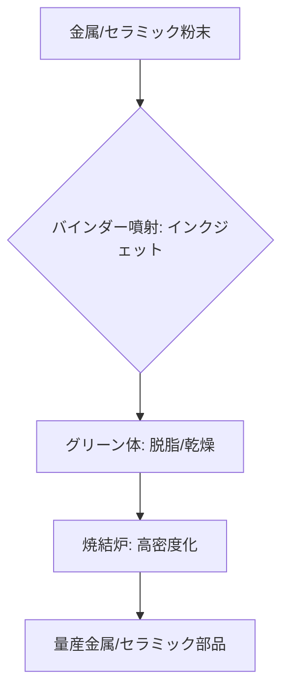

# T15-06-03 バインダージェット法（粉末+接着剤）

## Summary（5つの要点）

1. **基本原理**: 金属粉末やセラミック粉末の層に、**液体バインダー（接着剤）**をインクジェットヘッドで選択的に吹き付け、層状に固化させて造形物（グリーン体）を形成する `(1)`。
2. **高速・大量生産**: レーザー溶融（L-PBF）に比べて**造形速度が桁違いに速く**、造形機材の初期コストも低いため、**3D-AM技術の中で最も量産化**に適しているとされる `(2)`。
3. **後処理（焼結）**: 造形されたグリーン体は、接着剤を除去（脱脂）した後、**焼結炉**で高温焼結され、金属粉末同士が結合して高い密度と強度を持つ最終製品となる。
4. **応用分野**: **砂型鋳造**の複雑なコア・モールド製造、**セラミック部品**製造、そして金属部品の**射出成形**（MIM）の代替・補完技術として期待されている。
5. **課題（収縮・精度）**: 焼結工程で**体積が10%～25%収縮**するため、最終製品の**寸法精度と変形制御**が技術的なボトルネックとなる。この収縮率を事前に正確に予測する技術が重要。

#### 概念図

---

### 技術評価表（定量的な視点）
| 評価項目 | 評価 | 根拠 |
| :--- | :--- | :--- |
| 導入コスト | ⭐⭐⭐☆☆ | 装置は高額だが、材料コストは比較的安い。高スループットで償却しやすい |
| 技術成熟度 | ⭐⭐⭐☆☆ | 砂型鋳造では成熟。機能部品の量産化は焼結技術が課題 |
| 日本の競争力 | ⭐⭐⭐☆☆ | インクジェット技術（セイコーエプソン）に強み。装置は海外勢（Desktop Metal）が先行 |
| 市場性 | ⭐⭐⭐⭐⭐ | 大量生産を可能にするAM技術として、自動車、機械部品分野で需要増 |
| 品質保証の重要性 | ⭐⭐⭐⭐☆ | 焼結後の**密度、強度、収縮率**の安定的な制御が必須 |

---

## 日本の立ち位置・強み弱みのSummary

### 強み：日本企業や研究機関が持つ独自の技術、優位性などを箇条書きで記述。

* **インクジェット技術**: **セイコーエプソン**をはじめとする日本のメーカーが持つ**高精度なインクジェットヘッド**のノウハウは、バインダーの**微細かつ高速な吐出制御**に直接的に活かせる。
* **粉末冶金・セラミック技術**: **金属射出成形（MIM）**で培われた**粉末材料、焼結プロセス**に関する深い知見があり、バインダージェットの後処理工程に適用可能。
* **鋳造技術**: 自動車産業などの**砂型鋳造**における複雑な中子（コア）製造で、バインダージェット技術の採用が進んでいる。

### 弱み：日本が抱える規制、標準化の遅れ、海外依存などを箇条書きで記述。

* **装置市場の海外依存**: 大規模な金属バインダージェット装置市場は、**Desktop Metal、ExOne（現Desktop Metal）**などの米国企業が先行しており、国内装置の普及が遅れている `(2)`。
* **焼結プロセスの経験不足**: 最終的な部品品質を左右する**脱脂・焼結プロセス**に関する、AM固有のノウハウ蓄積とデータ化が不十分。
* **材料標準化の遅れ**: バインダーと粉末の適合性や、焼結後の材料特性に関する**標準化、データベース化**が遅れており、ユーザーの導入を妨げている。

---

## 技術ロードマップ（短期/中期/長期）

### 短期目標（～2027年）

* **焼結シミュレーション**と**AI**を組み合わせ、**最終製品の収縮率と変形**を事前に高精度で予測するシステムの導入。
* **インクジェット技術**を活用した**高精細なバインダー噴射技術**を開発し、造形精度を向上。
* **高付加価値なセラミック部品**（電子部品、耐熱部品）の量産プロセスを確立。

### 中期目標（2028年～2031年）

* **自動車部品**など、大量生産が求められる金属部品の**主要製造プロセス**としてバインダージェットを確立。
* 焼結工程を含む**全工程の自動化・インライン化**を図り、人手による作業を最小化。
* **マルチマテリアル**（T15-06-05）対応のバインダージェット技術を開発し、**硬質-軟質金属**の一体造形を実現。

### 長期目標（2032年～2035年）

* バインダージェットが**既存のMIMや鋳造に代わる**、低コストかつ環境負荷の低い**次世代の量産技術**として標準化。
* AIが造形データと焼結炉の稼働状況をリアルタイムで監視し、**品質を自律的に制御**するスマートファウンドリーを実現。

### 📚 参照リンク

1. [バインダージェット方式の仕組み - Desktop Metal](https://www.desktopmetal.com/products/production-system/)
2. [積層造形技術の量産化への応用 - JST](https://spc.jst.go.jp/news/230104/topic_3_02.html)
3. [セイコーエプソンのインクジェット技術応用](https://www.epson.jp/)
4. [金属粉末射出成形（MIM）技術とAMの比較 - 粉体粉末冶金協会](https://www.jspm.or.jp/)