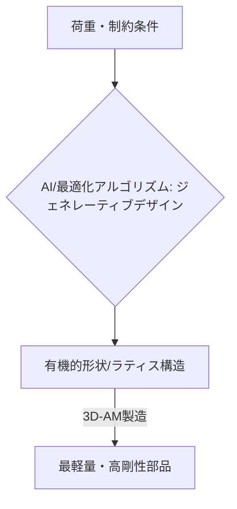

# T15-06-04 トポロジー最適化・ジェネレーティブデザイン

## Summary（5つの要点）

1. **定義**: 設計者が設定した**荷重条件、制約条件、目標**（例: 質量最小化、剛性最大化）に基づき、**AI・最適化アルゴリズム**が最適な材料配置、形状を**自動で生成**する技術 `(1)`。
2. **トポロジー最適化**: 特に構造物の軽量化に用いられ、初期の設計空間から不要な部分を**削ぎ落とし**、**骨のような有機的な形状**（ラティス、トラス構造など）を導出する。
3. **ジェネレーティブデザイン**: **複数の材料、複数の製造方法（AM、切削、鋳造）**を考慮し、**数千〜数万**の設計案を自動で生成・評価することで、人間が見つけられない最適解を探索する `(2)`。
4. **AMとの融合**: 従来の切削加工では製造不可能な、**複雑で有機的な形状**を、3D-AM（L-PBF、樹脂AMなど）によって初めて実現可能にする技術（**DfAM: Design for Additive Manufacturing**）。
5. **応用効果**: 航空機や自動車部品（ブラケット、サスペンション）の**劇的な軽量化**（20%～50%）、そして性能（剛性、放熱性）の向上を実現し、燃費改善、電動化に貢献する。

#### 概念図

---

### 技術評価表（定量的な視点）
| 評価項目 | 評価 | 根拠 |
| :--- | :--- | :--- |
| 導入コスト | ⭐⭐⭐☆☆ | 設計ソフトウェア（Autodesk, ANSYS）のライセンスが必要 |
| 技術成熟度 | ⭐⭐⭐⭐☆ | ソフトウェア機能は成熟。AMでの実部品製造実績が増加中 |
| 日本の競争力 | ⭐⭐⭐⭐⭐ | 自動車・航空宇宙の**CAE/最適化技術**が高く、応用力に優れる |
| 市場性 | ⭐⭐⭐⭐⭐ | 軽量化と設計自由度ニーズのある全製造業で必須となる |
| 品質保証の重要性 | ⭐⭐⭐⭐⭐ | 設計された形状が**製造され、期待通りの性能**を発揮することを保証する必要がある |

---

## 日本の立ち位置・強み弱みのSummary

### 強み：日本企業や研究機関が持つ独自の技術、優位性などを箇条書きで記述。

* **CAE技術の蓄積**: 自動車、電機、重工分野で長年にわたり培われた**高度な構造解析（CAE）**と**最適化技術**のノウハウがある。
* **軽量化への高い要求**: 自動車、航空宇宙分野において、燃費・電費向上を目的とした**徹底的な軽量化**の要求が高く、技術導入のモチベーションが高い。
* **マテリアルズインフォマティクス（MI）との連携**: AIによる材料特性予測（T15-01）と組み合わせ、**最適形状と最適材料を同時に設計**する試みが進んでいる。

### 弱み：日本が抱える規制、標準化の遅れ、海外依存などを箇条書きで記述。

* **AM特有の設計知識（DfAM）不足**: 最適化された形状を**AMで安定して製造**するための知識（サポート構造、ひずみ予測）を持つエンジニアが不足している。
* **ソフトウェア依存**: 主要なジェネレーティブデザインソフトウェア（Autodesk Fusion 360、Altair Inspireなど）を**海外ベンダー**に依存。
* **設計と製造の分断**: 最適化の結果が、実際の**AM機材のプロセスパラメータ**（T15-06-01）に適切に反映されず、設計と製造が分断されるケースがある。

---

## 技術ロードマップ（短期/中期/長期）

### 短期目標（～2027年）

* **トポロジー最適化**を標準設計プロセスに組み込み、主要な非構造部品（ブラケット、ヒンジなど）の**軽量化率を20%以上**達成。
* **AM特有の制約条件**（最小肉厚、造形角度）を設計アルゴリズムに組み込むための**自動化ツール**を導入。
* **熱応力、流体解析**など、複数の物理現象を考慮した**マルチフィジックス最適化**を開始。

### 中期目標（2028年～2031年）

* AIが設計、シミュレーション、製造可能性を評価し、**最終設計案を自動で決定**する**自律型設計システム**を実用化。
* **金属AMで製造された最適化部品**の**長期信頼性**を保証するための認証基準を確立。
* **マルチマテリアル**（T15-06-05）設計に対応したトポロジー最適化アルゴリズムを開発。

### 長期目標（2032年～2035年）

* 設計者が**機能要求**と**コスト制約**を与えるだけで、AIが**最適な材料、形状、製造プロセス**を自律的に決定・実行する**完全自律型エンジニアリング**を実現。
* 設計された複雑形状の部品を、デジタルツイン上で**リアルタイムに製造品質を予測**しながら製造するシステムを確立。

### 📚 参照リンク

1. [ジェネレーティブデザインとは - Autodesk](https://www.autodesk.co.jp/products/fusion-360/features/generative-design)
2. [トポロジー最適化の基本と応用 - ANSYS](https://www.ansys.com/)
3. [軽量化技術と積層造形 - Altair](https://www.altair.com/)
4. [自動車部品の軽量化におけるAM活用 - トヨタ自動車](https://global.toyota/jp/innovation/manufacturing/technology-innovation/)