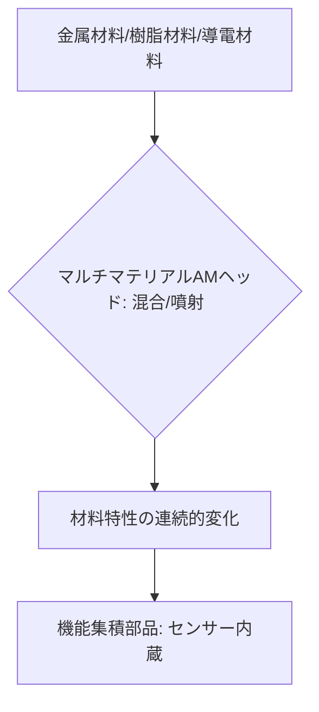

# T15-06-05 マルチマテリアル・グラデーション材料造形

## Summary（5つの要点）

1. **定義**: 一つの造形プロセスで、**複数の異なる材料**（金属、樹脂、セラミック、導電性材料など）を切り替えたり、**混合比率を連続的に変化**させたりしながら造形し、**単一部品内で多様な機能**を実現する技術 `(1)`。
2. **グラデーション材料**: 材料の特性（硬さ、色、導電性、熱伝導率）を、空間的に**連続的に変化**させることで、**応力集中を緩和**したり、自然界の構造（骨と軟骨の境界）を再現したりする。
3. **機能集積**: 部品内部に**導電性パス（配線）**や**センサー**、**アクチュエーター**を埋め込みながら一体成形し、部品自体をインテリジェント化する（例: 圧力センサー内蔵グリッパー）。
4. **応用分野**: **医療用インプラント**（生体組織との親和性向上）、**ソフトロボティクス**（柔軟なグリッパー）、**電子部品**（アンテナ、バッテリー内蔵部品）、高効率な**熱交換器**など、革新的な機能部品の開発が可能。
5. **技術的課題**: 異なる材料間の**界面（インターフェース）での接着強度**の確保、造形時の**材料特性の違い**（熱収縮率など）による**ひずみの制御**が最大の課題 `(2)`。

#### 概念図

---

### 技術評価表（定量的な視点）
| 評価項目 | 評価 | 根拠 |
| :--- | :--- | :--- || 導入コスト | ⭐⭐☆☆☆ | 装置が極めて高額。材料開発も複雑で高コスト |
| 技術成熟度 | ⭐⭐⭐☆☆ | 樹脂分野では実用化。金属-樹脂など異種材料間の接合は研究開発段階 |
| 日本の競争力 | ⭐⭐⭐⭐☆ | 異種材料接合、高性能材料開発で強み。AM装置は海外先行 |
| 市場性 | ⭐⭐⭐⭐⭐ | 従来のモノづくりでは不可能だった高機能部品の創出により市場が急拡大 |
| 品質保証の重要性 | ⭐⭐⭐⭐⭐ | 界面の**信頼性**、材料間の**物性差**による欠陥制御が極めて重要 |

---

## 日本の立ち位置・強み弱みのSummary

### 強み：日本企業や研究機関が持つ独自の技術、優位性などを箇条書きで記述。

* **異種材料接合技術**: 金属、セラミック、樹脂など、異なる材料間の**接合・界面制御**に関する深い知見と技術を持つ。
* **高性能材料のラインナップ**: マルチマテリアル造形に必要な**高機能な導電性インク、誘電体、構造用ポリマー**などの材料開発力が高い。
* **ソフトロボティクス・医療応用**: 柔軟性と駆動力を併せ持つ**ソフトアクチュエーター**や、**生体適合性**を持つインプラントなどの分野での研究が盛ん。

### 弱み：日本が抱える規制、標準化の遅れ、海外依存などを箇条書きで記述。

* **マルチマテリアルAM装置の海外依存**: **Stratasys J750**などの主要なマルチマテリアル光造形装置は海外メーカー製。
* **グラデーション特性のシミュレーション不足**: 空間的に特性が変化する材料の**物性、変形、破壊を予測**するシミュレーションソフトウェアや、設計ツールの開発が遅れている `(2)`。
* **材料標準化の遅れ**: 複数の材料が混在する部品の**性能評価、寿命予測、リサイクル性**に関する標準化・規制整備が途上。

---

## 技術ロードマップ（短期/中期/長期）

### 短期目標（～2027年）

* **硬質樹脂と軟質樹脂**を一体化した**高機能ガスケット、シーリング部品**の商業生産を開始。
* 樹脂AMによる**配線、アンテナ**などの導電性パスを内蔵したIoTデバイスのプロトタイプ開発を加速。
* 異なる材料間の**界面強度**を定量的に評価する**非破壊検査技術**（超音波、X線CT）を開発。

### 中期目標（2028年～2031年）

* **金属と樹脂**を混在させた**ハイブリッド・マルチマテリアルAM**を実用化し、センサー、電子部品を内蔵した構造部品を開発。
* **グラデーション材料**の設計を、トポロジー最適化（T15-06-04）と連携させ、**機能要求に基づく特性分布**を自動で実現。
* **異種材料間の熱応力、残留応力**を造形中に制御する**クローズドループ制御**を確立。

### 長期目標（2032年～2035年）

* AIが**材料選択、設計、造形、品質保証**までを統合的に行う**自律的なマルチマテリアル設計製造システム**を実現。
* **環境応答性、自己修復機能**を持つ**生体模倣**グラデーション材料を実用化。

### 📚 参照リンク

1. [マルチマテリアル3Dプリンティングの可能性 - Stratasys](https://www.stratasys.co.jp/3d-printers/j750/)
2. [異種材料積層造形技術の研究開発動向 - JST](https://www.jst.go.jp/)
3. [ソフトロボティクスへのAM応用事例 - 東京大学](https://www.u-tokyo.ac.jp/)
4. [金属-樹脂ハイブリッドAM技術 - 産業技術総合研究所](https://www.aist.go.jp/)