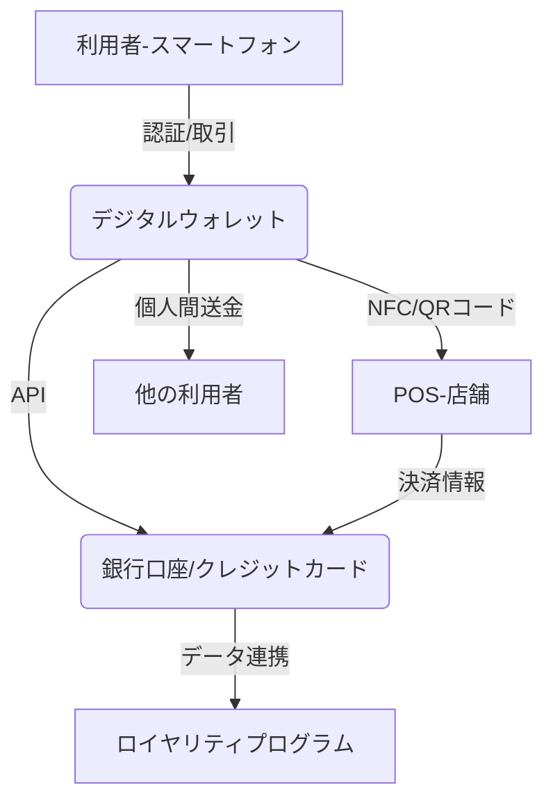

# T16-01-01 デジタルウォレット・モバイルペイメント

## Summary（5つの要点）

1. **成長予測**: 世界市場は2025年以降、利便性向上を背景に年率10%の成長が予測されており、決済の主軸はモバイルへ移行する `1`。
2. **キャッシュレス化の進展**: 日本のキャッシュレス決済比率は2024年に42.8%に達し、政府目標（40%）を達成。QRコード決済、交通系ICが急速に浸透 `3`。
3. **多機能統合**: 地域通貨、ロイヤリティポイント、クーポンなど、多様な金融・非金融機能がモバイルウォレットに統合され、スーパーアプリ化が進む `3`。
4. **技術基盤**: NFC（Near Field Communication、Type A/B/F）、QRコード、生体認証（指紋・顔）が複合的に利用され、決済の即時性・セキュリティが高度化。
5. **サイバーセキュリティリスク**: デジタル化に伴い、サイバー攻撃、データプライバシー、不正利用のリスクが高まり、新しい認証技術（バイオメトリクス）の導入が急務となる `2`。

#### 概念図

---

### 技術評価表（定量的な視点）
| 評価項目 | 評価 | 根拠・備考 |
| :--- | :--- | :--- |
| 導入コスト | ⭐⭐⭐☆☆ | 既存POS改修やNFC/QRリーダー導入が必要。中小店舗向けには安価なモバイルPOSも普及。 |
| 技術成熟度 | ⭐⭐⭐⭐⭐ | 技術は確立済。UX/セキュリティ改善が主要課題。 |
| 日本の競争力 | ⭐⭐⭐☆☆ | アプリ・サービスは国内勢が強いが、基盤技術（Apple Pay/Google Pay）は海外依存。 |
| 市場性 | ⭐⭐⭐⭐⭐ | 2035年までに決済の主流となり、社会インフラ化は不可避。 |
| 品質保証の重要性 | ⭐⭐⭐⭐⭐ | 不正利用防止（FDS）、システム障害ゼロが絶対条件。セキュリティが最重要。 |

---

## 日本の立ち位置・強み弱みのSummary

### 強み

* **サービス普及率**: PayPay、LINE Payなどの国内QRコード決済が急速に普及し、利用者数、加盟店数ともに高いカバレッジを達成。
* **交通系ICのインフラ**: Suica/PASMO等のFeliCa技術が世界に先駆けて定着しており、高い利便性と信頼性を確立している。
* **ポイント・経済圏との連携**: 楽天、ドコモなど、ポイントプログラムと決済サービスが密接に連携し、強力な経済圏を形成している。

### 弱み

* **クレジットカード依存**: キャッシュレス決済総額の約8割をクレジットカードが占めており、モバイルペイメントへの移行は海外主要国と比較して遅れている。
* **ガラパゴス化のリスク**: FeliCa技術など、日本独自の標準技術に依存する部分があり、グローバルなNFC標準との相互運用性に課題が残る。
* **セキュリティ人材不足**: モバイル決済の高度化に伴うサイバーセキュリティリスクへの対応を担う人材が不足している `2`。

---

## 技術ロードマップ（短期/中期/長期）

### 短期目標（～2027年）

* QRコード決済間の相互運用性の向上と、中小店舗への導入コスト低減。
* バイオメトリクス認証（生体認証）を組み合わせた高セキュリティ決済の標準化。
* モバイルウォレット内のデジタルID（運転免許証等）との連携機能の実証実験。

### 中期目標（2028年～2031年）

* モバイルウォレットを基点とした個人間送金、公共料金支払いの完全統合。
* Web3ウォレット（自己主権型ID/暗号資産）と既存金融システムのゲートウェイ構築。
* 決済データのAI分析による、不正取引検知システムの精度99.9%達成。

### 長期目標（2032年～2035年）

* 現金流通ゼロ社会の実現、全ての決済がデジタルウォレットで完結する社会インフラの確立。
* 決済データと健康データ・行動データを統合した、超パーソナライズ型金融サービスの提供。
* グローバル標準規格（ISO 20022等）に基づいた、クロスボーダー決済の即時・無料化。

### 📚 参照リンク

1. [モバイルウォレットと支払い技術市場予測とハイライト 2025 - 2032: 分析、トレ - Pando](https://pando.life/article/2389175)
2. [ペイメント 2025 ＆ Beyond――決済の進化と変革の先に待つ未来 | PwC Japanグループ](https://www.pwc.com/jp/ja/knowledge/thoughtleadership/payments-in-2025.html)
3. [日本の最新キャッシュレス決済事情（2025年版） - First Reach](https://first-reach.com/blogs/journal-diary/cashless-payments-japan-2025)